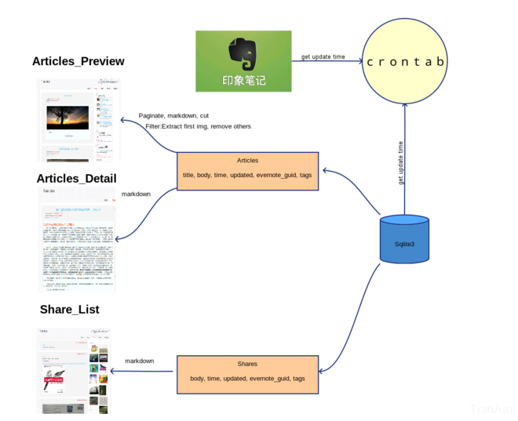

# About This Site

## TODO

貌似又出了一次故障，看来得抽空重写下这个后台了。。。
这次得好好思考下了（至少得管个三五年吧......）。

## 记录个意外

前天手抽不知为何意外删除了Dropbox的同步目录，清楚地记得删的是软链接，卡住有两三秒没删完，猛地觉得不对，赶紧Ctrl+C撤销了，然并卵，网速出奇地好，Server迅速同步了。后来发现Dropbox居然还有恢复功能，兴高采烈地恢复了。然而，忘了关掉文件监视器，于是所有被删掉的文件又刷新了一遍。。。

算了，懒得再恢复时间戳了，权当留个纪念吧。

<hr>

## BugFix

在尝试了OneDrive（最新版有个坑爹的bug，由于采用了lazy同步的模式，某些目录没法直接通过代码访问）、GoogleDrive（家里的电脑安装不上。。。居然没代理）之后，改用了Dropbox同步static file，刚发现其同步模式居然是先删掉本地文件再下载并创建，导致watchdog也同样做了一次这样的操作，于是文章的创建时间和更新时间都会变成最近一次更新。考虑到delete是低频且高危的操作，先将其从watchdog的监听事件里删了，这样只能手动到后台执行命令删除，算是个折中的解决方案吧。

## Update

最近好不容易挤了些时间更新了下本站，算是保持了一年一更的节奏吧:laughing:。事实上，更新本站最主要的原因是，最近这段时间都没有用Clojure了，以至于一直没空做一些更新，这次干脆把许多想要做的更新都做了。后端用的flask，加了些同步机制和https。

这半年变化挺大的，包括心态，工作，工具链等等。等了很久的Clojure 1.9终于发布了，不过却很少写了，倒是因为业余兴趣的需要，转向了Julialang，至于兴趣能坚持多久，随缘吧。

原来tianjun.ml的域名，在十一长假期间忘了续，结果被抢注了，居然还有这种操作......，吓得我赶紧又注册了个juntian.me的域名重定向到了目前的这个网站上。

这次更新的过程中，删了部分没啥营养的文章（主要是不知道怎么写英文的title，至于为什么文章title都换成英文的了，啊，说来话长），部分评论迁移的时候没了（真的是没了，不是我删了，要怪就怪disqus咯）。

后面本站应该会频繁更新一段时间，主要是NLP方面的一些内容，也算是对过去的半年有个交代吧~

<hr>

## 记录下用Clojure重写的本站的过程

最早打算重写这个网站的原因是为了方便同步网站的信息。由于以前是自己写的后台管理页面，每次更新内容都需要在网页上写东西，以前可能不是太大的问题，不过现在在家里的网总是断断续续的，而且近来记录笔记的习惯也倾向于本地化记录了，所以打算在网站与本地之间开通个接口方便同步一些信息。另外，对网站的内容做了一些精简，希望以后写的东西还是更professional一些吧。

其实，我也不知道整个过程花了多少时间，断断续续地，偶尔想起来的时候熟悉下相关库的api，遇到不懂的地方，也只能花时间死磕各个库的源码实现。不过，大部分代码应该是这几天放假的时候写的（总共也就几百行），源码可以在[这里](https://github.com/findmyway/blog-clj)看到。

记录几点体会吧：

1. 抽象和隔离的意识要比以前强一些了，会有意识地从逻辑层和代码层抽出一些共通的部分出来；
1. 测试的引入会改变自己写代码的方式，会有意识地去考虑如何方便进行测试；
1. 对错误和异常的处理还缺少很深入的思考与实践；

## BugFix

记录昨天fix的一个Bug，之前后台自动保存的功能出了个bug，直接导致一个文档的content同步覆盖掉了另一个文档的content。要命的是不知道怎么复现这个bug。查看log日志，所有的请求都正常。昨晚跟同学讨论了下，感觉应该是js自动保存逻辑出问题了。仔细review了下代码，果真是。

原来的实现是，自动保存和markdown渲染封装在同一个按键检测事件里，并加入了一个10秒钟的延时，如果10秒钟内没有按键触发则发起PUT请求保存当前内容。原来的代码所存在的问题是，编辑一个文件的时候，如果10秒钟内切换到了另外一个文档，那么，会导致读取的id和content不一致，具体说明如下：

```javascript
$('#response').keyup(function () {
    var v = $('#response').val(),
        s = markdown.core.mdToHtml(v);
    $("#rendered").html(s)
    MathJax.Hub.Queue(["Typeset",MathJax.Hub,"rendered"]);

    if(save_time_out) { clearTimeout(save_time_out); } //10 秒钟内检测到输入则重置延时
    save_time_out = setTimeout(function () {
        var ref = $('#tree-container').jstree(true),
            sel = ref.get_selected();
        if(!sel.length) { return false; }
        sel = sel[0];
        $.ajax({
            type: "PUT",
            url: "/essays/"+sel,
            data: JSON.stringify({"id":sel, "body": v}), // 问题出在这里，
            //PUT请求时，传递的是10秒钟前读到的v，
            //而此时的blog_id（即变量sel）可能变了，
            //导致一个文档的content更新到另一个文档里去了
            // 更改后的代码每次PUT重新读取当前的content和id
            // data: JSON.stringify({"id":sel, "body": $('#response').val() }),
            contentType: "application/json; charset=utf-8",
            datatype: "json",
            success: function(data){
                save_tree("Blog " + sel + " Content AutoSaved: ")
            },
            failure: function(err){console.log(err)}
        })
        }, 
        10000);
});
```

## Update

貌似这个网站保持每年更新一次的频率。最近这次又重新折腾了下，不过目前依然是半成品。这次折腾的时间稍微有点长，前前后后大概有一个月时间吧。先说说改版的原因：

1. 印象笔记基本被我弃用，而且原来写的网站后台同步系统有点小bug一直没有修复；
1. 最近一段时间学习了下Clojure，挺有意思的一门语言，想动手实践下；
1. 原来的HTML5模板总觉得被我改的有点丑，想再重新写一版；
1. 希望将网站的后台管理系统设计成个性化的笔记管理系统，一定程度上替代印象笔记，为知笔记等；

针对上面几点，分别对网站做了以下改进：

1. 抛弃原来的同步系统后，重写了后台的文档管理体系统，整个编辑界面借鉴了[作业部落](www.zybuluo.com/)的设计方案，双屏切分（左边编辑，右边预览），导航栏用于管理文档结构，由于是自己用，舍弃了账户管理模块；
1. 网页框架采用了[luminus](http://www.luminusweb.net/)，我觉得这就是个大杂烩，把各个优秀的部件组织在一起，然后提供一些高可用的模板，上手非常方便。数据存储方面，抛弃了之前用的SQLite，换了Redis（没别的原因，只是对Redis用着熟悉点），文件存储上，仍然采用了[七牛云存储](http://www.qiniu.com/)，[qiniu-clojure-sdk](https://github.com/killme2008/clj.qiniu)的作者封装得真简洁......网页权限管理用到了之前说的Buddy，简单易行；后台管理的安全性方面，目前暂时把csrf模块给去掉了，因为后台有很多的ajax请求，还没想好该怎么绑定csrf-token，缺少这方面的经验，这应该是整个网站最大的安全漏洞；
1. 重写前端页面。这块挺花时间的，主要是自己对js不熟，又重新翻了下[JavaScript高级程序设计](http://book.douban.com/subject/10546125/)这本书，然后熟悉了下jquery和react，感觉react写前端的想法确实有点不太一样，然后继续往前学习了下ClojureScript以及对react封装的库OM，完全刷新了我对前端的认识（我承认之前一直很BS前端干的活......)，然而时间精力有限，这些都仅仅是浅尝辄止。最后前端部分主要用jquery写的；

## 说说感受

整个从前端到后端全都写了一遍，说实话，觉得挺累的。很多地方都是从零开始，完全没有经验可谈。除了HTML是在WebStorm下写的，其余都是在vim下写的，并不是我排斥IDE，而是IDE用着效率太低了。

总的来说，我挺喜欢Clojure这门语言的，简洁，有魔力！可惜的是我到目前为止还算不上入门，也没体会到其在处理并发问题上的优势。而且，最近写clojure的过程中，也读了不少框架的源码，感觉很多代码还是很难懂。接下来的一段时间估计没空深入学习了，毕竟clojure又不能拿来跑RNN......我能想到后面会用到clojure的地方估计就是用它来写SICP的习题了......

---

## 写在前面

之前网站一直放在[SAE](http://www.sinaapp.com/)上，除了每月扣点**豆子**，用着也没啥问题，除了扩展性不太好之外。不过，间歇性的出了几次意外，后台往sql中写入数据的时候，不知道是啥原因，提交后页面卡死了，然后再去sae后台一看，哗啦啦几百豆子没了......我总共才送了１.5k，无语了。想了半天也没找出时什么原因，只知道是全都扣在sql的读写上了。也罢，懒得在上面折腾了，写的东西暂时都放在印象笔记里。前些天忽然想起来github送的DigitalOcean优惠券还没用，最近有点闲时间，再折腾了一把。之前的后台是刚熟悉python的时候写的，现在再看看，真是渣渣......然后动手重新写了一遍部署到DO上（回头看了一下，其实还是渣渣......忧桑）。这段时间用印象笔记用着很爽，主要是方便，所以，这次后台的改动主要就一个，利用Evernote的api把网站后台跟印象笔记打通了，这样便于随时积累，持续更新。~~另外，rss给去掉了，有兴趣的话加个印象笔记吧～~~

## 整体结构

怕自己以后给忘了，画个图，以后再修改起来也方便。

跟印象笔记api打交道的过程中，坑很多，最惨的一个莫过于，在sandbox中测试的好好的，换成印象笔记的token后就出错了,各种google，居然有人给出了[解决方案](http://stackoverflow.com/questions/23098372/evernote-invalid-token),把service_host改一下就好了，另外这里只是简单采用轮询的方式，因为对实时性要求不高，所以没用所谓的webhook。

目前网站布在新加坡节点，感觉速度上还行吧，没有网上说的那么差。万一不稳定了再换换。新加坡的节点有ipv6这个很不错。配合shadowsocks用着很快。

其实本来打算把shares部分大改的，主要是想跟自己的虾米账户打通，已经写了一半了，忽然发现国外不能访问国内的虾米，真是个蛋疼的世界。唉，真是应了那句话。

> 墙外的想到墙内去，墙内的想到墙外来......

算了，以后有空再弄弄，往所里的电脑上布个代理做跳板。也许下次会直接弄个music的二级域名出来。

## 说点细节

印象笔记和数据库的同步通过定时器实现，由于印象笔记的特殊性，每一条笔记对应正文和资源（包括图片等附件）两部分，因此将同步过程分为两步。

1. 首先查询对应笔记本中每条笔记的更新时间，同时检索本地数据库中每一条记录的更新时间。然后提取需要更新和新建的记录。正文部分用正则做一个粗过滤（替换掉div,br标签）后写入数据库（其实可以经过markdown渲染之后再写入数据库，这样响应会更快，不过，这部分响应时间相比建立连接的时间而言可以忽略不计，而且有时候需要在后台查看下过滤的结果），同时提取附件相关的内容转换成链接格式。并将涉及到的资源写入数据库中的一张表。

1. 扫描上面的资源表，对于没有下载到本地和同步到cdn的资源分别下载和上传，并校验。

分成两步的最主要原因是，如果附件比较大，很容易出现下载上传失败的情况，从而导致整个文档更新失败。将下载和上传部分独立出来后，不会影响文档内容的同步，如果某些大文件没法自动同步可手动在后台同步。

最后绑定下域名，分别把www.tianjun.ml和www.tianjun.me通过301重定向到主域名上。

## 谈谈感受

自己这么亲自折腾一把后，才会对现在的云平台带来的好处感受更深。其实说到底，像安装配置apache这些都是dirty work，云平台把这些集成后，可以说大大免去了这些苦力活，稳定性也有保证。

很久没写点东西了，最近会陆陆续续整理些出来，坚持坚持～