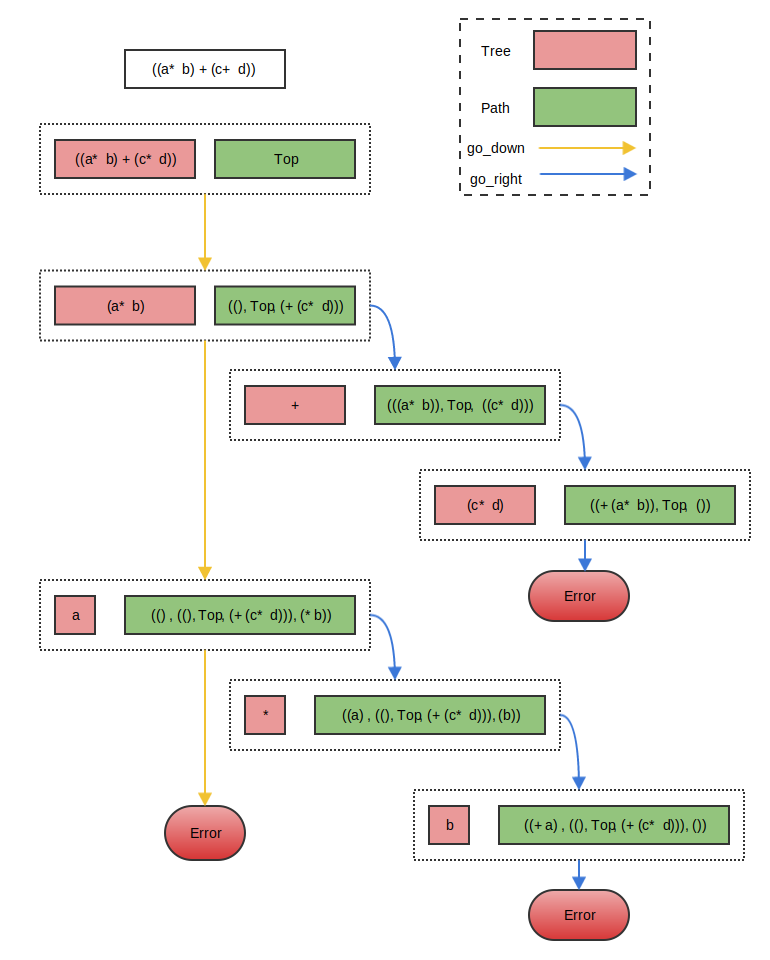

# 1. 什么是Zipper

根据Wikipedia上的[解释](https://en.wikipedia.org/wiki/Zipper_(data_structure))，zipper函数式编程语言中的一种数据结构，能够很方便地遍历和更新list, tree以及一些抽象的循环定义的结构。这个概念的特殊之处在于，函数式编程语言中对数据结构中某个元素的改变不会影响已有的变量，zipper要解决的就是在此条件下如何高效地查找和更新。

# 2. 如何理解Zipper

最早关于zipper的介绍就是[FUNCTIONAL PEARL The Zipper][]这篇paper。文章里用OCaml语言详细描述了两种数据结构，一种是list zipper，另一种是binary tree zipper（自己第一遍读这篇paper的时候，对第一个例子想了很久也没理解清楚，后来忽然发现其实就是list zipper的实现）。

个人感觉一开始直接去理解zipper的概念并不太容易，先用Church number这个简单的例子来加深下对$\lambda$演算的认识。

根据Wikipedia上的[解释](https://en.wikipedia.org/wiki/Lambda_calculus)，一个有效的$\lambda$算子包含以下3条规则：

1. 变量$x$,就是最基础的一个$\lambda$算子
1. $(\lambda x.t)$,（即输入为x，输出为t的匿名函数）
1. $(ts)$,其中t和s都是$\lambda$算子，将t应用于s，得到的仍然是$\lambda$算子

```
0 => λf.λx.x  
1 => λf.λx.f x
2 => λf.λx.f (f x)
...
```

上面几行是wiki里常见的表示Church number的一种方式。看着有点晕？根据前面的定义，我们把上面的表达式加点括号,然后变换下符号就好理解了：

```
0 => (λt.(λx.x))        ;; 记作 C0
1 => (λt.(λx.(tx)))     ;; 记作 C1
2 => (λt.(λx.(t(tx))))  ;; 记作 C2
```

从上面可以看出，其实就是一个两层的匿名函数，上面的Church number可以看做是``Ck t x``经过Currying之后的表示，其中Ck表示对应整数k的Church数， t表示某种transform（可以理解为某种函数变换），x表示变量。假设t为``lambda x: x + 1``，x为0，那么Church number就与整数一一对应了。

本文并不打算对$\lambda$演算进行深入探讨，在这里引入Church number的概念是为了说明，在函数式编程的概念中即使是整数n这样的基础数据类型也是通过递归来表示的。需要注意的是，递归的过程是有一个起点的，对于Church number的例子起点就是C0，如果想要得到Ck，则需要递归调用k次运算得到。

# 3. List Zipper

[FUNCTIONAL PEARL The Zipper][]中的第一个例子如下：

```ocaml
type tree = Item of item | Section of tree list;;
type path = Top | Node of tree list * path * tree list;;
```

理解前面的Church number之后，再加上一点点OCaml语法，就很好理解上面这两行代码，第一行首先递归定义了一个tree类型，其中``Item``是递归定义的起点，假设``item``的类型是int，下面几个例子都是tree的一些实例：

```ocaml
let t0 = Item (0)             (* 最基本的一个item *)
let t1 = []                   (* 空的tree *)
let t2 = Section [Item(1);Item(2);Item(3);Item(4)]  
(* 一个Section, 其中每个元素都是一个Item *)

let t3 = Section [
	Section [Item(1);
		Section [Item(1)]];
	Section [Item(2);Item(2)];
	Section [Item(3);Item(3)]]
(* 一个Section中包含了3个Section，每个Section都是可以嵌套的 *)
```

第二行代码中的``path``类型就是一个tupple，包含3个元素，第一个元素是以tree为元素的列表，第二个元素是递归的path（起点是Top）,第三个元素仍然是以tree为元素的列表。下面仍然给出几个实例：

```ocaml
let p0 = Node([], Top, [])    (* 最基础的一个path，左边和右边的元素都是空列表，中间是起点元素Top *)
let p1 = Node (t0, p0, t0)     
let p2 = Node (t1, p1, t2)
```

有了``tree``和``path``两个类型之后，就可以得到一个list zipper的类型了：

```ocaml
type location = Loc of tree * path
```

这里location是一个长度为2的tupple，包含``tree``和``path``。一个location本质是很自由的，其中的``tree``和``path``都可以是任意实现，通过对二者做一些限制，即可得到一个list zipper的实现。

从最简单的开始，一个最小list zipper的定义就是``Loc (Item(0), Top)``，从本质上讲，list zipper 是一种状态描述的结构，这里用paper中的一个例子来描述状态的变化过程。表达式``((a * b) + (c * d))``用前面定义的tree类型来表示就是

```
let t0 = Section [
	Section [Item(a); Item(*); Item(b)];
	Item(+);
	Section [Item(c); Item(*); Item(d)];]
```

此时，t0是最顶层的tree，定义此时的path为``Top``，便得到了t0对应的location为``let l0 = Loc (t0, Top)``。list zipper 定义了如下遍历规则：

- ``go_down``，就是指从当前location往更深一层走，location的第一个元素tree如果是一个Item的话会报错（没有更深的一层了），否则就是一个list，对其解构取出其元素``[t_first; t_rest]``，其中t_first构成新location中的tree元素，``let p_new = Node ([],p,t_rest)``则构成新location中的path元素。这里p表示上一层location中的path，左边的空list``[]``表示当前Section中t_first左边的tree（显然为空），t_rest则表示当前Section中t_first右侧的tree。相关的OCaml代码表示可以从paper中找到。对``l0``执行``go_down``操作后，可以得到``let l1 = Loc (Section [Item(a), Item(*), Item(b)], Node([], Top, [Item(+); Section [Item(c); Item(*); Item(d)]))``
- ``go_up``则是``go_down``的逆操作。对当前location中的path元素解构得到``(left, p_up, right)``，取出left和right与当前location中的tree元素拼接得到新的tree_up（left需要翻转）。
- ``go_right``，把当前location中path解构后，得到``(left, p, r::r_rest)``，取出其中的r作为新location的tree，然后当前location中的tree拼接到left上，这样得到了新的location ``Node(r, (tree::left, p, r_rest))``。对前面的``l1``应用``go_right``后得到``let l2 = Loc (Item(+), Node([Section [Item(a), Item(*), Item(b)], Top, Section [Item(c); Item(*); Item(d)]))``
- ``go_left``也就是`go_right``的逆操作。需要注意处理边界情况。

可视化的描述可以看下图：



# 4. Clojure中的zipper

Clojure中的提供了一个[clojure.zip][]模块。与OCaml中的实现稍微有些不同，由于Clojure是动态类型的，并没有类似循环定义的结构类型，因此在[clojure.zip][]库中默认提供了3类zipper（seq-zip, vec-zip, xml-zip），实际上前面说了zipper的思想可以在任何递归的结构中应用，后面会提到如何在clojure中扩充数据结构类型。

在Clojure中，一个zipper的基本形式如下：

```clojure
[node  ;; 这里node可以是seq, vec 或者是其它递归的结构
  {:l left_nodes  ;; 当前层级下当前node左侧的nodes
   :r right_nodes  ;; 同理，当前层级下当前node右侧的nodes
   :pnodes nodes_from_root_to_up  ;; 从root node开始，一直到当前node的父node的列表
   :ppath  ;; 递归定义，与前面的思想一致
  }]
```

[clojure.zip]: https://clojuredocs.org/clojure.zip

## 4.1 Clojure中提供的zipper类型与方法

[clojure.zip][]中包含了以下几类操作zipper的方法：

1. 遍历：next, prev, up, down, left, right, children, lefts, rights, rightmost, leftmost
1. 查询：node, path, 
1. 更新：edit, replace
1. 插入/删除: insert-child, insert-left, insert-right, remove
1. 判断： branch?, end?

比较有意思的一个实现是``end?``，用来判断``next``的结果是否到达终点。可以先看个例子：

```clojure-repl
user=> (zip/vector-zip [])
[[] nil]
user=> (zip/next (zip/vector-zip []))
[[] :end]
```

其实就是在``next``的时候加入了一些判断，因为``next``的实现是深度优先的，最后会回到root，然后把path设为``:end``这样每次next的时候用``end?``判断下遍历是否结束。另外需要注意的一个是``remove``，默认会返回根据深度优先排序当前location的前一个location。

## 4.2 如何扩展zippe到其它类型？

zipper的思想可以扩展到很多其他类型的数据结构。在[clojure.zip][]中提供了[zipper][]函数来构建新的zipper类型，这样就可以使用各种遍历更新的函数了。其中，需要提供一下几个函数：

1. ``branch?``，判断一个node是不是还能有children（可以为空）
1. ``children``，给定一个可以branch类型的node，返回seq类型的children
1. ``make-node``，给定一个node和children，返回新的node
1. ``root``，即root node

在[hickory][]中有一个``hiccup-zip``的实现，可以学习下如何进行扩展的。

[zipper]:https://github.com/clojure/clojure/blob/59b65669860a1f33825775494809e5d500c19c63/src/clj/clojure/zip.clj#L18
[hickory]:https://github.com/davidsantiago/hickory/blob/master/src/hickory/zip.cljx

## 4.3 更高效的访问方法

尽管[clojure.zip][]库中提供了很丰富的遍历和更新函数，但是，想要优雅地修改递归类型的结构仍然是件很繁琐的事，很多时候都需要动手写``loop ... recur ...``，通常认为这样的操作是比较底层的。

[specter][]就是用来提供高效访问的，其中对zipper类型的数据也提供了很好的接口，能够写出更简洁高效的代码。

[specter]:https://github.com/nathanmarz/specter
[FUNCTIONAL PEARL The Zipper]:https://www.st.cs.uni-saarland.de/edu/seminare/2005/advanced-fp/docs/huet-zipper.pdf

# 5 参考

- [Tree visitors in Clojure](http://www.ibm.com/developerworks/library/j-treevisit/)