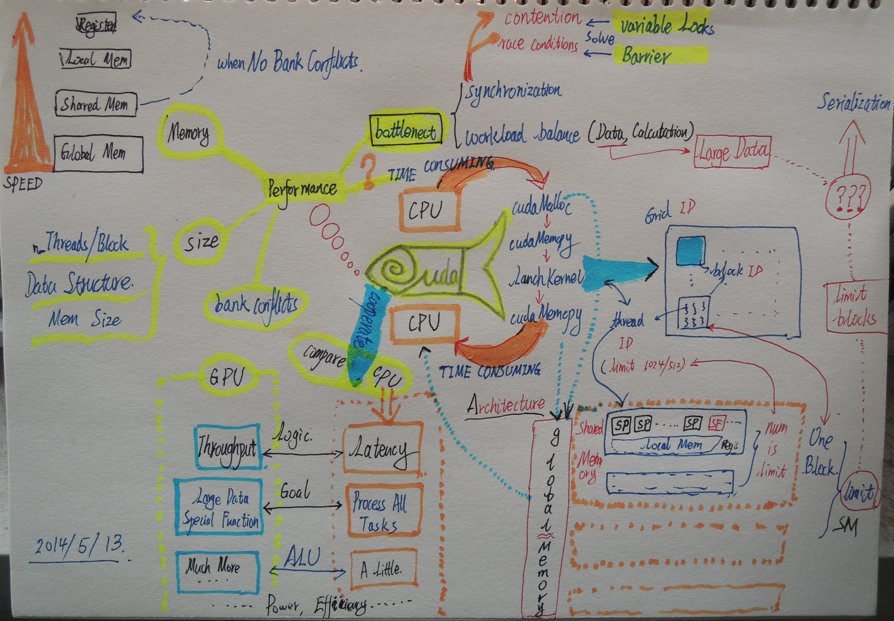

# 一张图说cuda

没去上几次高性能计算的课，有不完善的地方还请见谅。赶在明天考试之前复习了下课件，加上自己的一些理解随手画了画。

说说自己对并行计算的一点浅显认识。以前一直以为，并行计算嘛，就是fork出进程然后各干各的，最后汇总下结果。但发现实际中并行计算往往并非是完全独立的，相反，各个进程之间往往需要各种同步和交流机制。这在一定程度上对编程能力提出了巨大挑战，一方面需要对任务进行分块，另一方面需要自己控制好同步和交流的节奏（弄不好就出现计算结果飘忽不定的情况）。也就是说，原来在串行程序中根本不会出现的资源读写问题，到了并行程序里可能就会成为大问题。许多事情都需要自己手动控制好，就算再有耐心的程序猿看到了也会有些抓狂。只能寄希望以后某一天编译器可以变得足够智能，把苦逼的程序猿解放出来。另外不得不说，pycuda的封装做得很好，只是我没比较过性能上的差异。

为了写大作业，我不得不重拾很久都没碰过的c语言。嗯，指针真是个好东西，有时候真是无比怀念啊......不过，数组越界的问题，完全靠自觉了......唉，凡事都是有得有失。不过我觉得自己应该不会再用c来并行计算了，如果可以，我还是更愿意用一些高层的语言来写，尽管性能上可能会有些损失，但是，相比调试上所花的时间精力来说，值了。（我能说我花了一个多星期来调试大作业么...最后真的是把并行程序和串行程序对照着比较每一次的中间结果。。。然后发现是个相当无厘头的bug！人生啦，就这么毁在bug上了。。。)

不过，抛开这些底层的细节。借用老师在课上的一句话来说，并行编程的确是一门艺术活。真正能体现思考的魅力。至少我在编程的时候，脑海里走的是这么个流程。

- 首先，在脑海里虚拟出成千上万个脑细胞，把每个脑细胞想象成一个thread

- 再把任务分配到每个脑细胞，并且将其分组group成一个个block

- 将思绪按照时间维发散下去，read,write,sync, communicate......

- 然后，从每个group里挑选出个老大，负责最后信息的汇总

- 最后，唉，又耗费了好多脑细胞。。。清空Memory，重来。。。

关于并行编程的一些思考，推荐看看一个系列文章[【1】](http://devblogs.nvidia.com/parallelforall/thinking-parallel-part-i-collision-detection-gpu/)、[【2】](http://devblogs.nvidia.com/parallelforall/thinking-parallel-part-ii-tree-traversal-gpu/)、[【3】](http://devblogs.nvidia.com/parallelforall/thinking-parallel-part-iii-tree-construction-gpu/)，文中关于为什么要学习并行编程，以及并行编程和串行编程的一些差异讲得很不错，而且给出了一些例子。

最后，但求明天考试顺利。。。