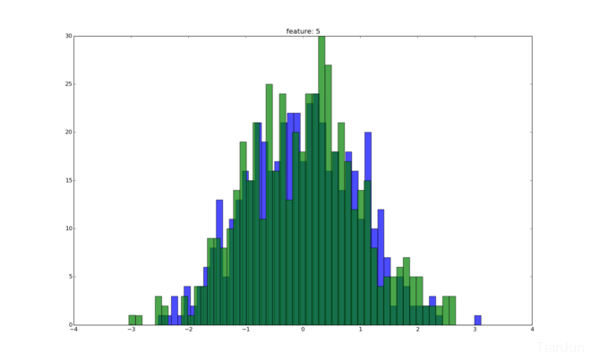
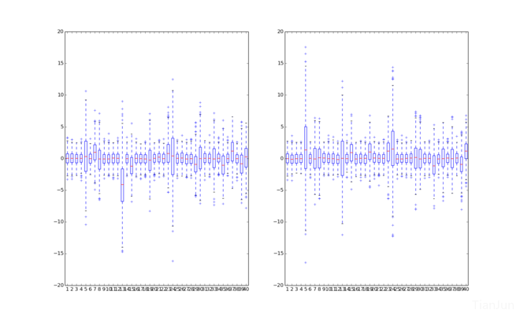
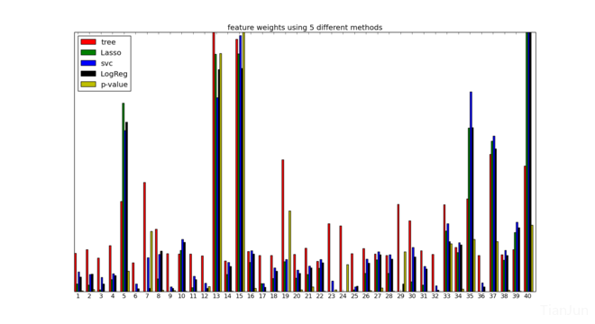
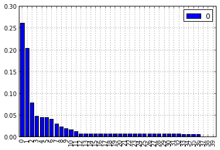
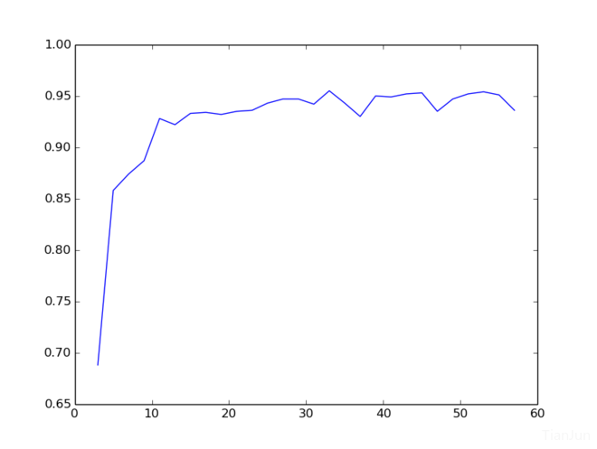

# Data Science London + Scikit-learn

先感受一下这40维特征的分布情况：

从这个图可以得到几个信息，一是特征都分布在０附近，特征之间没有很大的差异性，比较均衡；二是每一维特征的盒子分布的长度大概是１：３，有点接近高斯分布。事实上，针对每一维画一个直方图（其实这里画KDE的图更合适）可以粗略看出其分布情况：

上图中蓝绿色分别表示label分别为0，1对应到第５维特征时候的特征分布。
图１是把label为0和1的所有训练集同时表示在了一张图上，那么将二者分开来看看呢？

这样稍微可以看出点差别了，比较明显的是，有几维特征（比如第5，13维）在左右两边的分布出现明显的偏差。因此，可以断定，对于该数据集而言，少量的特征占有主要地位，而其他大多数特征只有较低的权重。当然，这样不够精确，下面对其量化下。

分别尝试用相关性衡量，逻辑回归，Lasso, svc，以及决策树模型，对初始特征的权值进行衡量，min-max归一化后的图如下

可以看到，权值较大的特征大概是15维左右。下图是根据pca得到的特征权重。

对特征了解了这么多，就来指定分类方法啦～

首先根据tutorial试下水，用svm对40维特征做训练，采用rbf核，５折交叉验证的结果是0.922，可以看到，svm对于这类有着强特征的数据表现不错。为了进一步提升，结合前面的分析可知，首先可以做的是对原始数据降噪。很容易想到的就是主成分分析。这里做pca降维的时候，需要结合训练集和测试集（主要是因为训练集才1000而测试集有9000，因此需要引入测试集对训练集进行强化）。同样采用5折交叉验证，当pca降维到12，13维附近的时候，最好能达到0.95左右(线上测试结果大概0.945附近)。实际上，降维的程度直接影响该结果。

那么，到此为止，似乎就遇到瓶颈了。提取主成分，分类，一气呵成。从前面两步可以看出，提升的关键在于对数据的清理，那么，能不能在此基础上继续往前探索呢？我们知道主成分分析有其局限性，那么还有哪些其他改进的办法呢？沿着这个思路，尝试采用sparse filtering 对该降维的过程做出改进。

直觉告诉我们，先用pca降维的维数作为基础，对原有的数据做sparse-filtering，同样５折交叉验证大概是0.928左右，可见跟使用原始的svm差别不大，修改sparse-filtering使用的维度，遍历之后如下图所示：

我们知道，sparse-filtering与pca降维的显著差异之一是，pca降维只找主要关系，而SF则是找特征之间的内在组合关系。（后面可以利用该特性进一步提升），从图中可以看出，采用SF的最好效果要略优于pca降维后的效果，可以达到0.955附近，但是实际线上测试不过0.94。这说明存在一定的过拟合现象，个人感觉，最主要的原因时后面的svm层过度调参所致。

可以尝试换成逻辑回归层作为分类试试。遗憾的是LR并不能达到svm那样的效果（主要是缺少核函数的映射过程，尝试的结果可想而知）。另外，感觉采用auto-encoder后可能效果要比sf要稍好一些，等熟悉了pylearn2后可以尝试下。

SF的效果带给人的启发之一是，原来40维特征，通过SF处理后，可以得到和pca降维后近似的结果，但是维度的变化范围比较广(20~50)。也就是说，我们的目的并不是**降维**，降维只是**手段**之一，我们的目的是提取**有用的信息**。理解这一点后就好说了。

回顾上面所做的，实际上就是一个简单的3层网络结构。似乎，稀疏表示之后再分类的最好的效果止步于0.95。由于训练集数据较少，大量的数据是未标记的。那么，一个很**单纯的想法**就是，将测试集的预测结果中准确度极高的部分并入训练集，扩充训练集样本，强化训练。论坛里已经有人这么[尝试](http://www.kaggle.com/c/data-science-london-scikit-learn/forums/t/4986/ideas-that-worked-or-did-not)过，似乎，没有太大提升。我估计，主要原因是，从测试集中提取到的概率值极高的那部分数据实际上是远离svm边界的数据，这部分数据加入到训练集中，对于区分那些边界附近的点意义不大。

整理下思路，现在的瓶颈似乎是在svm上，那些边界点难以分隔。因此，可以尝试加入一些弱分类器，另外适当调整参数C。

先用决策树试一下。本地测试0.8。换随机森林，先将训练集二八分，80%为``train_set``,20%为``val_set``，然后用40课树训练``train_set``，分别预测``train_set``,``val_set``，得到40维的概率值，分别记为``rf_train_set``,``rf_val_set``。再用svm训练这个``rf_train_set``，用得到的最佳参数去预测``rf_val_set``。结果是，该模型对``rf_train_set``的结果能达到100%，但是对``rf_val_set``仅仅只有84%左右。看来rf的预测值只能用来打辅助。分析其原因，一方面数据量太少，过拟合无疑。另外随机森林的数量和深度也需要适当限制，否则如果单颗树就陷入过拟合，其效果必然不好。

最后再尝试下融合。只简单试了一下特征融合，没做太多参数上的调优，但是小有提升，线上接近0.96。仔细想了想，尝试只能到此为止了。然后去论坛里找了找大家的解决方案，思路很新颖。通过分析数据的分布得出结论``数据是造的``。于是乎，对症下药，针对该数据的分布情况，采用GMM估计出原始分布的参数，再用简单分类器以GMM的结果为特征再次分类。我用svm复现了下该方法，确实很厉害，接近0.99。最后拿第一的那位也是融合了下rf的结果后做到的。