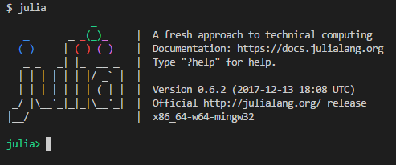
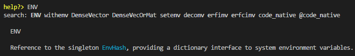

# 写给Python用户的Julia编程指南[updating]

本文的目的是，为拥有Python编程经验的用户提供一些指引，方便其快速上手Julia。

# 准备

## 下载和安装

[官网](https://julialang.org/downloads/)提供了各个系统下的安装包，不过我建议新手先安装[Julia PRO](https://juliacomputing.com/products/juliapro.html)，这个有点类似Python下的Anaconda，目前版本还没有1.0，这里以0.6.2为例，安装Julia的同时还会安装一些Julia下常见的包（省去了许多包管理麻烦，当然，也会带来一些新的小问题，这个碰到的时候再细说）。

由于我日常开发在Windows下，所以以下内容中操作系统相关的部分都以Windows为主（Linux和Mac下要容易很多，应该问题不大）。

安装后直接双击桌面的``JuliaPro - Command Prompt 0.6.2.1``快捷键即可打开Julia的REPL界面，就跟IPython有点像（后面会详细介绍其与IPython的联系和区别），建议将JuliaPRO安装路径下``Julia-0.6.2``中的bin目录添加到环境变量Path中，这样可以直接在git-bash或者cmd中直接运行julia(如下图)。



### Windows下开发学习的一点个人建议

我个人对Windows的态度是不吹不黑，但老实说，Windows下开发的体验很差。强烈建议安装个Debian/Ubuntu的WSL，除了不能直接跟底层GPU打交道外，我目前的开发中没遇到什么大问题，日常一般是开了两个terminal，一个显示REPL，另一个在Debian中切到对应的目录下做文件读取和服务管理。

## 编辑器

一般Python的开发会选择PyCharm之类的IDE，不过Julia下还没有与PyCharm对应的IDE。安装JuliaPRO之后，桌面会有一个``Juno for JuliaPro 0.6.2.1``，其实就是一个Atom上套了个插件，如果你原来就用Atom的话，也许你会喜欢这个编辑环境。我个人在Windows下倾向使用VSCode+Julia插件，不过社区里也有人用Vim和Emacs，选择一个适合你的就好。

<div class="alert alert-warning">
使用VSCode的Julia插件的时候，需要配置(File -> Preferences -> Settings)julia的路径，如"julia.executablePath": "D:\\workspace\\software\\JuliaPro-0.6.2.1\\Julia-0.6.2\\bin\\julia.exe"。
</div>

当然，你一定注意到了桌面还有一个``Jupyter 0.6.2.1``，其实就是Jupyter+IJulia的内核，如果你习惯Jupyter的话几乎可以做到无缝迁移。

## REPL

在IPython中，最常用的一个功能是查看函数的帮助文档，通过在函数/方法名后面加一个``?``来实现，不过在Julia的REPL中，是先输入``?``再输入函数名：



另外，在IPython中，经常会执行一些类似``ls``,``pwd``等等系统命令，这类命令在Julia中是通过函数来实现的(如``readdir()``, ``pwd()``)。此外，原来``%%``的魔法函数也有对应的函数实现。不过如果是在REPL中，可以直接输入`;`进入shell模式，执行各种命令（自行对比iPython中加了`!`执行命令）。

## 包管理

新版的Pkg管理模块比以前好用了很多，功能上有点像内置了一个[pipenv](https://github.com/pypa/pipenv)。打开Julia的REPL后，按`]`进入Pkg管理模块，通过`generate Foo`即可新建一个Project，然后`add Bar`可以添加依赖，更多操作可以查看[Pkg](https://docs.julialang.org/en/latest/stdlib/Pkg/)的Doc。

# 语法细节

下面从一些日常的操作来介绍如何从Python迁移到Julia。

## 代码结构

在Python中，代码是以目录结构组织起来的，然后用``__init__.py``来区分包和普通的目录，Julia的代码以模块（Modules）组织起来的，一个典型的Julia文件有如下结构：

```julia
module MyModule
using Lib

using BigLib: thing1, thing2

import Base.show

export MyType, foo

struct MyType
    x
end

bar(x) = 2x
foo(a::MyType) = bar(a.x) + 1

show(io::IO, a::MyType) = print(io, "MyType $(a.x)")
end
```

首先，``module``定义了整个模块，其作用范围一直到最后一行``end``，module名称一般采用驼峰式，在``module``中也可以定义一个``__init__``函数，其功能有点类似Python下的``__init__.py``文件（不完全对应，``__init__.py``某种程度上提供了下面``export``的功能）。

``using Lib``有点类似Python中的``from xxx import *``，此刻你脑海中想到的第一个问题应该是命名冲突！对，我一开始也这么想的，后来习惯了发现，好像问题不大，因为Julia是带类型的，一定程度上通过重载缓解了这个问题。

``using BigLib: thing1, thing2``就是显式地导入，类似``from xxx import foo, bar``。

个人感觉，Julia中``import``主要用于扩展某个函数的时候使用，这一点``using``做不到（``using``只用于提供查找变量的搜索空间）。~~``importall``就是``import``的扩展版~~(新版本中``importall``已废弃)。

``export``则是，将该``module``内部的某些变量暴露出去。在Python中可能是通过``__foo``等来实现的。

函数部分的区别和联系后面再详述。

有时候，我们想直接从某个文件中导入，需要用``include("foo.jl")``来实现。

有一个函数``whos()``可以用来查看当前的变量信息，有点像Python中的``globals()``。

## 数据结构

### index

<div class="alert alert-danger">
在Julia中，按index访问访问元素的时候，是从1而不是0开始的。这大概是我自己从Python迁移到Julia最不习惯的一方面（一不小心就出错了）。访问最后一个元素要使用``end``关键字，有点像Python中的``-1``。另外，Julia中索引的时候，是左闭右闭``[]``的，不是Python中的左闭右开``[)``
</div>

### string

- 在Julia中，Char和String分别是用单引号``'``和双引号``"``初始化的，不能像Python中一样混用，三个双引号的用法是一致的。
- 字符串的连接采用``*``符号，而不是``+``。
- 字符串中支持变量替换，这个在Python3.6中有支持。二者只是表示上有所差别，Julia中是``"foo is ${1 + 1}"``，Python3.6中是``f"foo is {1 + 1}"``。
- 前面你可能注意到了，Python中可以在string前增加``f""``，``r""``等实现某种特殊功能，在Julia中，可以自定义许多非标准的字符串解释器，这个很强大，谁用谁知道。
- 读文件有一点稍稍不同，需要调用``eachline``函数，此外，Python中常常会用到的``strip``，Julia中对应的是``chomp``。

### list

Python中最常用的就是list了，Julia中并没有严格与之对应的数据结构，不过，就一般使用而言，可以把一维的``Array{Any,1}``拿来用。

- ``push!``对应``append``，``append!``对应``extend``方法，这里提一下，Julia还是函数式的风格，而Python中平常使用还是面向对象的风格为主。此外还有``prepend!``等等对用的函数。
- Python中的list comprehension 一样可以使用，``[x * 2 for x in range(1,10) if x > 3]``。我个人为了保持代码风格的一致性，习惯用``map``，``filter``处理。
- Python中``list``可以通过``*``来扩展，Julia中的Array并不能这样做（用``repeat``函数实现）。

### Tuple

和Python中基本一致，~~未来也会~~目前支持类似Python3中的`NamedTuple`。

### numpy

这里单独说明下，Julia可以看作是自带了numpy的Python，Numpy的许多操作都能在[标准库中Array](https://docs.julialang.org/en/stable/stdlib/arrays/)部分找到。

记录几个需要注意的点：

- ``max``和``maximum``的区别
- 初始化矩阵的时候，julia中用``;``来区分行
- numpy中的数据类型一般通过``dtype``参数来指定（通过``.astype``做类型转换），而Julia中，则是采用带参数类型函数来初始化（如``Array{T}(m,n)``）
- Julia中，array的存储顺序是按照列存储的，因此对矩阵赋值的时候需要注意区别。``A[[1,2], [2,3]] = [2, 3,4 ,5]``和``[[1,2], [2,3]] = [2 3;4 5]``的结果是有区别的。

### iterator

- 在python中经常会用到``yield``来生成迭代器，Julia中似乎没有找到对应的，我看到过一个相关的[讨论](https://discourse.julialang.org/t/pygen-python-style-generators/3451/53)，一定程度上可以用Channel来实现。但仍然有些繁琐，希望以后能支持。
- Python中有个itertools也经常用，这个在Julia中都是通过macro实现的，我个人感觉[Lazy.jl](https://github.com/MikeInnes/Lazy.jl)基本够用，有些个性化需求的话，自己写一个也很方便。

### struct

对比Python中的class

### macro

这个先放这里，在Python中很少会接触，前期迁移到Julia中的时候，只需要掌握一些常用的宏就可以了。

## Grammar

Julia中有些Python中没有的语法糖，个人感觉有些还算有意思，有些就比较累赘了。

- ``do``，这个没啥意思，就是把lambda搬了个位置
- control flow上，因为没有了Python中的intent，需要用``end``来控制，虽然麻烦了点，但也可以理解。另外没有``pass``关键字。
- ``let``用于局部的变量重绑定，特定时候可以解决命名冲突问题，其实有很多方式绕开。有点怀念Clojure中的``let``

### function

如果不考虑类型的话，Julia下的function和Python相比，主要的差别是：

- ``end``作为结尾，默认返回最后一个表达式，基本不需要``return``语句
- positional，optional参数写法保持一致，keyword参数的写法用``;``做了分隔，不过一般都这么写：
  ```julia
  function f(x; y=0, kwargs...)
    ###
  end
  ```
- 对于one-line definition，一般用``f(x) = x``的形式，如果一个表达式不够用，可以这样``f(x) = (step1;step2;step3)``。
- lambda函数的写法看起来更简洁点，``x -> x^x``

### operator

- ``.``，向量化操作，起初觉得没啥意思，记得Clojure有个macro实现类似的语义，后来发现，这个点真心简洁
- ``+=``，注意Julia中默认是immutable的，所以类似``A += 3``的操作其实是做了个rebinding
- ``...``,Python中会用``*``和``**``来对函数的参数解绑，在Julia是``...``
- 注意区分``==``和``===``，类比Python中的``==``和``is``

### type

这个应该是从Python转Julia最大的区别，没有捷径，好好阅读文档。这里我记下点自己觉得比较常用的几个知识点：

- ``typemax``和``typemin``可以提供某些类型的取值范围(Int64,Float32等)

# 接下来？

- 花点时间通读[Julia Documentation](https://docs.julialang.org/en/stable/)。
- 看看[Introducing Julia](https://en.wikibooks.org/wiki/Introducing_Julia)这个wikibook，日常使用中的问题都可以在这里找到答案。