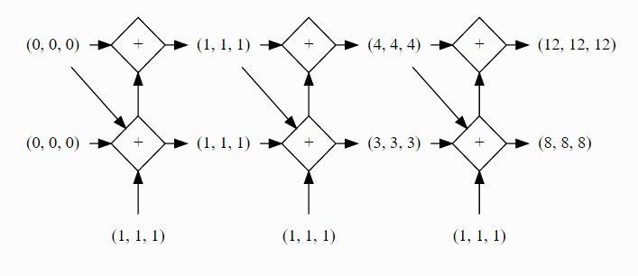

# Deep Learning 相关库简介

本文将从deep learning 相关工具库的使用者角度来介绍下github上stars数排在前面的几个库（tensorflow, keras, torch, theano, skflow, lasagne, blocks)。由于我的主要研究内容为文本相关的工作，所以各个库的分析带有一定主观因素，以RNN模型为主，CNN相关的内容了解得不是特别深入（本文没有比较caffe和mxnet，其实主要原因还是自己C++太久没用了......）。

阅读本文你会了解：

1. 各个库是如何对神经网络中的结构和计算单元进行抽象的；
1. 如何用每个库跑RNN相关的模型；
1. 各个库学习和使用的难以程度对比；
1. 在各个库基础之上进一步改进和开发的难易程度；

本文**不会**涉及：

1. 各个库运行时间效率的对比(我没有自己做过相关的对比实验，但是网上有很多数据可以查)；
1. CNN相关模型的构建（前面提到了自己最近对这块了解得不多）；
1. RNN相关模型的原理和解释（网上很多资料，可以先学习后再进一步阅读）；

## 先说说这几个库之间的大致关系

> 对于一个优秀的深度学习系统，或者更广来说优秀的科学计算系统，最重要的是编程接口的设计。他们都采用将一个领域特定语言(domain specific language)嵌入到一个主语言中。例如numpy将矩阵运算嵌入到python中。这类嵌入一般分为两种，其中一种嵌入的较浅，其中每个语句都按原来的意思执行，且通常采用命令式编程(imperative programming)，其中numpy和Torch就是属于这种。而另一种则用一种深的嵌入方式，提供一整套针对具体应用的迷你语言。这一种通常使用声明式语言(declarative programing)，既用户只需要声明要做什么，而具体执行则由系统完成。这类系统包括Caffe，theano和刚公布的TensorFlow。

以上是摘自[MXNet设计和实现](http://mxnet.readthedocs.org/en/latest/overview_zh.html)中的一段话。理解了这段话后，对后面各个库的进一步理解很有帮助。MXNet的设计者表示融合了这两种编程模式，我们先抛开mxnet，如上所述torch是采用命令式编程，然后theano和tensorflow是采用声明式编程，skflow对常用的tensorflow的封装，lasagne是对theano的封装，blocks除了对theano进行封装之外还提供了额外的处理机制，keras则是用一套接口同时封装了theano和tensorflow。

## 从theano说起

前面说theano是声明式语言，其基本过程可以描述为以下几步：

1. 定义输入变量(x,y)，输出变量(z);
1. 描述变量之间的计算关系(z = x + y);
1. 编译(f = theano.function([x, y], z);
1. 求值(f(1,2))；

那么，如果我想用theano写一个lstm呢？（具体参见[这里](http://deeplearning.net/tutorial/lstm.html))

1. 准备输入变量x及x_mask(维度为 batch_size * sentence_length * vector_size)，目标变量target(维度为batch_size)
1. **定义**并**初始化**lstm**结构单元**中的**参数**(i, f, o, c)
1. 定义好一个scan函数，在scan函数中完成每个结构单元的计算，根据lstm网络的性质，将结构单元的输出导入到下一步的输入。在这里，theano中的scan就是一个加强版的for**循环**
1. 计算loss，采用某种算法更新参数
1. 编译，f = theano.function([x, x_mask, target], loss)
1. 对每个batch求值

注意前面加黑的几个关键词，在后我们将反复看到每个库的设计者对这几个概念的不同理解。

## 接着说tensorflow

tensorflow的设计思想和theano很接近。但是我感觉，tensorflow似乎更强调整体性和结构型。二者的明显区别在于：

1. tensorflow默认有一个Graph的结构，所有添加的结点都是在这个图结构上，但是theano中并没有这个概念。我的理解是这个Graph结构对于变量的管理会方便点。
1. tensorflow目前能够在单机上多卡并行处理，其机制是通过指定gpu来分配计算过程的。因此，可以说其并行机制是数据层面的。而theano需要在载入包之前就指定gpu，

其余的很多地方都是相似的，只是换了名字而已，比如：
tensorflow中的variable对应theano下的共享变量shared variables，
tensorflow中的placeholder对应theano中的tensor变量，
另外tensorflow中为了避免变量的来回复制，其所用的tensor的概念和theano中不太一样

然后来看看tensorflow是怎么实现一个LSTM网络的，与theano不同，tensorflow已经对rnn_cell和lstm_cell做了封装，因此写起来容易了很多。

1. 定义好输入及中间变量
1. 采用**for循环**将每个lstm_cell的输入输出组装起来
1. 剩下的也就没有新意了，计算loss，更新state

我们后面再讨论这种封装方式与其他库的对比。

## 再说torch
torch的代码写起来有点像写matlab，本身torch是一个科学计算的大集合(我感觉只是借了lua这个语言一个外壳，方便和c及c++交互罢了，从这个角度来看，我觉得julia这门语言似乎大有潜力），这里我们主要是讨论其中的nn和rnn模块。

我自己对lua及torch都不是很熟，但是好在语法不复杂，基本都能看懂，建议大家也能花点时间学习下，这样下次看到哪篇paper里实验部分用torch写的时候，不至于完全看不懂。尽管我对torch的了解不深，但是不得不说torch对剩下其它几个库的设计影响非常大！

在torch的nn模块里，首先对整个网络结构做了分类抽象。首先是最顶层的抽象Model，这个里面最基础的就是output和grad_output，记忆中和caffe的抽象是类似的，将计算结果和偏导结果用一个抽象类来表示了。然后是Sequential, Parallel 及 Concat这三个容器。Sequential用于描述网络中一层层的序列关系，典型的就是MLP，Parallel可以用于分别处理输入的不同维度，而Concat则可以用于合并操作。一般来说，我们现在的网络结构都可以通过这三种结构拼接得到。

然后再看看torch的rnn模块中如何构建lstm网络的：

和tensorflow一样，首先是继承自AbstractRecurrent的一个抽象，然后是参数配置和初始化，不同之处在于，其对LSTM中的门结构也做了进一步抽象，最后，用Sequence代替了for循环的功能，从而提供一个完整的网络结构。

## 小结

通过上面的简单描述，我们对这三个基本库有了些大致的印象。

- torch是最庞大的库，如果一开始就选择这个库作为工具的话，还算说得过去，否则学习的代价有点大，因为平常做实验涉及的往往不只是跑跑模型这么简单，还涉及到数据的预处理与分析，相关图表的绘制，对比实验等等。这样一来要学习的东西就比较多了。
- theano由于借用了numpy，scipy等python下科学计算的库，相对torch来说要轻松一些。不过，theano本身并没有像其它两个库一样提供cnn，rnn等模型的抽象类，因此往往不会直接使用theano去写模型。
- tensorflow则更像是为神经网络相关模型而定制的。从顶层设计上就以graph为依托，通过不同的Session来控制计算流。

从库的使用者角度来说，tensorflow和torch都还不错。但是，如果涉及网络结构（这里特指RNN相关的网络）修改，那么torch要相对容易一些，主要是多了一个Gate的抽象，中间参数的处理上不需要太操心，而tensorflow中LSTM和RNN抽象类的耦合比较紧，如果涉及内部结构的修改会稍稍麻烦点，需要重写的方法比较多。

tensorflow开源时间不久，先抛开不计。由于theano缺少对神经网络结构的抽象，而torch中nn模块又设计得很合理，于是后面涌现的基于theano的库多多少少都有所参照。

## Keras

keras设计的level有点高，其设想的就是底层的计算模块是可拔插的。这个功能当然看起来很炫酷，我想用tensorflow就用tensorflow，想用theano就用theano作为计算内核，然而代价也是有的，如果你想改其中的结构，复杂程度立马上去了。我觉得这个库的目标用户仅限于使用现有神经网络单元结构的人。如果你发现某个结构keras里没有？没事，这个项目开发者众多，发起个issue，马上就有人填坑（比如highway network, 我在其它几个库里还没发现，这里居然就有了，虽然并不复杂）。如果你想构造个自己的结构单元？那得了，您还是看看后面几个库吧。

综上所述，keras最大的亮点就是，简洁而全面。正所谓人多力量大嘛！ 由于其底层处于兼容性做了一套自己的封装，想改的话稍显麻烦。

如果你觉得看完keras还不知道怎么用？想来点更简单的？有！sklearn用过把，fit, predict两步即可，傻瓜式操作，人人都是机器学习大神。skflow就是类似的，看名字就知道了。不过是基于tensorflow开发的。我反正是没用过这个库......

## Lasagne

lasagne对网络结构的抽象和上面的几个库有很大的不同，在lasagne中基本抽象单元是Layer，对应到整个神经网络中的一层结构。这个layer可以是cnn也可以是rnn结构，除此之外还有一个MergeLayer，就是多输入多输出的结构。和torch一样，也对Gate门结构做了抽象。

这样设计有好处也有麻烦的地方：

- 好处是，写出来的网络结构很简洁，网络结构的初始化和配置都包含在layer初始化参数里；
- 不方便的地方是，只引入了layer结构抽象层，是在是有些单一，如果能再加一个类似torch中的Sequential结构就perfect了，因为一旦涉及到循环，就不得不回头去使用theano中的scan函数，说实话，scan函数设计得太复杂了点。（当然，作者是不这么认为的，设计者认为lasagne并不是要将theano完全隔离开，相反，lasagne中的所有变量都应该相对theano是透明的Transparency）。

此外，lasagne中LSTM网络的实现与前面的大致相同，实现细节上，lasagne中的lstm类直接继承自MergeLayer，然后内部采用``scan``函数实现，像其它库由于有循环结构的抽象实现，因此每个``lstm_cell``类只需要完成单个结点内部的运算（也即只实现``scan``函数中的``_step``辅助函数）

总的感觉就是，lasagne在类的抽象上并没有过度设计，整个网络中的参数采用自顶向下的宽度优先算法获取，因此，只要你愿意，你可以任意在这个网络上“凿”个洞，得到该局部网络的关系。有一定的扩展性优势。

##Blocks

这个库是我最看好的一个库，作者应该从torch中借鉴了很多思想。

在这个库中，每一个运算都看做是一块砖，这块砖涉及配置、分配、应用和初始化这四步。更重要的一点是，brick与brick之间可以嵌套，从而得到更抽象的brick。这下子解决了我们前面一直碰到的一个问题，：**抽象层次**的把握！前面大多都是根据抽象层次的不同设计各自的类，而blocks通过嵌套将类统一起来，这样我们在设计自己的模块时，可以很方便地选取合适尺寸的brick。

相比lasagne中直接根据layer.get_output来获取参数，blocks采用了ComputationGraph来管理整个网络结构，我的理解是，lasagne的那种方式还是有点野蛮......采用ComputationGraph之后，可以同时制定输入和输出对象，这样即使网络结构变得更复杂了，我们也可以随心所欲指定其中某个部分来更新。

下面用blocks[文档中](http://blocks.readthedocs.org/en/latest/rnn.html)关于rnn的一个模型来说明blocks在个性化定制方面是多么优雅。先看图：

如果要设计这样一个stack的模型，就需要make your hands dirty 了。在lasagne中，这个整体会被看做一个layer，所以需要自己重写一个layer，那跟直接用theano写无异了......keras中也没有提供现有的模型，所以......对于tensorflow和torch来说，需要重写AbstractRecurrent类，从而可以让其接受两个输入。

相比之下Keras提供的解决方案就比较优雅，通过iterate将simplerecurrent在time_step维度上缩短到了1步，然后再将整个连接结构封装起来。（也许其它几个库也有类似的控制，暂时没发现）

当然，除了上面这些抽象层面的易用性，blocks还提供了丰富的可视化调试和控制接口，以及数据预处理的fuel模块。这些功能在整个工程变得越来越臃肿的时候还是很实用的。

## 总结

在了解theano的基础上，如果只是想跑一下现有的模型不关注底层的实现，可以直接用Keras，上手快，模块清晰。如果打算持续投入，涉及大量网络结构改进，推荐使用bricks，其对训练过程的控制有着独特的优势。

另外需要注意的一点是，同样的数据，用不同库的同一个算法时，结果很可能会出现几个点的差异，这往往是不同库中对默认参数的初始化方式不同引起的，需要仔细检查下。