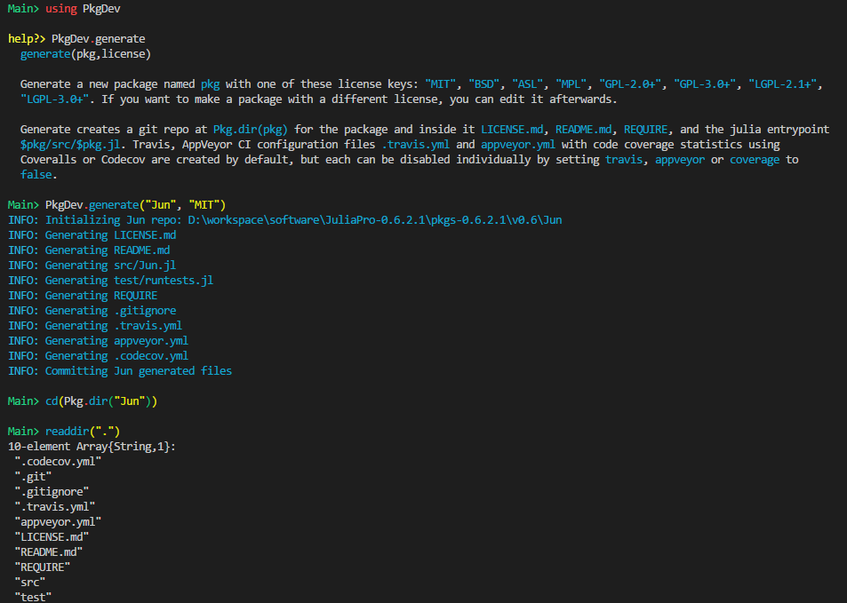

# Julia下的Packages概览

光说不练假把式。本着实用主义的精神，在造轮子之前，不妨先花些时间学习下现有的一些包。

**20180319**

|#|Stars|Link|
|-|-----|----|
|1|1206|[IJulia](http://github.com/JuliaLang/IJulia.jl)|
|2|1131|[Gadfly](http://github.com/GiovineItalia/Gadfly.jl)|
|3|1008|[Mocha](http://github.com/pluskid/Mocha.jl)|
|4|479|[Knet](http://github.com/denizyuret/Knet.jl)|
|5|456|[JuMP](http://github.com/JuliaOpt/JuMP.jl)|
|6|444|[DataFrames](http://github.com/JuliaData/DataFrames.jl)|
|7|443|[Plots](http://github.com/JuliaPlots/Plots.jl)|
|8|433|[DifferentialEquations](http://github.com/JuliaDiffEq/DifferentialEquations.jl)|
|9|416|[PyCall](http://github.com/JuliaPy/PyCall.jl)|
|10|402|[DSGE](http://github.com/FRBNY-DSGE/DSGE.jl)|
|11|331|[Cxx](http://github.com/Keno/Cxx.jl)|
|12|299|[TensorFlow](http://github.com/malmaud/TensorFlow.jl)|
|13|288|[MXNet](http://github.com/dmlc/MXNet.jl)|
|14|287|[Distributions](http://github.com/JuliaStats/Distributions.jl)|
|15|286|[Escher](http://github.com/shashi/Escher.jl)|

## 准备

首先，回顾下文档中关于[Package](https://docs.julialang.org/en/latest/manual/packages/)的介绍。执行`Pkg.add("PkgDev")`后，尝试构建一个新的Package，梳理下Package的基本结构。

- `REQUIRE`文件中目前只有一个`julia 0.6`，深入了解某个Package之前，`REQUIRE`是首先要查看的，每一行表示了一个依赖（一般还会指定相应的版本信息）。
- `.codecov.yml`是代码覆盖率检查，`.travis.yml`和`appveyor.yml`是用来做CI的，这些可以先不管
- `src/`目录下现在还只有一个单独的文件`Jun.jl`
- `test/`目录下只有一个`runtests.jl`

嗯，其实就是个空壳，啥也没有......

未来还有会有`Pkg3`，结构上不太一样了，等这个模块完善了再介绍下。

## Overview

尽管根据star数量来决定学习顺序似乎是个更务实的做法，不过各个库之间的依赖关系很复杂，而且不同库之间的复杂程度也很不一样，我决定从一些基础的开始。

### [Missings.jl][]

[Missings.jl][]这个库简单实用，可以看到，其`REQUIRE`文件只包含

1. julia 0.6
1. Compat 0.45.0

第一行指定了julia的版本（前面提到过，新创建的库中都会包含这行），第二行`Compat`是用来对不同版本的julia提供兼容的。

[Missings]: https://github.com/JuliaData/Missings.jl