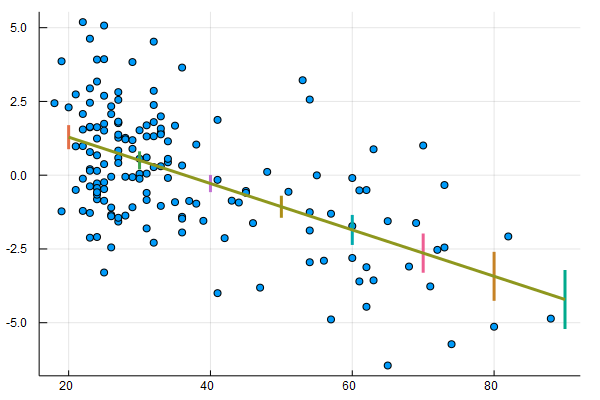
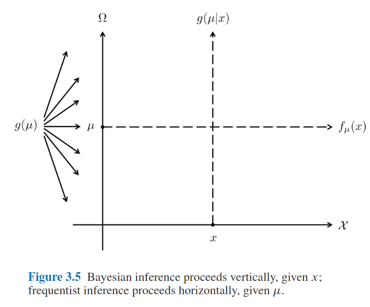
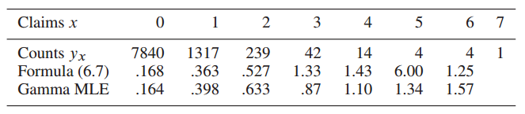
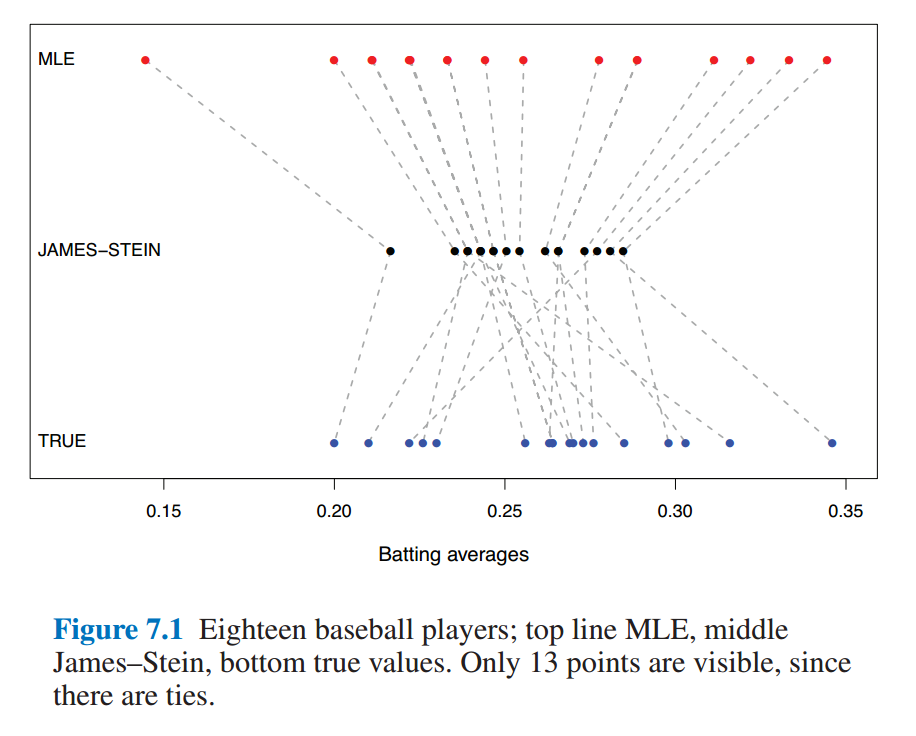
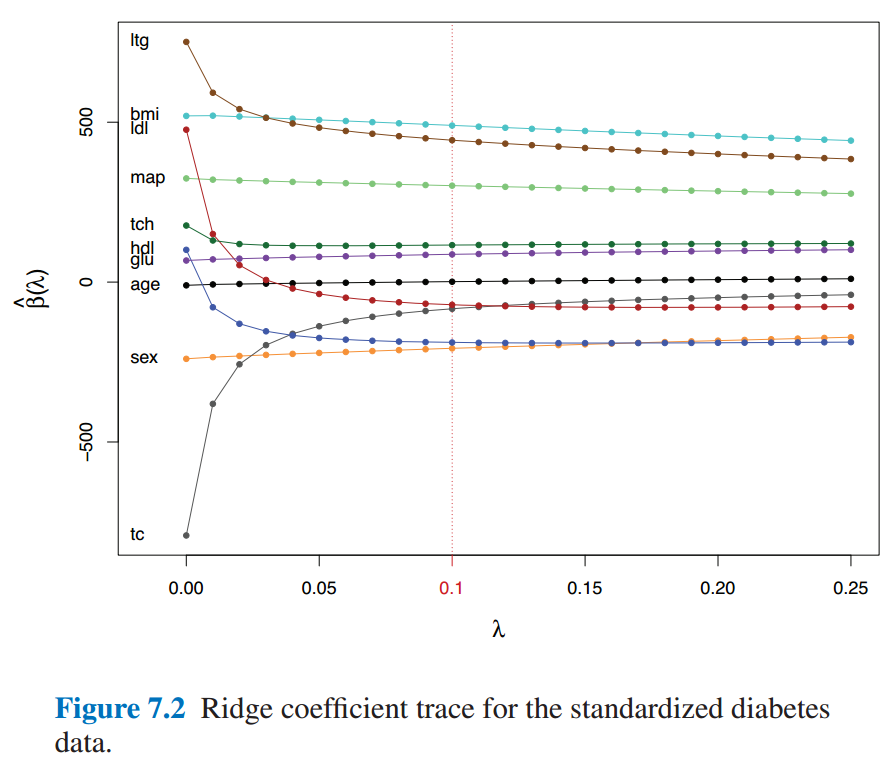
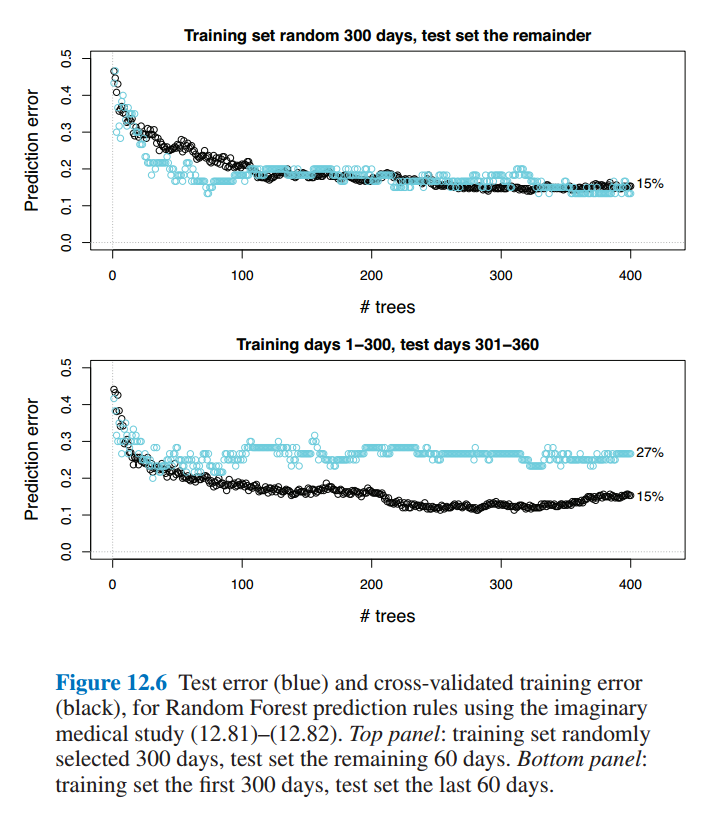

# *Computer Age Statistical Inference* 读书笔记

从MS Library借的这本书，两个作者都很给力，Trevor是ESL的合作者之一，Bradley是bootstrap的inventor。这本书是按照时间顺序展开的，读完有利于对过去几十年里统计推断的一些发展有个更清晰的脉络。这里随手记点笔记。

这本书有对应的[网站](https://web.stanford.edu/~hastie/CASI/index.html)，可以在上面查看电子版，数据集以及讨论等（评论用的disqus，所以需要翻墙的）。

前言里有句话挺有意思：

> Very broadly speaking, algorithms are what statisticians do while inference says why they do them.

# Ch1 Algorithms and Inference

书中举了个回归的例子，先用线性回归拟合了年龄与肾脏Tot指数之间的关系。顺便复习下标准差的计算：

$$
\begin{equation}
\sigma_{\bar{x}} = \frac{\sigma}{\sqrt{n}}
               \approx \sqrt{\frac {\sum_{i=1}^{n} (x_i - \bar{x})^2} {n(n-1)} }
\end{equation}
\label{se}
$$

上式中，$\sigma$是整体的标准差，这里用样本的标准差来近似。关于如何计算线性估计的置信区间，可以看看[Simple_linear_regression](https://en.wikipedia.org/wiki/Simple_linear_regression)，以及[Standard Errors for Regression Equations.pdf](Standard Errors for Regression Equations.pdf)。下面我用Julialang复现了下图一。

```julia
using CSV
using Plots
using StatPlots
using DataFrames
using GLM

gr()
cd(raw"D:\workspace\github\blog-py\blog\static\essay_resources\Notes_on_Computer_Age_Statistical_Inference") 

kidney = CSV.read("kidney.csv", nullable=false)
@df kidney scatter(:age, :Tot)

X = hcat(ones(nrow(kidney)), kidney[:age])
y = kidney[:Tot]
OLS = fit(LinearModel, X, y)
# GLM.LinearModel{GLM.LmResp{Array{Float64,1}},GLM.DensePredChol{Float64,Base.LinAlg.Cholesky{Float64,Array{Float64,2}}}}:

# Coefficients:
#        Estimate Std.Error  t value Pr(>|t|)
# x1      2.86067  0.359561  7.95603   <1e-12
# x2   -0.0786009 0.0090557 -8.67972   <1e-14

age_samples = collect(20:10:90)
Xtest = hcat(ones(length(age_samples)), age_samples)
pred = predict(OLS, Xtest, :confint)

for i in 1:size(pred, 1)
    y_pred, y_lower, y_upper = pred[i, :]
    display(plot!([age_samples[i],age_samples[i]], [ y_lower, y_upper], linewidth = 3))
end

plot!(age_samples[[1, end]], pred[[1, end], 1], legend=:none, linewidth=3)
savefig("Figure_1_1.png")
```



此外书中还用lowess和bootstrap方法拟合了该数据集，暂时对这二者不太熟，后面深入学习了再试着复现下。另外，Julia中的GLM这个库，感觉还是不够完善，对DataFrame的支持不是特别好，跟R语言是没法比的了，不过也还凑合，等我多一些Julia经验了去完善下。

第二个例子是假设检验。首先选取了两种白血病人中第136号基因的活跃性作为对比，根据t检验的结果，按照一般的理解，应该得出0.0036的显著性假设（即该基因的活跃性有很大的区分度）。然而，该基因只是7128个基因指标中的一个，这又让该结果显得不那么令人感到惊讶，于是捎带引出了false-discovery-rate的概念。

我的理解是，作者在第一章用这两个例子是想让读者理解**Statistical Inference**的概念。比如，第一个回归的例子中，用线性回归（或者其它多项式回归）来拟合观测数据（即Algorithm），然后再用Standard Error（或者lowess,bootstrap standard error等）衡量误差（即Inference）；第二个例子中，用t检验来检测Null Hypothesis，然后再用false-discovery-rate来衡量假设检验的结果。书中提到，这就有点像[Tukey](https://en.wikipedia.org/wiki/John_Tukey)提出的**explanation-confirmation**系统，当然，作者认为如今Algorithm和Inference的概念要远比这二者更广泛。

# Ch2 Frequentist Inference

假设我们观测到了211个肾脏病人的gfr（glomerular filtrate rate 肾小球过滤率）指标 $\boldsymbol{x} = (x_1, x_2, ..., x_n)$，该指标在所有肾脏病人中的分布为$F$（该分布是未知的），那么$\boldsymbol{X} = (X_1, X_2,...X_n)$可以看作是n次从$F$中独立采样的结果，记作：

$$
\begin{equation}
F \rightarrow \boldsymbol{X}
\end{equation}
$$

然后，假设我们想要得到的是从$F$中每一次随机采样的期望（注意下面式中的$X$不是粗体的），即：

$$
\begin{equation}
\theta = E_F \{X \}
\end{equation}
$$

因此，需要根据已有的观测数据$\boldsymbol{x}$估计出$\theta$，

$$
\begin{equation}
\hat{\theta} = t(\boldsymbol{x})
\end{equation}
\label{2.4}
$$

接下来很关键的一点，理解原书中的公式(2.5)，即：

$$
\begin{equation}
\hat{\Theta} = t(\boldsymbol{X})
\end{equation}
\label{2.5}
$$

$\eqref{2.4}$和$\eqref{2.5}$的联系在于$\boldsymbol{x}$可以看作是$\boldsymbol{X}$的一个sample，因而$\theta$也可以看作是$\Theta$的一个实例。这样，频率学派的Inference可以定义为:

> The accuracy of an observed estimate $\hat{\theta} = t(\boldsymbol{x})$ is the probabilistic accuracy of $\hat{\Theta} = t(\boldsymbol{X})$ as an estimator of $\theta$（这句话有点绕，好难翻译，先贴个原文）

通常我们关心bias和variance，即：

$$
\begin{equation}
\mu = E_F\{\hat{\Theta}\}
\end{equation}
$$

$$
\begin{equation}
\mathrm{bias} = \mu - \theta \quad \mathrm{and} \quad \mathrm{var} = E_F\{(\hat{\Theta} - \mu )^2\}
\end{equation}
$$

实际使用中，通常会有一些折中手段，最常见的就是直接plug-in(其实就是$\eqref{se}$中的近似处理)

$$
\begin{equation}
se(\bar{X}) = [\mathrm{var}_F(X) / n]^{1/2}
\end{equation}
$$

其中$\mathrm{var}_F(X)$可以根据观测样本$\boldsymbol{x}$来估计：

$$
\begin{equation}
\hat{\mathrm{var}}_F = \sum (x_i - \bar{x})^2 / (n-1)
\end{equation}
$$

所谓的plug-in就是直接用$\hat{\mathrm{var}}_F(X)$去替换$\mathrm{var}_F(X)$。

其它的几种做法在后面章节会有提及（重点看下pivotal statistics，比较另类）。

Ch2.2部分提到的likelihood ratio的思想似乎在其它地方见到过。

# Ch3 Bayesian Inference

理解贝叶斯推断和频率学推断之间关系的关键在这章：

$$
\begin{equation}
\mathcal{F} = \{ f_{\mu}(x);\ x \in \mathcal{X}, \mu \in \Omega\}
\end{equation}
$$

这里$x$是采样空间$\mathcal{X}$中的一个样本（可能是一维的，也可能是多维的），而参数$\mu$是参数空间$\Omega$中的一个采样。书中举了两个$f$的例子（正态分布和泊松分布）来解释$\mathcal{X}$和$\Omega$的具体含义，这里不赘述。在频率学派中，$\mu$是固定的，我们希望通过观测值得到其估计并推断出误差，而在贝叶斯推断中，$\mu$是服从某种概率分布的，其先验为$g(\mu)$，我们希望推断出$g(\mu|x)$的分布。根据贝叶斯定理可以得出：

$$
\begin{equation}
g(\mu|x) = g(\mu) f_{\mu}(x) / f(x), \qquad \mu \in \Omega
\end{equation}
$$

这里$f(x)$是$\mu$在$\Omega$下的边缘分布。

3.2部分有意思的是第二个example，作者用心良苦，引出了均匀先验、Jeffrey先验和Triangle先验。

3.4部分对二者做了完整的比较，对于低维参数，下图非常形象（对于高维情况有所不同，书中有阐述）：



# Ch4 Fisherian Inference and Maximum Likelihood Estimation

似乎，MLE刚出来的时候并不太受待见（计算太复杂）。

Fisher Information的核心是log似然相对于x微分的variance，这部分的推导以前没接触过，只是粗略知道说，MLE估计附近近似服从$\hat{\theta} \sim \mathcal{N}(\theta, \sigma^2/n)$。

放在这一章介绍Fisher Inference，是因为它有点介于贝叶斯和频率派分析之间，用的是频率派的那一套，不过分析的是MLE。

这一章里还提到了Cramer–Rao lower bound，后面再回过头来详细讲讲这个。

# Ch5 Parametric Models and Exponential Families

这一章容纳的知识点有点多。目前为止所接触到模型的参数维度都还较低（不超过20维），与之对应的一个概念是**非参数**（nonparametric）。早期之所以青睐这类参数模型在数学上处理起来方便（mathematical tractability）。

首先介绍了一些常见的分布（Normal、Poisson、Binomial、Gamma、Beta），这里需要对这类分布之间的关系有个基本的熟悉，然后是多元正态分布的一些性质。比较重要的是式子（5.16），（5.17）和（5.18），多元正态分布可以被拆解，由此也引出了后面5.3节多参分布簇的Fisher's Information Bound，中间的推导有点复杂，不过最后的结论很重要（在其他地方有读到过），MLE$\mu_1$的variance总是随着冗余参数的增加而上升的，这就导致最大似然以及其它近似无偏估计的方法都会过度关注“其它”参数（就是建模过程中必要但非我们关心的参数），而如今的应用都包含上千个这类参数，因而某些情况下，有偏估计反而更合适。

此外，（5.21）的结论在后面也有用到，即$\mu$根据观测值$x$得到的后验分布也是正态分布(其均值和方差的性质在第7章有用到)：

$$
\begin{equation}
\mu| x \sim \mathcal{N} \left(M + \frac{A}{A + \sigma^2}(x-M), \frac{A\sigma^2}{A + \sigma^2}\right)
\end{equation}
$$

5.4节将多项分布与单纯形（Simplex）以及泊松分布之间的联系描述得很清楚。

> Nonparametrics, and the multinomial, have played a larger role in the modern environment of large, difficult to model, data sets

没太理解5.4节结尾这句话，留着回头再看看。最后5.5节以泊松分布为例，将前面的那些分布上升到了指数簇的一般形式，这部分深究起来，还需要补许多知识点。

# Ch6 Empirical Bayes

6.1中的例子很巧妙，*Robbins' Formula*，借用泊松分布的性质，在计算边缘分布的时候将先验消去了，然后根据样本估计得出参数期望的估计。这里稍微展开讲下，6.2也会用到。

某一年中，欧洲的一家汽车保险公司有9461个投保人，其中7840人没有发生索赔，1317人有1起索赔，239人有2起索赔...(如下图所示)



假设每个投保人在一年中索赔的次数服从以下泊松分布：

$$
\begin{equation}
Pr\{x_k = x\} = p_{\theta_k}(x) = e^{-\theta_k}\theta^x_k / x!
\label{6_1}
\end{equation}
$$

其中，$\theta_k$是$x_k$的期望（回顾下泊松分布的性质）。假设我们已经知道了$\theta$的先验分布$g(\theta)$，根据贝叶斯定理：

$$
\begin{equation}
E\{\theta | x \}= \frac{\int^\infty_0 \theta p_\theta (x) g(\theta) \ d\theta}{\int^\infty_0 p_\theta (x) g(\theta) \ d\theta}
\label{6_2}
\end{equation}
$$

然后，将$\eqref{6_1}$带入$\eqref{6_2}$中，就得到了下式：

$$
\begin{equation}
E\{\theta | x\} = (x+1) f(x+1) / f(x)
\end{equation}
$$

其中边缘分布$f(x)$为：

$$
\begin{equation}
f(x) = \int^\infty_0 p_\theta(x) g(\theta) \ d\theta = \int^\infty_0 \left[e^{-\theta} \theta^x / x! \right] g(\theta) \ d\theta
\end{equation}
$$

这里用$x$在样本中的比例来作为$f(x)$的估计值：

$$
\begin{equation}
\hat{f}(x) = y_x / N, \quad \mathrm{with} \ N = \sum_x y_x
\end{equation}
$$

这样在不知道先验分布的情况下也完成了估计。6.2中的例子思想有点类似，但是感觉技巧性更强点......求期望的时候做了个指数展开。

6.3中用一个完整的例子阐述了如何估计先验分布的参数，作者在这里是想强调21世纪以来，统计学的一些变化（逐渐在接纳indirect evidence）。

# Ch7 James-Stein Estimation and Ridge Regression

这章花了不少时间来理解，仍然有许多细节没捋清楚，先记下些要点。借助第五章的内容，先得出了$\boldsymbol{\hat{\mu}} ^ {Bayes}$与$\boldsymbol{\hat{\mu}} ^ {MLE}$的均方差期望之间相差一个系数$B$，其估计值为：

$$
\begin{equation}
\hat{B} = 1 - (N - 3) / S \qquad \left[S= \sum^N_{i=1} (x - \bar{x})^2 \right]
\end{equation}
$$

然后$\boldsymbol{\hat{\mu}}^{JS}$是$\boldsymbol{\hat{\mu}}^{Bayes}$的一个plug-in，那么，当$N \gt 3$的时候，$\boldsymbol{\hat{\mu}}^{JS}$的risk更低（即所谓的shrinkage）。当然，根据James–Stein Theorem，该性质其实不受先验分布假设的影响。

7.2部分用一个实际的例子，阐述了James-Stein的over-shrinking特性。



7.3是熟悉的Ridge Regression，参数$\lambda$会对稀疏化程度有影响。



有点相当于给$\beta$增加在0附近的先验(当然也有许多其他解释，书中提了下就一笔带过了）。

7.4对一类Corner Case做了解释和说明，尽管risk降低了，但是毕竟是有偏估计（这在某些情况下是不能接受的）。

# Ch8 Generalized Linear Models and Regression Trees

略过，GLM相关的内容此处讲得很简略，有其它书讲得更细致。

# Ch9 Survival Analysis and the EM Algorithm

略过，这部分内容不是特别感兴趣。

# Ch10 The Jackknife and the Bootstrap

在有计算机之前，泰勒展开几乎是计算一些复杂指标的唯一方法。jackknife是1957年提出的，而bootstrap则是1979年。jackknife的思想很简单，但不得不佩服其开创性，从形式上有点像*留一交叉验证(LOOCV)*：

$$
\begin{equation}
\hat{se}_{jack} = \left[ \frac{n-1}{n} \sum_1^n \left( \hat{\theta}_{(i)}  - \hat{\theta}_{(.) }\right)^2 \right] ^{1/2}
\end{equation}
$$

其中$\hat{\theta}_{(i)}$是去掉样本$x_i$之后的估计， $\hat{\theta}_{(.)}$则是前者的平均：$ \sum_1^n \hat{\theta}_{(i)} / n$

Bootstrap则往前再迈了一步，原来$\hat{\theta}$的估计可以看作是分两步得到的：首先从概率分布$F$中得到样本$\boldsymbol{x}$，然后根据某种计算方式$s(.)$得到估计值$\hat{\theta}$：

$$
\begin{equation}
F \xrightarrow{\text{iid}} \boldsymbol{x} \xrightarrow{s} \hat{\theta}
\end{equation}
$$

而Bootstrap的做法则是，将$F$替换成了样本空间$\hat{F}$，于是计算过程为：

$$
\begin{equation}
\hat{F} \xrightarrow{\text{iid}} \boldsymbol{x^*} \xrightarrow{s} \hat{\theta}^*
\end{equation}
$$

关于bootstrap总结的部分，有意思的一点是，通常，B=200足够用来估计标准差$\hat{se}_{boot}$，如果要计算bootstrap的置信区间，则可以需要1000或更多次的采样。

10.3中的多种重采样方案是对前面用bootstrap估计标准差的一些扩展，与前面Simplex的思想进行了统一。

# Ch11 Bootstrap Confidence Intervals

如果分布近似正态分布，那么可以用经典的$\hat{\theta} \pm 1.96 \hat{se}$估计出95%区间，但对于有偏分布而言，如泊松分布，该估计并不准。这一章就是解释用Bootstrap估计置信区间的一些做法。Percentile的做法比较好理解，积分后利用transformation invariance特性，即可完成估计。后面Bias-Corrected方法理解不深。11.6提到了贝叶斯区间，大概是一般教科书中都有详细阐述，这里只是简单提及了下。

# Ch12 Cross-Validation and $C_p$ Estimates of Prediction Error

虽然一直在实验里用CV，但是很少有了解过其细节，这一章对其演变历史有了很好地阐述。12.4部分阐述的现象在以前打比赛的时候经常碰到（时序预测问题中训练集/验证集划分的问题）。



# Ch13 Objective Bayes Inference and Markov Chain Monte Carlo

Ah, 终于到了贝叶斯推断。大多数内容在其它地方读到过，记下几点印象深刻的。

Gibbs采样的做法是将其它变量积分掉了再采样，而MCMC的做法则是先随机候选样本然后决定接受或拒绝。想要详细了解恐怕这几页是不够的，不过这本书的好处就在于提供了很丰富的参考文献。

抽象出来看，Gibbs采样和MCMC的做法相当于是从参数空间$\Omega$中采样得到了一个子空间$A$，然后替换掉贝叶斯公式中的边缘分布。（13.4有详细讲解）

# Ch15 ~ Ch21

这部分内容先不读了，几乎每一章都可以找本书来读，等以后有具体需要了再串起来读下。