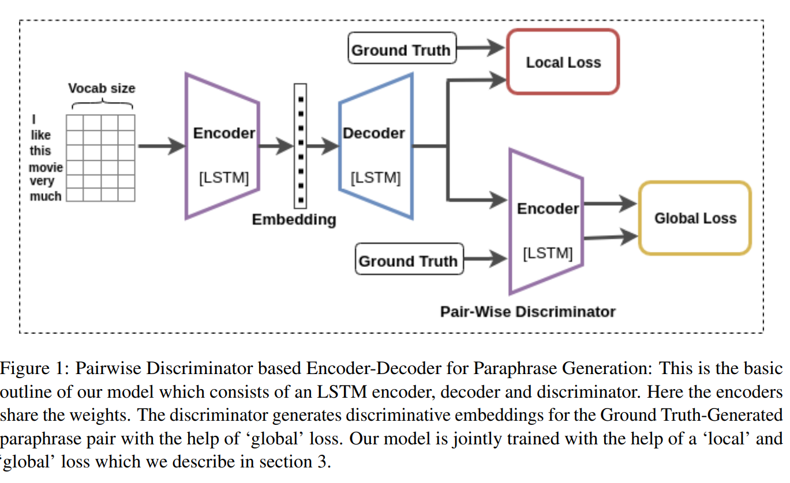
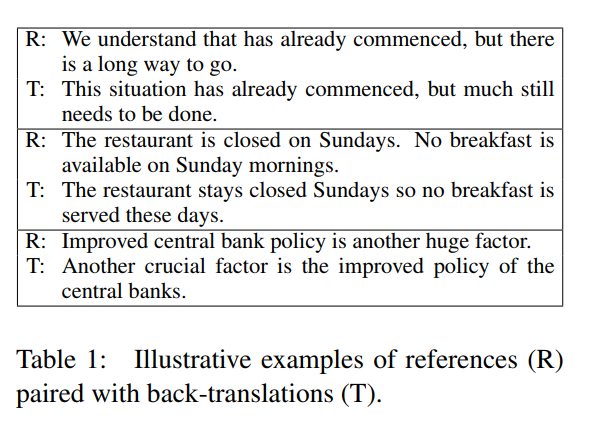
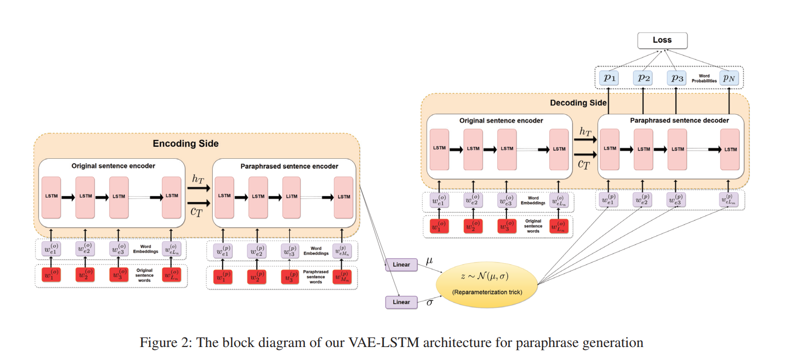
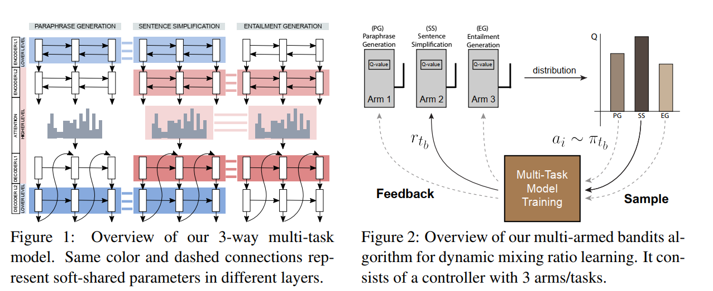
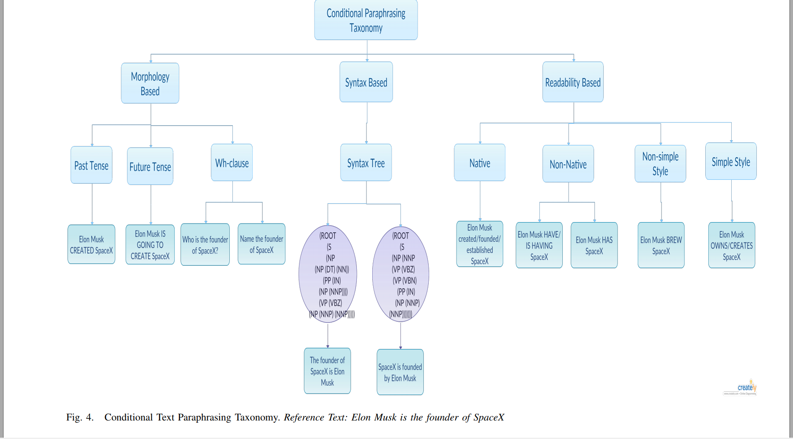
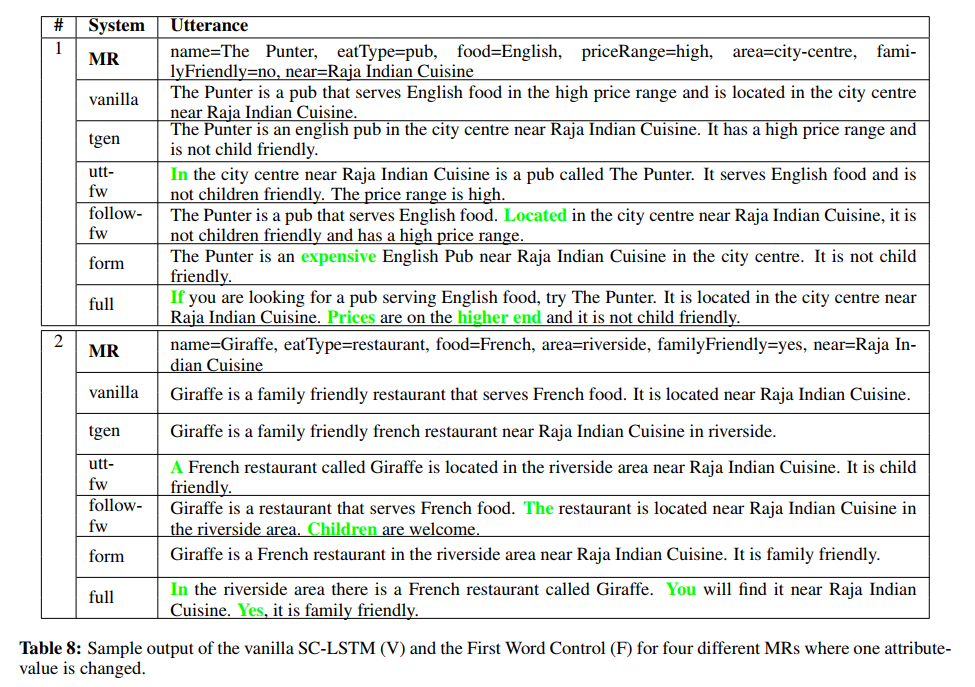

# Paraphrase Generation

## Paper List

- [Paraphrase Generation with Deep Reinforcement Learning](./papers/Paraphrase_Generation_with_Deep_Reinforcement_Learning.pdf)
    - Neural paraphrase generation recently draws attention in different application scenarios. The task is often formalized as a sequence-to-sequence (Seq2Seq) learning problem. Prakash et al. (2016) employ a stacked residual LSTM network in the Seq2Seq model to enlarge the model capacity. Cao et al. (2017) utilize an additional vocabulary to restrict word candidates during generation. Gupta et al. (2018) use a variational auto-encoder framework to generate more diverse paraphrases. Ma et al. (2018) utilize an attention layer instead of a linear mapping in the decoder to pick up word candidates. Iyyer et al. (2018) harness syntactic information for controllable paraphrase generation. Zhang and Lapata (2017) tackle a similar task of sentence simplification withe Seq2Seq model coupled with deep reinforcement learning, in which the reward function is manually defined for the task. Similar to these works, we also pretrain the paraphrase generator within the Seq2Seq framework. The main difference lies in that we use another trainable neural network, referred to as evaluator, to guide the training of the generator through reinforcement learning.

    - There is also work on paraphrasing generation in different settings. For example, Mallinson et al. (2017) leverage bilingual data to produce paraphrases by pivoting over a shared translation in another language. Wieting et al. (2017); Wieting and Gimpel (2018) use neural machine translation to generate paraphrases via back-translation of bilingual sentence pairs. Buck et al. (2018) and Dong et al. (2017) tackle the problem of QA-specific paraphrasing with the guidance from an external QA system and an associated evaluation metric.

- [Semantic Parsing via Paraphrasing](./papers/Semantic_Parsing_via_Paraphrasing.pdf)
    - Canonical utterance construction Given an utterance x and the KB, we construct a set of candidate logical forms Zx, and then for each z 2 Zx generate a small set of canonical natural language utterances Cz. Our goal at this point is only to generate a manageable set of logical forms containing the correct one, and then generate an appropriate canonical utterance from it. This strategy is feasible in factoid QA where compositionality is low, and so the size of Zx is limited (Section 4)
    - Paraphrasing We score the canonical utterances in Cz with respect to the input utterance x using a paraphrase model, which offers two advantages. First, the paraphrase model is decoupled from the KB, so we can train it from large text corpora. Second, natural language utterances often do not express predicates explicitly, e.g., the question “What is Italy’s money?” expresses the binary predicate CurrencyOf with a possessive construction. Paraphrasing methods are well-suited for handling such text-to-text gaps. 

- [Paraphrase Detection in NLP(Slide)](./slides/Paraphrase_Detection_in_NLP.pdf)
- [Neural Paraphrase Generation with Stacked Residual LSTM Networks(2016)](./papers/Neural_Paraphrase_Generation_with_Stacked_Residual_LSTM_Networks.pdf)
    - Some *old* encoder decoder methods
- [Learning Semantic Sentence Embeddings using Pair-wise Discriminator](./papers/Learning_Semantic_Sentence_Embeddings_using_Pair_wise_Discriminator.pdf)
    - An application of paraphrase
    
- [Learning Paraphrastic Sentence Embeddings from Back-Translated Bitext](./papers/Learning_Paraphrastic_Sentence_Embeddings_from_Back_Translated_Bitext.pdf)
    
    - ...finding clear differences in length, the amount of repetition, and the use of rare words.

- [Pushing the Limits of Paraphrastic Sentence Embeddings with Millions of Machine Translations](./papers/Pushing_the_Limits_of_Paraphrastic_Sentence_Embeddings_with_Millions_of_Machine_Translations.pdf)
    Much larger compared above

- [Deep Reinforcement Learning for Sequence to Sequence Models](./papers/Deep_Reinforcement_Learning_for_Sequence_to_Sequence_Models.pdf)
    - Using RL to address the following two questions:
        - 1) exposure bias
        - 2) inconsistency between train/test measurement
- [Get To The Point: Summarization with Pointer-Generator Networks](./papers/Get_To_The_Point_Summarization_with_Pointer_Generator_Networks.pdf)
    - First, we use a hybrid pointer-generator network that can copy words from the source text via pointing, which aids accurate reproduction of information, while retaining the ability to produce novel words through the generator.
    - Second, we use coverage to keep track of what has been summarized, which discourages repetition.
- [A Deep Generative Framework for Paraphrase Generation](./papers/A_Deep_Generative_Framework_for_Paraphrase_Generation.pdf)
    
- [Semantic Structural Evaluation for Text Simplification](./papers/Semantic_Structural_Evaluation_for_Text_Simplification.pdf)
    We presented the first structure-aware metric for
text simplification, SAMSA, and the first evaluation experiments that directly target the structural
simplification component, separately from the lexical component. 
- [Dynamic Multi-Level Multi-Task Learning for Sentence Simplification](./papers/Dynamic_Multi_Level_Multi_Task_Learning_for_Sentence_Simplification.pdf)
    
- [Integrating Transformer and Paraphrase Rules for Sentence Simplification](./papers/Integrating_Transformer_and_Paraphrase_Rules_for_sentence_simplification.pdf)
- [Conditional Text Paraphrasing A Survey and Taxonomy](./papers/Conditional_Text_Paraphrasing_A_Survey_and_Taxonomy.pdf)
    
- [A Deep Ensemble Model with Slot Alignment for Sequence-to-Sequence Natural Language Generation](./papers/A_Deep_Ensemble_Model_with_Slot_Alignment_for_Sequence-to-Sequence_Natural_Language_Generation.pdf)
    - Slot Alignment
- [Evaluating the State-of-the-Art of End-to-End Natural Language Generation: The E2E NLG Challenge(80 pages /2019/07/24)](./papers/Evaluating_the_State-of-the-Art_of_End-to-End_Natural_Language_Generation_The_E2E_NLG_Challenge.pdf)
- [Constrained-Decoding-for-Neural-NLG-from-Compositional-Representations-in-Task-Oriented-Dialogue.pdf](./papers/Constrained-Decoding-for-Neural-NLG-from-Compositional-Representations-in-Task-Oriented-Dialogue.pdf)
    - (1) propose using tree-structured semantic representations, like those used in traditional rule-based NLG systems, for better discourse-level structuring and sentence-level planning;
    - (2) introduce a challenging dataset using this representation for the weather domain;
    - (3) introduce a constrained decoding approach for Seq2Seq models that leverages this representation to improve semantic correctness;
    - (4) demonstrate promising results on our dataset and the E2E dataset
- [Syntactic Manipulation for Generating More Diverse and Interesting Texts](./papers/Syntactic_Manipulation_for_Generating_More_Diverse_and_Interesting_Texts.pdf)
    - Syntactic Controled LSTM
    