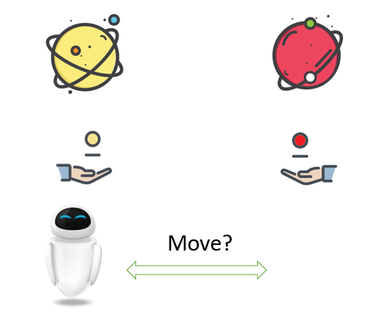
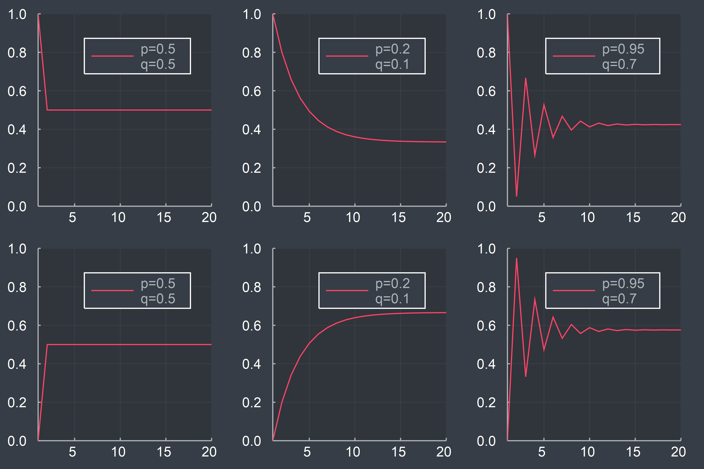
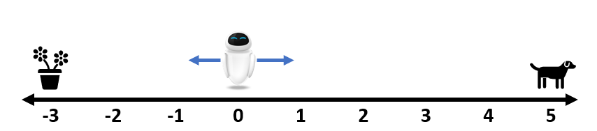
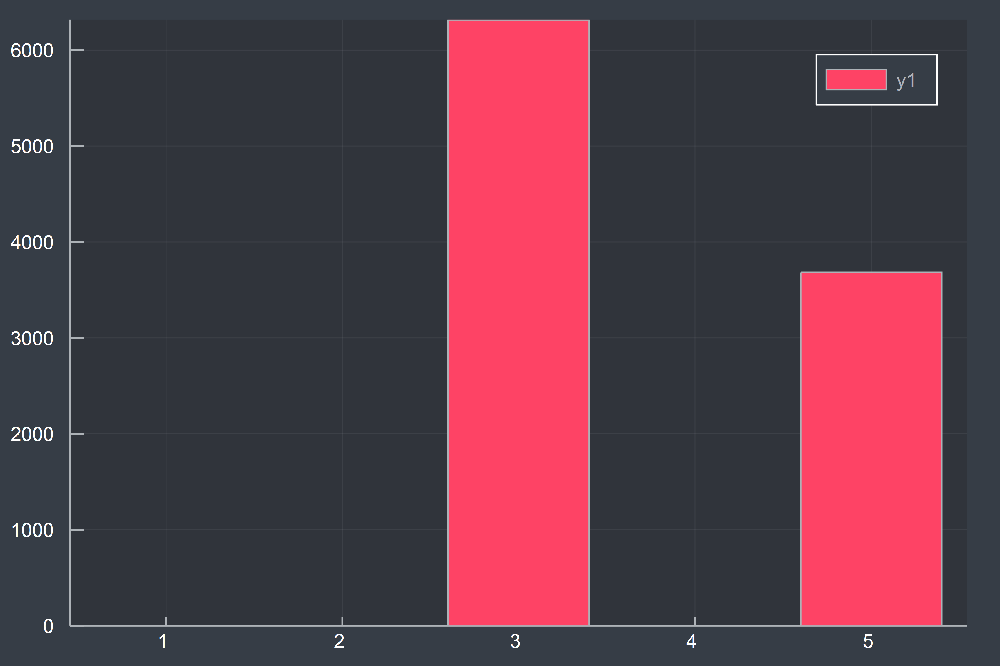
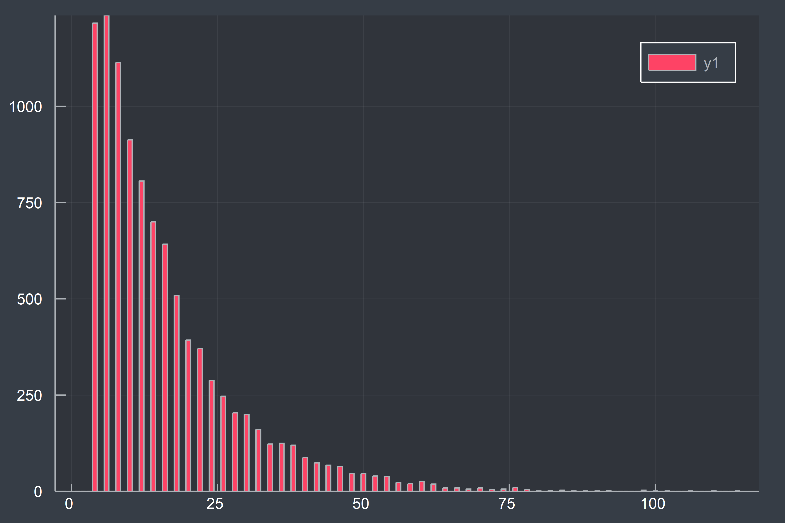
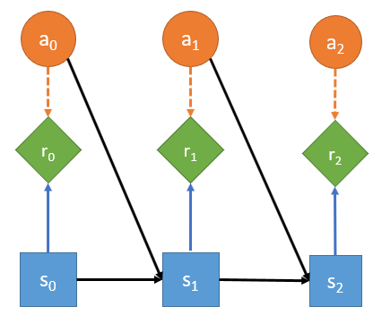
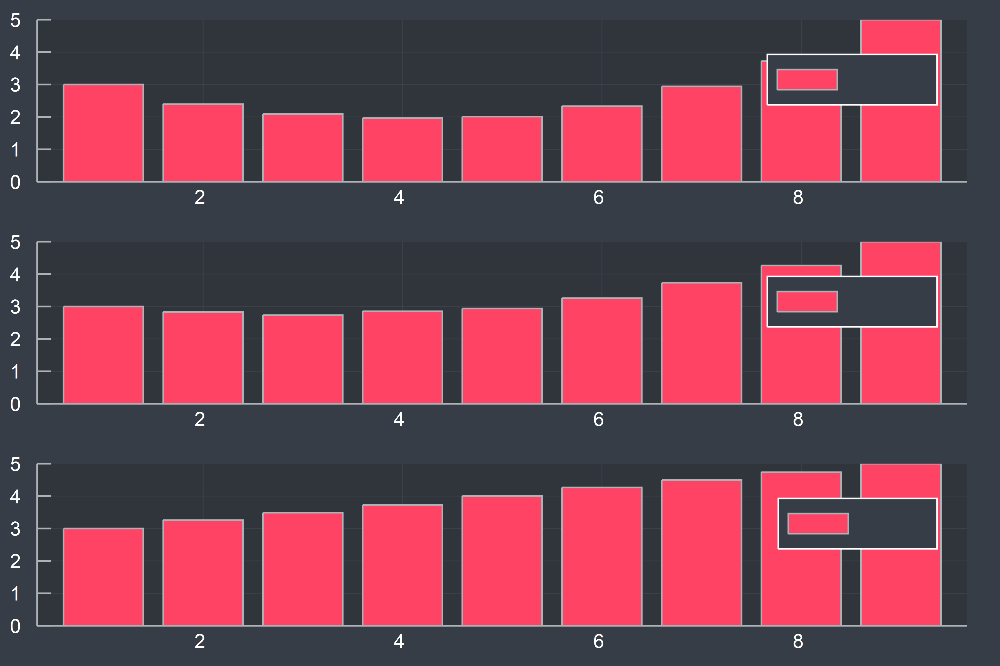
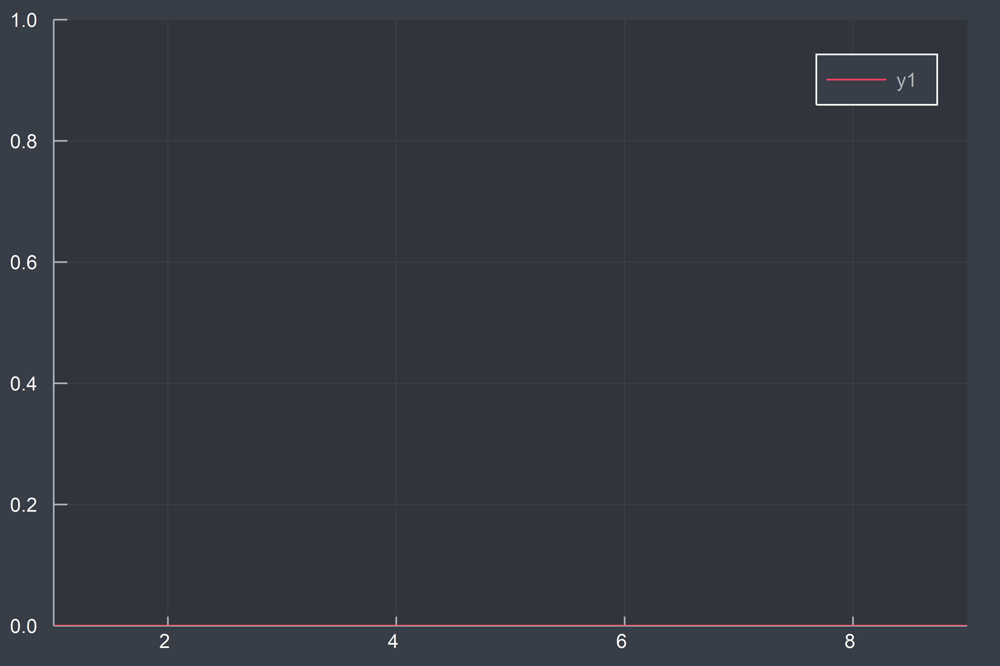
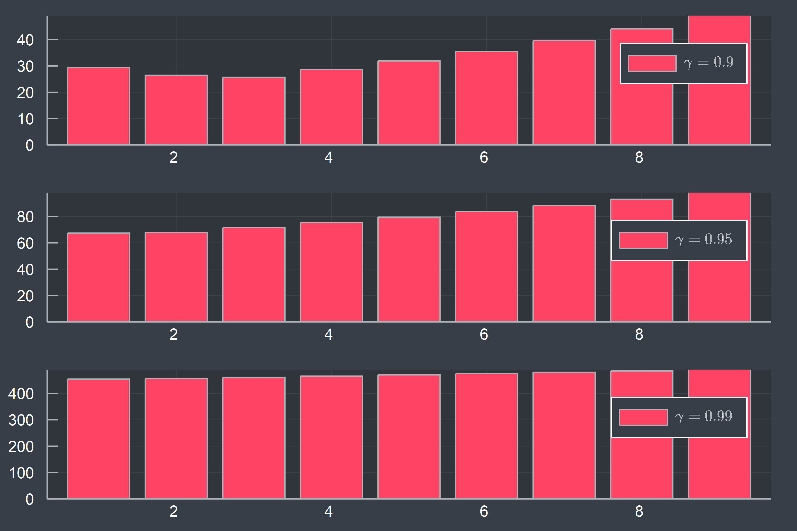
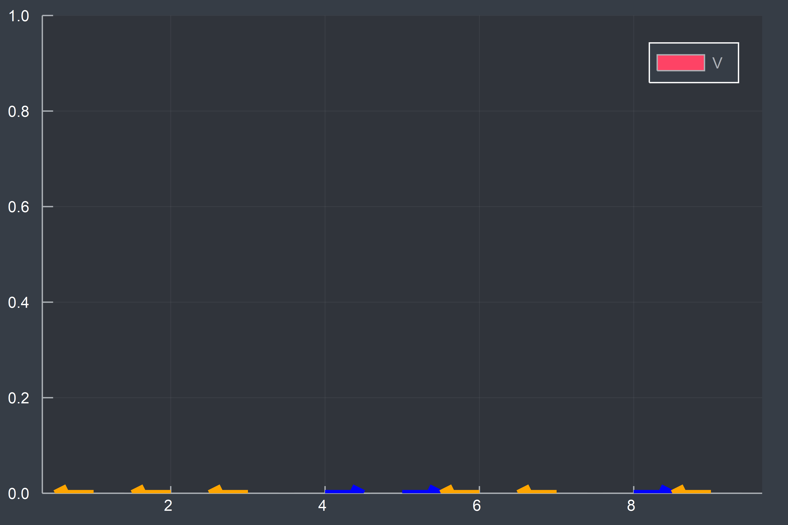

# 强化学习实战[updating]

[等我用Julia写个RL的库了再来继续更新。]

我一直希望找到一篇长文，能从实用的角度讲清楚强化学习。一年过去了，我决定自己动手写这样一篇文章。

## 编程语言

本文将使用Julia作为主要的编程语言来实现Reinforcement Learning中的大多数算法。

Why Julia?事实上，我更乐意使用Clojure，然而其基础工具库实在太匮乏，不得不放弃。Why not Python?我只是单纯觉得Julia写出来的代码更好看！不过阅读本文并不需要读者熟练掌握Julia，只需要有基本的编程思想即可，我会尽量将Julia这门语言独有的内容降到最低（必要的时候会给出解释和参考文献）。

# 1. Tabular Methods

> “昨夜西风凋碧树，独上高楼，望尽天涯路。”

## 1.1 Day 1: Where's Eve?



假设某个虚拟的世界中只有两个星球（黄色星球[Y]和红色星球[R]），每个星球上各有一枚硬币（正面朝上的概率本别是$p$, $q$），我们的机器人朋友Eve的初始位置在左边的黄色星球上($s_0=Y$)，接下来，它每天都尝试投掷当前所在星球上的硬币，如果正面朝上，那么它移动到另外一个星球上，否则呆在原地不动。于是，我们可以计算出第$t$天Eve处于黄色星球的概率:$P(s_t=Y)=P(s_{t-1}=Y)(1-p) + P(s_{t-1}=R)(q)$，类似的，处于红色星球的概率为：$P(s_t=R) = P(s_{t-1}=Y)(p) + P(X_{t-1}=R)(1-q)$.将其写成概率转移矩阵的形式如下：

$$
\begin{equation}
\boldsymbol{P} = \left( \begin{matrix} 1-p & p \\
q & 1-q \end{matrix} \right)
\end{equation}
$$

于是，$t$时刻Eve所处状态的概率为：

$$
\begin{equation}
\boldsymbol{s}_t = \boldsymbol{s}_0 \boldsymbol{P}^t
\end{equation}
$$
这里，$\boldsymbol{s}_0=(1,0)$，即初始状态处于左边的黄色星球。由于该概率转移矩阵的特殊性质，$\boldsymbol{s}_t$最终会收敛到一个稳态。下图为$(p,q)$分别取(0.5,0.5),(0.2, 0.1),(0.95,0.7)时，$\boldsymbol{s}_t$的收敛过程：



假设我们的机器人Eve落在了一条数轴的原点处，它的任务是寻找到生命，在-3和5处分别有一盆花和一只小狗，Eve每天只能选择向左或向右移动一个单位，只要发现生命（花或者狗）后，任务便结束，然后Eve返回并获得相应的奖励（假设奖励分别是3和5，其它位置没有奖励）。 显然，对于这样一个简单而且确定的问题而言，有多种搜索的方法得到解，这里先假设Eve并不知道环境是确定的。



现在先给出如下定义：

- $\mathcal{A}$：Actions, **动作空间**,在这里包含两种可能``{:left, :right}``
- $a_t$: 在$t$时刻采取的行动
- $\mathcal{S}$: States, **状态空间**，这里就是Eve所有可能的位置``{-3, -2, -1, 0, 1, 2, 3, 4, 5}``
- $s_t$: 在$t$时刻所处的状态
- $\mathcal{R}$:所有可能的奖励，这里由三个离散值``{0, 3, 5}``构成
- $R_t$：每一天获得的奖励，特别地，我们将游戏结束时的时间记为$T$，任务结束时获得的奖励为$R_T$

假设Eve很笨，它的记忆只有一天（并不记得它曾走过哪些地方），每天只会等概率地随机选择向左或向右移动，将其记作**策略**$\pi$（尽管目前还只是随机游走，谈不上什么策略）。我们先观察以下两个指标：

1. $\bar{R_T} = \frac{\sum_{i=1}^{N} R_T^i}{N}$，N次试验的平均收益(``3.746``)
  
2. $\bar{T} = \frac{\sum_{i=1}^{N} T^i}{N}$，N次试验平均行动的次数(``16.164``)
  

平均收益只有3.7左右，离最优解（5）还有点距离，此外平均实验次数居然到了16次。接下来，我们将一步步放松约束条件，改进Eve的行动策略。

这里先将前面Eve与环境交互的过程用下图抽象出来：



每一步的reward只由当前时刻的state和action共同决定（这里对于Eve来说，每天的reward其实只与state相关，环境并不受Eve的行动影响，当然，真实情况要比这复杂得多，我们一步步来），而下一时刻的state则只受上一个时刻的state和action共同决定。

## 1.2 Day 2: The Value of State

某一天，Eve感到很迷茫，它不知道未来这么走下去，收益究竟有多少，我们可以给Eve算一下未来收益的总和$G$：

$$
\begin{equation}
G_t = R_t + R_{t+1} + R_{t+2} ...
\end{equation}
$$

不过，Eve可能并不这么认为，同样的收益，第5天得到还是第3天得到对于Eve来说有着不同的意义（显然后者的意义更大），所以不妨给每天的收益增加一个基于时间的折扣系数$\gamma$（这么做有许多好处，数学上处理起来更方便，而且对于infinite的问题也更容易求解，当然，根据实际问题不同，你完全可以设计不同的$G_t$计算方式，比如averaged reward）。

$$
\begin{equation}
G_t = R_t + \gamma R_{t+1} + \gamma^2 R_{t+2} + ...
\end{equation}
$$

那么，根据Eve在$t$时刻所处的状态不同，假设可以算出收益的期望，称作value function:

$$
\begin{equation}
V_t(s) = \mathbb{E}(G_t | s) = \mathbb{E}(R_t + \gamma R_{t+1} + \gamma^2 R_{t+2} + ... | s)
\label{value_equation}
\end{equation}
$$
从上帝视角来看，在环境不发生变化的情况下，显然每个状态s都有一个对应的固定的$V(s)$，这样，每次Eve决定怎么走的时候，只需要看下这张表，从可以到达的所有状态中，找到价值最高的状态$s'$，跳转过去即可。现在问题变成了如何计算$V(s)$。我们不妨先模拟下，将Eve放在不同的位置，然后分别执行原来的随机策略，计算平均收益$\hat{G_t}$，来估计$V(s)$。



看起来上图似乎符合我们的直观感受。$\gamma$越大，我们就越是看重长期收益，反之则更看重短期收益。

不过，对我们的机器人Eve来说，手上并没有这样一张表，前面虽然通过模拟得到了这样一张表，但是效率还很低。那是否能找到解析解呢？首先引入状态转移的概念，这里Eve每一时刻所处的状态只与其上一时候所处的状态（和行动）有关，不受更早时候状态（和行为）的影响（即具有Markov性质），于是有：

$$
\begin{equation}
P(s'|s) = \sum_{a \in A} P(s' | s, a)
\end{equation}
$$

对于前面Eve机器人随机策略而言，对应的概率转移矩阵为：

$$
\begin{equation}
\begin{bmatrix}
1.0  &0 &0 &0 &0 &0 &0 &0 &0         \\
0.5 &0 & 0.5  &0 &0 &0 &0 &0 &0      \\
0   &0.5 &0 & 0.5 &0 &0 &0 &0 &0      \\
0 &0   &0.5 &0 & 0.5 &0 &0 &0 &0     \\
0 &0 &0   &0.5 &0 & 0.5 &0 &0 &0    \\
0 &0 &0 &0   &0.5 &0 & 0.5  &0 &0  \\
0 &0 &0 &0 &0   &0.5 &0 & 0.5 &0  \\
0 &0 &0 &0 &0 &0   &0.5 &0 & 0.5 \\
0 &0 &0 &0 &0 &0 &0   &0 & 1.0 \\
\end{bmatrix}
\end{equation}
$$

于是，$\eqref{value_equation}$可以写成：

$$
\begin{equation}
V_t(s) = R_t(s) + \gamma \sum_{s' \in S} P(s' | s) V_{t+1}(s')
\end{equation}
$$

上式构建了不同时刻的价值函数之间的关系，在这里由于状态转移函数是固定的，最终会达到一个稳态（TODO: 这里需要展开说下，MRP），即：

$$
\begin{equation}
\begin{bmatrix}
V^*(s_1) \\
\dots \\
V^*(s_N) 
\end{bmatrix} = 
\begin{bmatrix}
R(s_1) \\
\dots \\
R(s_N) 
\end{bmatrix} + \gamma \begin{bmatrix}
P(s_1|s_1) & \dots &P(s_N|s_1)\\
\vdots  &\ddots &\vdots \\
P(s_1|s_N) &\dots &P(s_N|s_N) 
\end{bmatrix}
\begin{bmatrix}
V^*(s_1) \\
\dots \\
V^*(s_N) 
\end{bmatrix}
\end{equation}
$$

采用矩阵的表示方法即是：

$$
\begin{equation}
\begin{split}
\boldsymbol{V} &= \boldsymbol{R} + \gamma \boldsymbol{P V}\\
\boldsymbol{V} &= (\boldsymbol{I} - \gamma \boldsymbol{P})^{-1} \boldsymbol{R}
\end{split}
\end{equation}
$$

```julia
P = diagm(repmat([0.5], 8), 1) + diagm(repmat([0.5], 8), -1)
P[1,1], P[1,2], P[end, end-1], P[end, end] = 1, 0, 0, 1
V(γ) = (diagm(ones(9)) -  γ*P)^-1 * R
show(V(0.9))
# [30.0, 19.9416, 14.3146, 11.8686, 12.0601, 14.9316, 21.1213, 32.0046, 50.0]
show(V(0.95))
# [60.0, 48.1992, 41.4721, 39.1104, 40.8656, 46.9225, 57.9186, 75.0113, 100.0]
show(V(0.99))
# [300.0, 301.464, 309.018, 322.814, 343.132, 370.383, 405.115, 448.032, 500.0]
```

稠密矩阵求逆的复杂度为$O(n^3)$（TODO: 这里需要插入相关文献），接下来，我们将分别采用Value Iteration和 Policy Iteration来求解。

### Value Iteration

让我们先从上帝视角来看看这个问题。我们的本意是希望得到一张表，让Eve每次行动的时候，能够查看它从当前位置往左和往右走的期望价值，然后从中选出期望价值最大的行动$a$作为决策Policy的结果。显然，最糟糕的情况下，我们需要遍历所有的可能$|A|^{|S|}$，不过通过Value Iteration，我们可以先找到稳态的$V(s)$，然后直接得出最优的Policy。可以证明在最优策略下（TODO: Reference Needed Here, Bellman Function），价值函数满足以下式子：

$$
\begin{equation}
V^*(s) = \underset{a \in A}{max} \left( R(s, a) + \gamma \sum_{s' \in S}P(s' | s,a) V^*(s') \right)
\end{equation}
$$

于是，我们可以先随机初始化$V(s)$，然后根据上式迭代计算并更新，直至收敛。下图动态地展示了该过程：



不同gamma对应的稳态Value:



在得到稳态的$V^*$之后，即可根据下式得到对应的最优Policy：

$$
\begin{equation}
\pi(s) \leftarrow \underset {a \in A} {arg \ max} \left( R(s, a) + \gamma \sum_{s' \in S}P(s' | s,a) V^*(s') \right)
\end{equation}
$$

### Policy Iteration

Policy Iteration的思想是，先将所有状态对应的$V$置为0（也可以根据先验设置相应的值），针对每个状态，先随机初始化一个action(或根据前面设置的先验调整),记为$\pi_0$，在给定Policy之后，我们可以算出下一步所有状态对应的$V(s')$，即(Policy Evaluation)：

$$
\begin{equation}
V^{\pi}_t (s) = R(s, \pi(s)) + \gamma \sum_{s' \in S} P(s'|s, \pi(s)) V^{\pi}_{t+1}(s')
\end{equation}
$$

然后根据新得到的$V_{t+1}(s)$,重新调整Policy，使得每个state对应的action都是朝着$V(s'|s)$最大的方向在移动，即（Policy update）:

$$
\begin{equation}
\pi_{k+1}(s) = \underset {a \in A} {arg \ max} \left( R(s,a) + \gamma \sum_{s' \in S} P(s' | s, a) V^{\pi_k}(s') \right)
\end{equation}
$$

如此迭代，直至Policy不再变化。如何证明最优呢？（TODO: 单调性）



## 1.3 Day 3: Monte Carlo Methods in Depth

在前面1.2中，我们尝试将Eve的起点放在不同位置，然后计算每次实验结束时reward的期望的估计值，从而用来评价不同状态作为起始点的重要性。不过，在大多数问题中，我们关注的不仅仅是某一状态作为初始状态的情况。

**First Visit Monte Carlo Method** 方法的思想就是，Agent在做出一次尝试之后，得到状态的序列$s_0, s_1, ... s_T$（将其想象成搜索空间中的一条路径），以及最终的$r$，然后，将该reward分配给路径上的第一次遇到的状态，重复多次之后，计算每个状态上r的平均值作为该状态的价值估计（显然，也不一定限制在first visit的state，只是这样处理更自然些）。假设我们对state之间的转换关系很清楚（即已知**model**），那么剩下的任务就是每次往前看一步，找到最优的state，跳转过去即可。对于model未知的情况，则需要考虑(state, action) pair，然后根据前面first visit的方法更新对应pair的价值，最后，在每个状态下找到使得pair的value最大的action即可。

类比前面的Policy Iteration过程，这里我们同样可以借用MC得到的q value，然后迭代优化。（其实就是Generalized Policy Iteration的一种）这里有两个前提假设：

1. exploring starts （引入 $\epsilon$-soft解决该问题）
1. infinite number of episodes （根据GPI中的思想，一步步优化）

### Off-Policy MC

首先区分behavior policy 和 target policy(可以是某种固定的贪心算法)。根据behavior policy得出一条序列，然后按照重要性采样更新value。（TODO:这里需要展开）

### MCTS

TODO: 这个需要讲个专题

## 1.4 Day 4: Temporal-Difference Learning

在前面MC部分中，我们需要等到一个episode结束后，得到最终的reward，然后用其更新state value，TD的思想则是，只需走一步，然后利用两步之间state value的差分修正上一步的state value(learn a guess from a guess, model free)。

$$
\begin{equation}
V(S_t) \leftarrow V(S_t) + \alpha (R_{t+1} + \gamma V(S_{t+1} - V(S_t)))
\end{equation}
$$

### SARSA

直接学习action value。

$$
\begin{equation}
Q(S_t, A_t) \leftarrow Q(S_t, A_t) + \alpha (R_{t+1} + \gamma Q(S_{t+1}, A_{t+1}) - Q(S_t, A_t))
\end{equation}
$$

变种，Expected SARSA

$$
\begin{equation}
\begin{split}
Q(S_t, A_t)  & \leftarrow Q(S_t, A_t) + \alpha (R_{t+1} + \gamma \mathbb{E} (Q(S_{t+1}, A_{t+1} | S_{t+1}) - Q(S_t, A_t)) \\
& \leftarrow Q(S_t, A_t) + \alpha (R_{t+1} + \gamma \sum_{a} \pi(a|S_{t+1}) Q(S_{t+1}, a) - Q(S_t, A_t)) 
\end{split}
\end{equation}
$$

Q-Learning

$$
\begin{equation}
Q(S_t, A_t) \leftarrow Q(S_t, A_t) + \alpha (R_{t+1} + \gamma \ \underset {a } {max} \ Q(S_{t+1}, a) - Q(S_t, A_t))
\end{equation}
$$

<div class="alert alert-info">
关于SARSA和Q-Learning的对比，可以参考这里的<a href="https://www.google.co.jp/search?q=sarsa+and+q+learning&oq=sarsa+and+q&aqs=chrome.0.0j69i57j0l4.3086j0j1&sourceid=chrome&ie=UTF-8">Youtube</a>链接。
</div>


进一步，[Double Q-Learning][]，算是一种off-policy，behavior和target随机相互学习。摘要部分说得很清楚了：

> In some stochastic environments the well-known reinforcement learning algorithm Q-learning performs very poorly. This poor performance is caused by large overestimations of action values. These overestimations result from a positive bias that is introduced because Q-learning uses the maximum action value as an approximation for the maximum expected action value. We introduce an alternative way to approximate the maximum expected value for any set of random variables. The obtained double estimator method is shown to sometimes underestimate rather than overestimate the maximum expected value. 

# 2. Approximate Methods

> “衣带渐宽终不悔，为伊消得人憔悴。”

# 3. Deep Reinforcement Learning

> “众里寻他千百度，蓦然回首，那人却在灯火阑珊处。”

# 参考文献

## Books

1. [Reinforcement Learning: An Introduction. Second edition][]
1. [Decision Making Under Uncertainty Theory and Application][]
1. [Artificial Intelligence: Foundations of Computational Agents, 2nd Edition][]
1. [Approximate Dynamic Programming: Solving the Curses of Dimensionality, 2nd Edition][]
1. [Dynamic Programming and Optimal Control][]
1. [Reinforcement Learning State of the Art][]
1. [reinforcement learning and dynamic programming using function approximators][]

[Reinforcement Learning: An Introduction. Second edition]: http://incompleteideas.net/book/the-book-2nd.html
[Decision Making Under Uncertainty Theory and Application]: https://mitpress.mit.edu/decision-making-under-uncertainty
[Artificial Intelligence: Foundations of Computational Agents, 2nd Edition]: http://artint.info/
[Approximate Dynamic Programming: Solving the Curses of Dimensionality, 2nd Edition]: http://adp.princeton.edu/
[Dynamic Programming and Optimal Control]: http://www.athenasc.com/dpbook.html
[Reinforcement Learning State of the Art]: https://link.springer.com/book/10.1007%2F978-3-642-27645-3
[reinforcement learning and dynamic programming using function approximators]: http://rlbook.busoniu.net/

## Papers

1. [Double Q-Learning][]

[Double Q-Learning]: https://papers.nips.cc/paper/3964-double-q-learning.pdf