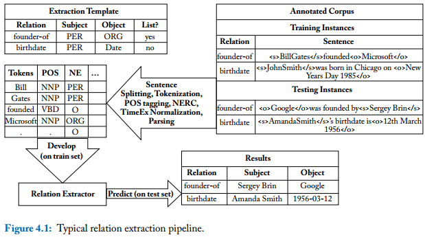
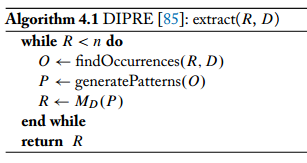
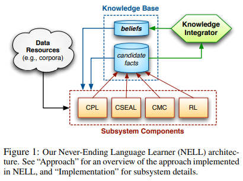
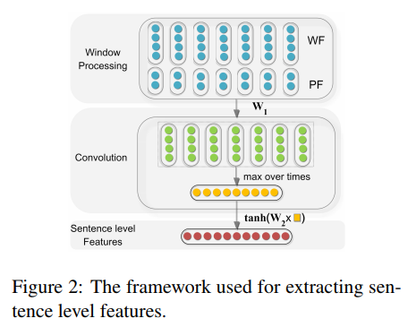
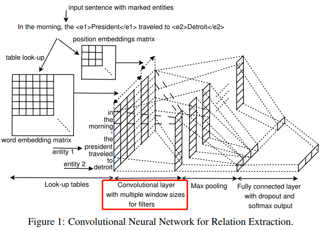
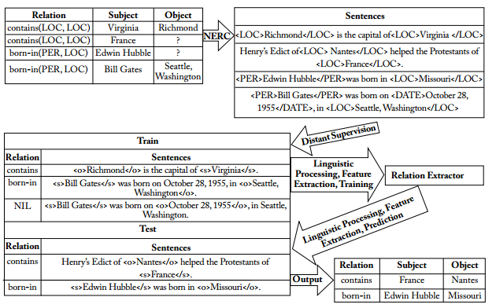
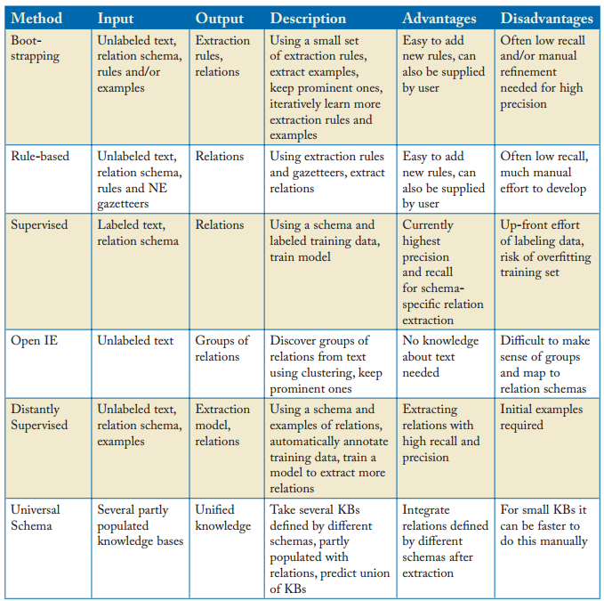

# Relation Extraction

By **Jun Tian**

Slides/Papers/Data are removed. (2021-08-12)

2018-03-21

The task of relation extraction(RE) is to extract links between pairs of nominals.

> Given a sentence $S$ with annotated pairs of nominals $e_1$ and $e_2$, we aim to identify the relations between $e_1$ and $e_2$.

Typical relation types include *birthdate(PER, DATE)*, and *founder-of(PER, ORG)*, with examples for relations being *birthdate(John Smith, 1985-01-01)* or *founder-of(Bill Gates, Microsoft)*.

## Survey

### Papers

1. ⭐⭐⭐[Pawar, Sachin, Girish K. Palshikar, and Pushpak Bhattacharyya. "Relation Extraction: A Survey." arXiv preprint arXiv:1712.05191 (2017).][]
1. ⭐⭐⭐[Maynard, Diana, Kalina Bontcheva, and Isabelle Augenstein. "Natural language processing for the semantic web." Synthesis Lectures on the Semantic Web: Theory and Technology 6.2 (2016): 1-194.][]
  Chapter 4. Relation Extraction.
1. ⭐⭐[Li, Juanzi, et al. "Knowledge Graph and Semantic Computing."][]
  P50. A Survey on Relation Extraction
1. [Kumar, Shantanu. "A Survey of Deep Learning Methods for Relation Extraction." arXiv preprint arXiv:1705.03645 (2017).][]
  Mostly are CNN

### Slides

1. ⭐⭐⭐[Learning Semantic Relations from Text 2015 EMNLP](Paper/2015_EMNLP_Nakov_tutorial_Semantic_Relations.pdf)
1. [Relation Extraction 2013](Paper/cse517wi13-RelationExtraction.pdf)
1. [A-survey-on-Relation-Extraction-Slides.pdf](Paper/A-survey-on-Relation-Extraction-Slides.pdf)

## Approaches

### Bootstrapping Methods

1. ⭐[Brin, Sergey. "Extracting patterns and relations from the world wide web." International Workshop on The World Wide Web and Databases. Springer, Berlin, Heidelberg, 1998.][]
  
1. [Etzioni, Oren, et al. "Web-scale information extraction in knowitall:(preliminary results)." Proceedings of the 13th international conference on World Wide Web. ACM, 2004.][]
1. ⭐[Carlson, Andrew, et al. "Toward an architecture for never-ending language learning." AAAI. Vol. 5. 2010.][]
  
1. [Pedro, Saulo DS, and Estevam R. Hruschka. "Conversing learning: Active learning and active social interaction for human supervision in never-ending learning systems." Ibero-American Conference on Artificial Intelligence. Springer, Berlin, Heidelberg, 2012.][]

### Rule Based Approaches

There are two different types of rule-based approaches:

- Those which are stand-alone (**poor recall**, unable to generalize to **unseen patterns**).
- Those which learn rules for inference to complement other relation extraction approaches.

1. [Soderland, Stephen G. Learning text analysis rules for domain-specific natural language processing. Diss. University of Massachusetts at Amherst, 1997.][]
1. [Reiss, Frederick, et al. "An algebraic approach to rule-based information extraction." Data Engineering, 2008. ICDE 2008. IEEE 24th International Conference on. IEEE, 2008.][]
1. ⭐[Dong, Xin, et al. "Knowledge vault: A web-scale approach to probabilistic knowledge fusion." Proceedings of the 20th ACM SIGKDD international conference on Knowledge discovery and data mining. ACM, 2014.][]
  This starts with a pair of entities that are known to be in a relation according to a (seed) knowledge base, then performs random walk over the knowledge graph to find other paths that connect these entities.

### Supervised Approaches

**Pros**: Best performance, provided that a sufficient amount of labeled training data is available.
**Cons**: Labeled training data is expensive to produce and thus limited in quantity.

#### Traditional Methods

Typical features:

- n-grams of words to left and right of entities;
- n-grams of POS of words to left and right of entities;
- flag indicating which entity came first in sentence;
- sequence of POS tags and bag of words (BOW) between the two entities;
- dependency path between subject and object;
- POS tags of words on the dependency path between the two entities; and
- lemmas on the dependency path.
- relation embeddings

1. [Kambhatla, Nanda. "Combining lexical, syntactic, and semantic features with maximum entropy models for extracting relations." Proceedings of the ACL 2004 on Interactive poster and demonstration sessions. Association for Computational Linguistics, 2004.][]

#### Neural Network Methods

1. ⭐⭐⭐[Socher, Richard, et al. "Semantic compositionality through recursive matrix-vector spaces." Proceedings of the 2012 joint conference on empirical methods in natural language processing and computational natural language learning. Association for Computational Linguistics, 2012.][]
1. [Hashimoto, Kazuma, et al. "Simple customization of recursive neural networks for semantic relation classification." Proceedings of the 2013 Conference on Empirical Methods in Natural Language Processing. 2013.][]
1. [Zhang, Dongxu, and Dong Wang. "Relation Classification: CNN or RNN?." Natural Language Understanding and Intelligent Applications. Springer, Cham, 2016. 665-675.][]

##### Convolution Neural Network

1. ⭐⭐⭐[Zeng, Daojian, et al. "Relation classification via convolutional deep neural network." Proceedings of COLING 2014, the 25th International Conference on Computational Linguistics: Technical Papers. 2014.][]
  Lexical and sentence level features.
  
1. [Nguyen, Thien Huu, and Ralph Grishman. "Relation extraction: Perspective from convolutional neural networks." Proceedings of the 1st Workshop on Vector Space Modeling for Natural Language Processing. 2015.][]
  
1. [Santos, Cicero Nogueira dos, Bing Xiang, and Bowen Zhou. "Classifying relations by ranking with convolutional neural networks." arXiv preprint arXiv:1504.06580 (2015).][]
  Ranking is introduced.
1. [Xu, Kun, et al. "Semantic relation classification via convolutional neural networks with simple negative sampling." arXiv preprint arXiv:1506.07650 (2015).][]
1. ⭐[Lin, Yankai, et al. "Neural relation extraction with selective attention over instances." Proceedings of the 54th Annual Meeting of the Association for Computational Linguistics (Volume 1: Long Papers). Vol. 1. 2016.][]

##### Recurrent Neural Network

1. [Zhang, Dongxu, and Dong Wang. "Relation classification via recurrent neural network." arXiv preprint arXiv:1508.01006 (2015).][]
1. [Zhang, Shu, et al. "Bidirectional long short-term memory networks for relation classification." Proceedings of the 29th Pacific Asia Conference on Language, Information and Computation. 2015.][]
1. [Xu, Yan, et al. "Classifying relations via long short term memory networks along shortest dependency paths." Proceedings of the 2015 Conference on Empirical Methods in Natural Language Processing. 2015.][]
1. [Zhou, Peng, et al. "Attention-based bidirectional long short-term memory networks for relation classification." Proceedings of the 54th Annual Meeting of the Association for Computational Linguistics (Volume 2: Short Papers). Vol. 2. 2016.][]

##### Joint Extraction/End-to-End

1. [Roth, Dan, and Wen-tau Yih. A linear programming formulation for global inference in natural language tasks. ILLINOIS UNIV AT URBANA-CHAMPAIGN DEPT OF COMPUTER SCIENCE, 2004.][]
1. [Li, Qi, and Heng Ji. "Incremental joint extraction of entity mentions and relations." Proceedings of the 52nd Annual Meeting of the Association for Computational Linguistics (Volume 1: Long Papers). Vol. 1. 2014.][]
1. [Miwa, Makoto, and Yutaka Sasaki. "Modeling joint entity and relation extraction with table representation." Proceedings of the 2014 Conference on Empirical Methods in Natural Language Processing (EMNLP). 2014.][]
1. [Miwa, Makoto, and Mohit Bansal. "End-to-end relation extraction using lstms on sequences and tree structures." arXiv preprint arXiv:1601.00770 (2016).][]
1. ⭐[Zheng, Suncong, et al. "Joint entity and relation extraction based on a hybrid neural network." Neurocomputing 257 (2017): 59-66.][]
1. [Ma, Xuezhe, and Eduard Hovy. "End-to-end sequence labeling via bi-directional lstm-cnns-crf." arXiv preprint arXiv:1603.01354 (2016).][]
1. [Liu, Yang, et al. "Implicit Discourse Relation Classification via Multi-Task Neural Networks." AAAI. 2016.][]
1. ⭐⭐[Sun, Mingming, et al. "Logician: A Unified End-to-End Neural Approach for Open-Domain Information Extraction." Proceedings of the Eleventh ACM International Conference on Web Search and Data Mining. ACM, 2018.][]

##### Deep Reinforcement Learning

1. ⭐⭐⭐[Zeng, Xiangrong, et al. "Large Scaled Relation Extraction with Reinforcement Learning." Relation 2 (2018): 3.][]
1. ⭐⭐[Feng, Jun, et al. "Reinforcement Learning for Relation Classification from Noisy Data." (2018).][]
1. ⭐⭐⭐[Narasimhan, Karthik, Adam Yala, and Regina Barzilay. "Improving information extraction by acquiring external evidence with reinforcement learning." arXiv preprint arXiv:1603.07954 (2016).][]
1. [Feng, Yuntian, et al. "Joint Extraction of Entities and Relations Using Reinforcement Learning and Deep Learning." Computational intelligence and neuroscience 2017 (2017).][]

### Unsupervised Approaches

**Pros**: Leverage large amounts of data and extract large numbers of relations.

1. [Yates, Alexander, et al. "Textrunner: open information extraction on the web." Proceedings of Human Language Technologies: The Annual Conference of the North American Chapter of the Association for Computational Linguistics: Demonstrations. Association for Computational Linguistics, 2007.][]
  Learn a **CRF** over POS tags and NP chunks. A Self-Supervised Classifier is also used.
1. [Yan, Yulan, et al. "Unsupervised relation extraction by mining wikipedia texts using information from the web." Proceedings of the Joint Conference of the 47th Annual Meeting of the ACL and the 4th International Joint Conference on Natural Language Processing of the AFNLP: Volume 2-Volume 2. Association for Computational Linguistics, 2009.][]
1. [Kinoshita, Keisuke, et al. "The REVERB challenge: A common evaluation framework for dereverberation and recognition of reverberant speech." Applications of Signal Processing to Audio and Acoustics (WASPAA), 2013 IEEE Workshop on. IEEE, 2013.][]
  Address some issues in TextRunner.(Read the paper for details.)
1. [Angeli, Gabor, Melvin Jose Johnson Premkumar, and Christopher D. Manning. "Leveraging linguistic structure for open domain information extraction." Proceedings of the 53rd Annual Meeting of the Association for Computational Linguistics and the 7th International Joint Conference on Natural Language Processing (Volume 1: Long Papers). Vol. 1. 2015.][]
  Attention is first introduced.
1. [Wang, Linlin, et al. "Relation classification via multi-level attention cnns." Proceedings of the 54th Annual Meeting of the Association for Computational Linguistics (Volume 1: Long Papers). Vol. 1. 2016.][]

### Distant Supervision Approaches

1. [Craven, Mark, and Johan Kumlien. "Constructing biological knowledge bases by extracting information from text sources." ISMB. Vol. 1999. 1999.][]
1. ⭐⭐⭐[Mintz, Mike, et al. "Distant supervision for relation extraction without labeled data." Proceedings of the Joint Conference of the 47th Annual Meeting of the ACL and the 4th International Joint Conference on Natural Language Processing of the AFNLP: Volume 2-Volume 2. Association for Computational Linguistics, 2009.][]
    > If two entities participate in a relation, **any sentence** that contains those two entities might express that relation.
    In fact, it is supervised by a database, rather than by labeled text.
    
1. ⭐[Riedel, Sebastian, Limin Yao, and Andrew McCallum. "Modeling relations and their mentions without labeled text." Joint European Conference on Machine Learning and Knowledge Discovery in Databases. Springer, Berlin, Heidelberg, 2010.][]
    > If two entities participate in a relation, **at least one sentence** that mentions these two entities might express that relation.
1. ⭐[Hoffmann, Raphael, et al. "Knowledge-based weak supervision for information extraction of overlapping relations." Proceedings of the 49th Annual Meeting of the Association for Computational Linguistics: Human Language Technologies-Volume 1. Association for Computational Linguistics, 2011.][]
1. ⭐[Surdeanu, Mihai, et al. "Multi-instance multi-label learning for relation extraction." Proceedings of the 2012 joint conference on empirical methods in natural language processing and computational natural language learning. Association for Computational Linguistics, 2012.][]
1. [Le Sun, Xianpei Han. "Global Distant Supervision for Relation Extraction." (2016).][]
1. [Zhang, Hongjun, et al. "Relation extraction with deep reinforcement learning." IEICE TRANSACTIONS on Information and Systems 100.8 (2017): 1893-1902.][]
1. [Ji, Guoliang, et al. "Distant Supervision for Relation Extraction with Sentence-Level Attention and Entity Descriptions." AAAI. 2017.][]

### Summary

## Data

- [SemEval2010_task8](Data/SemEval2010_task8_all_data.zip)
- [SemEval2018_task7](http://lipn.univ-paris13.fr/~gabor/semeval2018task7/)
- [ACE 2004](https://catalog.ldc.upenn.edu/ldc2005t09) (**NOT FREE**)
- [ACE 2005](https://catalog.ldc.upenn.edu/LDC2006T06) (**NOT FREE**)

## Tools

### Packages

1. ⭐⭐⭐[OpenIE5.0](https://github.com/dair-iitd/OpenIE-standalone)
1. ⭐[Stanford relation extractor](http://nlp.stanford.edu/software/relationExtractor.html)
1. [Stanford Open Information Extraction](https://nlp.stanford.edu/software/openie.html)
1. [Ollie](https://github.com/knowitall/ollie)
1. [ReVerb](http://reverb.cs.washington.edu/)
1. [DeepDive](http://deepdive.stanford.edu/)

### Code

1. ⭐⭐[Neural Relation Extraction](https://github.com/thunlp/TensorFlow-NRE)
1. [Reinforcement Learning for Relation Classification from Noisy Data(AAAI2018)](https://github.com/JuneFeng/RelationClassification-RL)
1. [DeepRL-InformationExtraction](https://github.com/karthikncode/DeepRL-InformationExtraction)

[Maynard, Diana, Kalina Bontcheva, and Isabelle Augenstein. "Natural language processing for the semantic web." Synthesis Lectures on the Semantic Web: Theory and Technology 6.2 (2016): 1-194.]: Paper/NaturalLanguageProcessingfortheSemanticWeb.pdf
[Brin, Sergey. "Extracting patterns and relations from the world wide web." International Workshop on The World Wide Web and Databases. Springer, Berlin, Heidelberg, 1998.]: Paper/1999-65.pdf
[Etzioni, Oren, et al. "Web-scale information extraction in knowitall:(preliminary results)." Proceedings of the 13th international conference on World Wide Web. ACM, 2004.]: Paper/1p100.pdf
[Carlson, Andrew, et al. "Toward an architecture for never-ending language learning." AAAI. Vol. 5. 2010.]: Paper/1879-8287-1-PB.pdf
[Pedro, Saulo DS, and Estevam R. Hruschka. "Conversing learning: Active learning and active social interaction for human supervision in never-ending learning systems." Ibero-American Conference on Artificial Intelligence. Springer, Berlin, Heidelberg, 2012.]: Paper/iberamia2012.pdf
[Reiss, Frederick, et al. "An algebraic approach to rule-based information extraction." Data Engineering, 2008. ICDE 2008. IEEE 24th International Conference on. IEEE, 2008.]: Paper/48e62ae4478bfad44adfec18b156f471a68c.pdf
[Dong, Xin, et al. "Knowledge vault: A web-scale approach to probabilistic knowledge fusion." Proceedings of the 20th ACM SIGKDD international conference on Knowledge discovery and data mining. ACM, 2014.]: Paper/Dong2014KVW.pdf
[Yates, Alexander, et al. "Textrunner: open information extraction on the web." Proceedings of Human Language Technologies: The Annual Conference of the North American Chapter of the Association for Computational Linguistics: Demonstrations. Association for Computational Linguistics, 2007.]: Paper/p25-yates.pdf
[Kinoshita, Keisuke, et al. "The REVERB challenge: A common evaluation framework for dereverberation and recognition of reverberant speech." Applications of Signal Processing to Audio and Acoustics (WASPAA), 2013 IEEE Workshop on. IEEE, 2013.]: Paper/8eff98cfd960ba7ab004b213ef1d1a76f17b.pdf
[Angeli, Gabor, Melvin Jose Johnson Premkumar, and Christopher D. Manning. "Leveraging linguistic structure for open domain information extraction." Proceedings of the 53rd Annual Meeting of the Association for Computational Linguistics and the 7th International Joint Conference on Natural Language Processing (Volume 1: Long Papers). Vol. 1. 2015.]: Paper/P15-1034.pdf
[Craven, Mark, and Johan Kumlien. "Constructing biological knowledge bases by extracting information from text sources." ISMB. Vol. 1999. 1999.]: Paper/ISMB99-010.pdf
[Mintz, Mike, et al. "Distant supervision for relation extraction without labeled data." Proceedings of the Joint Conference of the 47th Annual Meeting of the ACL and the 4th International Joint Conference on Natural Language Processing of the AFNLP: Volume 2-Volume 2. Association for Computational Linguistics, 2009.]: Paper/P09-1113.pdf
[Li, Juanzi, et al. "Knowledge Graph and Semantic Computing."]: Paper/knowledgegraphandsemanticcomputing.pdf
[Yan, Yulan, et al. "Unsupervised relation extraction by mining wikipedia texts using information from the web." Proceedings of the Joint Conference of the 47th Annual Meeting of the ACL and the 4th International Joint Conference on Natural Language Processing of the AFNLP: Volume 2-Volume 2. Association for Computational Linguistics, 2009.]: Paper/P09-1115.pdf
[Kambhatla, Nanda. "Combining lexical, syntactic, and semantic features with maximum entropy models for extracting relations." Proceedings of the ACL 2004 on Interactive poster and demonstration sessions. Association for Computational Linguistics, 2004.]: Paper/P04-3022.pdf
[Riedel, Sebastian, Limin Yao, and Andrew McCallum. "Modeling relations and their mentions without labeled text." Joint European Conference on Machine Learning and Knowledge Discovery in Databases. Springer, Berlin, Heidelberg, 2010.]: Paper/b9a731678bf0494fe29cbebb42a822224cc6.pdf
[Hoffmann, Raphael, et al. "Knowledge-based weak supervision for information extraction of overlapping relations." Proceedings of the 49th Annual Meeting of the Association for Computational Linguistics: Human Language Technologies-Volume 1. Association for Computational Linguistics, 2011.]: Paper/P11-1055.pdf
[Surdeanu, Mihai, et al. "Multi-instance multi-label learning for relation extraction." Proceedings of the 2012 joint conference on empirical methods in natural language processing and computational natural language learning. Association for Computational Linguistics, 2012.]: Paper/D12-1042.pdf
[Le Sun, Xianpei Han. "Global Distant Supervision for Relation Extraction." (2016).]: Paper/12006-56239-1-PB.pdf
[Socher, Richard, et al. "Semantic compositionality through recursive matrix-vector spaces." Proceedings of the 2012 joint conference on empirical methods in natural language processing and computational natural language learning. Association for Computational Linguistics, 2012.]: Paper/D12-1110.pdf
[Zeng, Daojian, et al. "Relation classification via convolutional deep neural network." Proceedings of COLING 2014, the 25th International Conference on Computational Linguistics: Technical Papers. 2014.]: Paper/C14-1220.pdf
[Nguyen, Thien Huu, and Ralph Grishman. "Relation extraction: Perspective from convolutional neural networks." Proceedings of the 1st Workshop on Vector Space Modeling for Natural Language Processing. 2015.]: Paper/W15-1506.pdf
[Santos, Cicero Nogueira dos, Bing Xiang, and Bowen Zhou. "Classifying relations by ranking with convolutional neural networks." arXiv preprint arXiv:1504.06580 (2015).]: Paper/1504.06580.pdf
[Xu, Kun, et al. "Semantic relation classification via convolutional neural networks with simple negative sampling." arXiv preprint arXiv:1506.07650 (2015).]: Paper/1506.07650.pdf
[Lin, Yankai, et al. "Neural relation extraction with selective attention over instances." Proceedings of the 54th Annual Meeting of the Association for Computational Linguistics (Volume 1: Long Papers). Vol. 1. 2016.]: Paper/P16-1200.pdf
[Wang, Linlin, et al. "Relation classification via multi-level attention cnns." Proceedings of the 54th Annual Meeting of the Association for Computational Linguistics (Volume 1: Long Papers). Vol. 1. 2016.]: Paper/P16-1123.pdf
[Zhang, Dongxu, and Dong Wang. "Relation classification via recurrent neural network." arXiv preprint arXiv:1508.01006 (2015).]: Paper/1508.01006.pdf
[Zhang, Shu, et al. "Bidirectional long short-term memory networks for relation classification." Proceedings of the 29th Pacific Asia Conference on Language, Information and Computation. 2015.]: Paper/Y15-1009.pdf
[Xu, Yan, et al. "Classifying relations via long short term memory networks along shortest dependency paths." Proceedings of the 2015 Conference on Empirical Methods in Natural Language Processing. 2015.]: Paper/D15-1206.pdf
[Zhou, Peng, et al. "Attention-based bidirectional long short-term memory networks for relation classification." Proceedings of the 54th Annual Meeting of the Association for Computational Linguistics (Volume 2: Short Papers). Vol. 2. 2016.]: Paper/P16-2034.pdf
[Li, Qi, and Heng Ji. "Incremental joint extraction of entity mentions and relations." Proceedings of the 52nd Annual Meeting of the Association for Computational Linguistics (Volume 1: Long Papers). Vol. 1. 2014.]: Paper/P14-1038.pdf
[Miwa, Makoto, and Yutaka Sasaki. "Modeling joint entity and relation extraction with table representation." Proceedings of the 2014 Conference on Empirical Methods in Natural Language Processing (EMNLP). 2014.]: Paper/D14-1200.pdf
[Miwa, Makoto, and Mohit Bansal. "End-to-end relation extraction using lstms on sequences and tree structures." arXiv preprint arXiv:1601.00770 (2016).]: Paper/1601.00770.pdf
[Zheng, Suncong, et al. "Joint entity and relation extraction based on a hybrid neural network." Neurocomputing 257 (2017): 59-66.]: Paper/Joint-Entity-and-Relation-Extraction-Based-on.pdf
[Ma, Xuezhe, and Eduard Hovy. "End-to-end sequence labeling via bi-directional lstm-cnns-crf." arXiv preprint arXiv:1603.01354 (2016).]: Paper/1603.01354.pdf
[Kumar, Shantanu. "A Survey of Deep Learning Methods for Relation Extraction." arXiv preprint arXiv:1705.03645 (2017).]: Paper/1705.03645.pdf
[Liu, Yang, et al. "Implicit Discourse Relation Classification via Multi-Task Neural Networks." AAAI. 2016.]: Paper/11831-56211-1-PB.pdf
[Zhang, Dongxu, and Dong Wang. "Relation Classification: CNN or RNN?." Natural Language Understanding and Intelligent Applications. Springer, Cham, 2016. 665-675.]: Paper/213.pdf
[Feng, Jun, et al. "Reinforcement Learning for Relation Classification from Noisy Data." (2018).]: Paper/AAAI2018Denoising.pdf
[Pawar, Sachin, Girish K. Palshikar, and Pushpak Bhattacharyya. "Relation Extraction: A Survey." arXiv preprint arXiv:1712.05191 (2017).]: Paper/1712.05191.pdf
[Zeng, Xiangrong, et al. "Large Scaled Relation Extraction with Reinforcement Learning." Relation 2 (2018): 3.]: Paper/zeng_aaai2018.pdf
[Narasimhan, Karthik, Adam Yala, and Regina Barzilay. "Improving information extraction by acquiring external evidence with reinforcement learning." arXiv preprint arXiv:1603.07954 (2016).]: Paper/1603.07954.pdf
[Zhang, Hongjun, et al. "Relation extraction with deep reinforcement learning." IEICE TRANSACTIONS on Information and Systems 100.8 (2017): 1893-1902.]: Paper/E100.D_2016EDP7450.pdf
[Feng, Yuntian, et al. "Joint Extraction of Entities and Relations Using Reinforcement Learning and Deep Learning." Computational intelligence and neuroscience 2017 (2017).]: Paper/7643065.pdf
[Sun, Mingming, et al. "Logician: A Unified End-to-End Neural Approach for Open-Domain Information Extraction." Proceedings of the Eleventh ACM International Conference on Web Search and Data Mining. ACM, 2018.]: Paper/2018_Logician_A_Unified_End-to-End_Neural_Approach_for_open_domain_IE(1).pdf
[Ji, Guoliang, et al. "Distant Supervision for Relation Extraction with Sentence-Level Attention and Entity Descriptions." AAAI. 2017.
]: Paper/14491-66562-1-PB.pdf
[Hashimoto, Kazuma, et al. "Simple customization of recursive neural networks for semantic relation classification." Proceedings of the 2013 Conference on Empirical Methods in Natural Language Processing. 2013.]: Paper/D13-1137.pdf
[Roth, Dan, and Wen-tau Yih. A linear programming formulation for global inference in natural language tasks. ILLINOIS UNIV AT URBANA-CHAMPAIGN DEPT OF COMPUTER SCIENCE, 2004.]: Paper/ADA460702.pdf
[Soderland, Stephen G. Learning text analysis rules for domain-specific natural language processing. Diss. University of Massachusetts at Amherst, 1997.]: Paper/10.1.1.48.8283.pdf