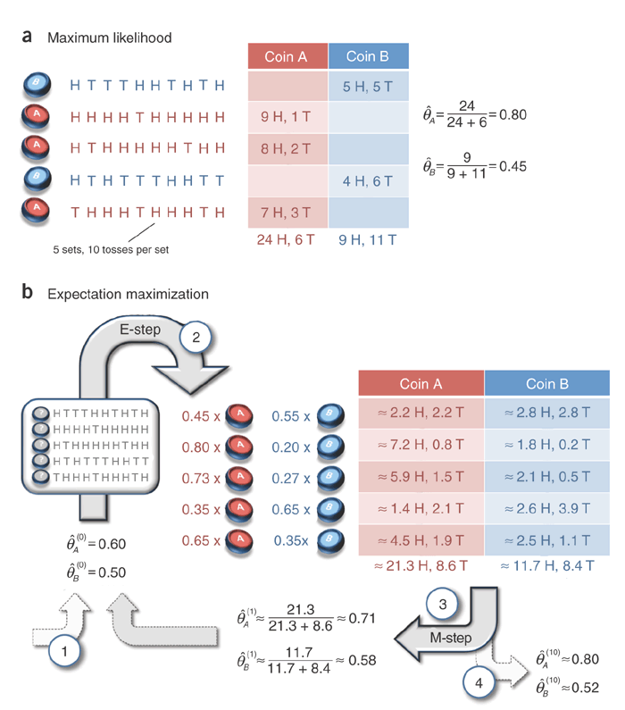

# EM算法

偶然看到一篇[文章](http://www.nature.com/nbt/journal/v26/n8/full/nbt1406.html)讲EM算法，感觉讲得很清晰。文中用到了一个抛硬币的问题，这里“搬运”过来，重新阐述下。

## 问题

假设现在有两枚硬币，随机抛掷之后，正面朝上的概率分别设为$\theta_A$和$\theta_B$，然后我们做了5轮实验，每轮随机选一枚硬币（记为$z_i$），抛10次并记录结果（记为$\boldsymbol{x}_i$），现在我们希望估计出$\theta_A$和$\theta_B$的值。

## 最大似然

假设$z_i$是已知的，那么只需最大化对数似然$\log (x, z; \theta)$即可，根据采样独立性假设，将log似然对$\theta$求导之后，可以得到$\theta$的点估计：

$$
\begin{equation}
\hat {\theta_A} = \frac {选择硬币A时正面朝上的次数} {选择硬币A的次数}
\end{equation}
$$

## EM

假如隐变量$z$不可知，那么就无法通过上面的方法求解了。不过，我们可以先随机设置$\theta$的一组取值，然后根据观测数据$\boldsymbol{x}$“猜测”隐变量的分布$z$，再利用该隐变量的估计值和观测数据$\boldsymbol{x}$，按照前面最大似然的做法去计算$\theta$的值，如此迭代直至$\theta$收敛。

需要注意的是，这里“猜测”的是$z$的分布，而不是具体的某个值，联系到K-means算法中，通常的做法是将每个中心点做替换，这里相当于只是做“软分类”。

具体流程见原图：



下面我用Python代码将图中的流程复现下：

```python
import numpy as np
from scipy.stats import binom

observed = """
HTTTHHTHTH
HHHHTHHHHH
HTHHHHHTHH
HTHTTTHHTT
THHHTHHHTH"""

x = np.array([[1 if c=="H" else 0 for c in line] for line in observed.strip().split()])
x_heads = x.sum(axis=1)
x_tails = 10 - x.sum(axis=1)
assert np.all(x_heads == np.array([5,9,8,4,7]))

def calc_z(theta):
    za_est = binom.pmf(x_heads, 10, theta[0])
    zb_est = binom.pmf(x_heads, 10, theta[1])
    return za_est / (za_est + zb_est), zb_est / (za_est + zb_est)

def calc_theta(z):
    h_A = (x_heads * z[0]).sum()
    t_A = (x_tails * z[0]).sum()
    h_B = (x_heads * z[1]).sum()
    t_B = (x_tails * z[1]).sum()
    return h_A / (h_A + t_A), h_B / (h_B + t_B)    

def is_nearly_same(theta_pre, theta_cur):
    return np.abs(sum(theta_pre) - sum(theta_cur)) < 1e-5

theta_pre = [0.6, 0.5]

for i in range(1000):
    theta_cur = calc_theta(calc_z(theta_pre))
    if is_nearly_same(theta_pre, theta_cur):
        print i, theta_cur
        break
    else:
        theta_pre = theta_cur
# 11 (0.7967829009034072, 0.51959543422720311)
```

显然，EM只能找到局部最优解，可以通过设置多个随机起始点来缓解这个问题，原文对这个问题有讨论。

此外，一点个人感受，这里随机初始点有点像先验，然后通过似然更新，得到一次后验估计（即先验和最大似然的中和），如此迭代，有意思。