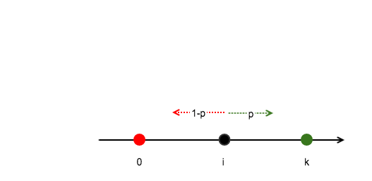

# The Gambler's Ruin Problem

最近在看[概率统计](https://book.douban.com/subject/10827481/)和[Explorations in Monte Carlo Methods](https://book.douban.com/subject/4236768/)这两本书的时候，都有看到这个例子，单独拎出来记录下。

## 问题描述

假设A、B两人一起玩一个游戏，A获胜的概率为$p$，B获胜的概率为$1-p$，A手上有$i$块钱，B手上有$k-i$块钱（即两人的总和为$k$），每次输的一方要给对方1块钱。重复该游戏直到其中一方破产，求最终A剩余的钱为$k$的概率。

我们可以将该过程抽象出来：假设A是坐标轴上位于$i$处的一点，每次随机向左或向右移动单位长，向右移动的概率为$p$，向左移动的概率为$1-p$，重复该过程，直到A运动到原点或者位置$k$时结束，那么最终该点位于位置$k$的概率为多少？

## 问题分析

这里将A最终位于点$k$记为事件$W$，直观上看，假如$p=1/2$，那么$k-i$相对于$i-0$越大，那么$P(W)$也就越小。由于A每次只能移动一步，于是，该问题可以看做是动态规划的问题。

记每次移动后A的位置为$a$，于是有：

$$
\begin{equation}
\mathrm{P}(W|a=i)=p \mathrm{P}(W|a=i+1) + (1-p) \mathrm{P}(W|a=i-1)
\end{equation}
$$

为了方便，记$\mathrm{P}(W|a=i)$为$a_i$，于是上式可以写成如下通项公式：

$$\begin{equation}
(1-p)(a_{i} - a_{i-1})=p(a_{i+1} - a_{i})
\end{equation}
$$

然后，根据边界条件$a_0 = 0$和$a_k = 1$可以得到以下式：

$$
\begin{equation}
\begin{split}
a_2 - a_1 &= \frac{1-p}{p} a_1 \\
a_3 - a_2 &= \frac{1-p}{p} (a_2 - a_1) \; &= \left(\frac{1-p}{p}\right)^2 a_1 \\
\vdots \\
a_{k-1} - a_{k-2} &= \frac{1-p}{p} (a_{k-2} - a_{k-3}) \; &= \left(\frac{1-p}{p}\right)^{k-2} a_1 \\
1 - a_{k-1} &= \frac{1-p}{p} (a_{k-1} - a_{k-2}) \; &= \left(\frac{1-p}{p}\right)^{k-1} a_1 \\
\end{split}
\end{equation}
$$

求和之后可以得到：
$$
\begin{equation}
1 - a_1 = a_1 \sum_{i=1}^{k-1} \left( \frac{1-p}{p} \right) ^ i
\end{equation}
$$

## 讨论
