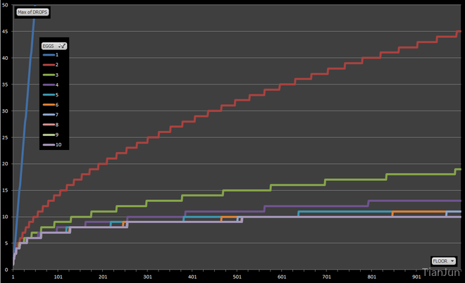

# Throwing Eggs from a Building

下午做练习题时碰到的问题，*Algorithms, 4th*中的**1.4.24**和**1.4.25**。思考了之后发现是个挺有意思的问题。下面结合题目和网上的一些资料做个简单的分析。

## 1. 问题描述

原文的问题是这样的：

> 1.4.24 *Throwing eggs from a building.* Suppose that you have an N-story building and plenty of eggs. Suppose also that an egg is broken if it is thrown off floor F or higher, and intact otherwise. First, devise a strategy to determine the value of F such that the number of broken eggs is $\sim lg N$ when using $\sim lg N$ throws, then find a way to reduce the cost to $\sim 2lg F$.

简单来说就是这么个意思：

> 在一座N层楼房上往下扔**假鸡蛋**，这些**假鸡蛋**只有在第F层楼及以上才会被摔破（没有摔破的鸡蛋可以接着用）。为了找到这个F，设计一个思路使得尝试的次数接近$\sim lg N$并且最后摔破的鸡蛋个数接近$\sim lg N$，然后想办法降低到$\sim 2lg F$。

### 1.1 二分法

首先想到的应该是用二分法来解决这个问题。从中间数（N/2)开始，如果鸡蛋摔破了，就继续往下找。显然，如果鸡蛋在1楼才摔破的话，摔破的鸡蛋个数和尝试的次数都接近$\sim lg N$。问题在于，如何降低到$\sim 2lg F$？

### 1.2 减少摔碎的鸡蛋个数

试着思考下这个问题的特殊之处，**如果某一次尝试的过程中鸡蛋没有摔破，那么可以接着用**！回顾前面的二分法中的极端情况，每次尝试都摔碎了个蛋，太浪费了。也就是说，如果换成从下往上搜索而不是从中间开始搜索，那么最初的几次尝试很大可能不会摔碎蛋的。于是，最简单的应该就是拿着鸡蛋从1楼开始往上一层一层试，直到鸡蛋摔碎。不过这样虽然摔碎的鸡蛋的个数降到了**1个**，但是测试的次数却上升到了**F个**。

### 1.3 平衡摔碎的鸡蛋数和尝试的次数

从前面的分析可以感受到，如果降低摔碎的鸡蛋个数，测试的次数就上去了，反之亦然。那么如何平衡呢？前面是拿着鸡蛋一层一层往上测试，这样子太慢了！不妨每隔两层（三层，五层？）测试一次，摔碎了的话再退回来。这样测试的次数将低了一些，但是仍然是线性的。还是太慢了！干脆换成指数增长。假设第k次摔碎了，然后再倒回来采用二分查找。这样摔碎的鸡蛋个数是$\sim lg(F/2)$（前面在第$1,2,4,...,2^k-1$层测试的时候没摔碎，只有后面$2^k-1到 2^k$之间 二分查找时候才有可能摔碎），而尝试的次数  为$\sim 2lg F$。

### 1.4 疑惑

疑惑的是，这样子虽然肯定可以降低摔碎鸡蛋的个数，但并不一定能降低尝试的次数啊

## 2 问题扩展

> 1.4.25 *Throwing two eggs from a building.* Consider the previous question, but now suppose you only have two eggs, and your cost model is the number of throws. Devise a strategy to determine F such that the number of throws is at most $2\sqrt{N}$, then find a way to reduce the cost to $\sim c\sqrt{F}$. This is analogous to a situation where search hits (egg intact) are much cheaper than misses(egg broken).

### 2.1 简单的尝试

现在的问题变成了，如果只有两个鸡蛋，怎样才能降低查找次数？

不考虑其他的，假设楼房有100层，现在手上有两个蛋，先跑到50楼扔一个了再说，人品不好，蛋碎了，那么接下来该怎么办？老老实实拿着剩下的那个从一楼开始尝试吧，最多试50次。直觉告诉我们，一开始就选太大了反而得不偿失。事实上，借用前一个问题的分析思路，可以尝试用线性增长的方式来解决这个问题(显然这次不能用指数增长了，还得check最后一个区间的……)。假如每次往上提升采用一个**定步长**，其实可以算出最优解。设步长为x，那么最大的查找次数为$x + \frac{100}{x}$，其最优解近似于$2\sqrt{N}$

### 2.2 变步长

前面这种解法的瓶颈点在哪呢？最后一步！

假设鸡蛋在最后一步那地方碎了，此时已经走了$\frac{100}{x}$步，然后还需要再尝试10次（从90到100层之间，也就是步长的长度）。

通过采用**变步长**的思想，前面这个解决方案还可以稍微改进一些。我们知道，二分法求解问题的核心思想是**最大化信息熵**，通俗点说，就是每check一次之后，不管目标值在check点的左边还是右边，对我来说需要check的次数是相同的。对应到这个问题上，设第一步的步长为$x_1$，不管蛋碎了没有，我希望接下来check的次数都是相同的。显然，如果蛋碎了，我就只剩一个蛋了，还需要从下往上check$x_1-1$次，如果蛋没碎，此时只要$x_1$选取的合理，满足前面最大熵要求，我仍然只需要$x_1 - 1$次就能找到F。如此迭代下去便不难发现，最后可以得到公式$x_1 + (x_1-1) + (x_1 - 1 - 1) + ... + 1 = N$，从而可以求解出初始步长。

## 3 更多的鸡蛋～

如果鸡蛋的个数变成3个，4个，5个......

采用**减而治之**的思想，可以很好去解决这个问题。以3个鸡蛋为例子：

> 1. 首先，得确定第一个步长$x_1$，
> 1. 如果碎了，则问题转换成了2个鸡蛋$x_1-1$层楼的问题，（根据前面的方法假设该问题的最优解为$x_c$)；
> 1. 如果没碎，则转换成3个鸡蛋$N-x_1$层楼的问题

通过迭代的方法比较容易求解该类问题。

更多有意思的分析可以看看[这里](http://datagenetics.com/blog/july22012/index.html)。
下图是从上文中摘出的一幅图，用来说明不同情况下需要的蛋的个数。

