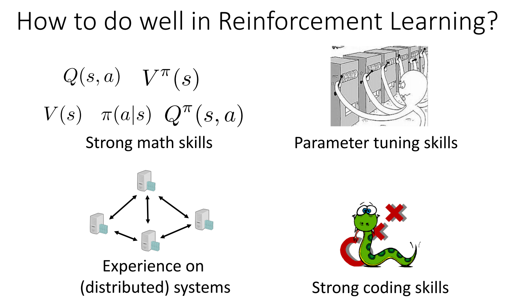

# 从零开始用Julia写一个Reinforcement Learning的库

今天看到Julia-0.7的alpha版本出来了，1.0应该也快了。我打算在这里完整记录下如何从零开始写一个Julia的库，估计有好多坑......

从[田渊栋](http://yuandong-tian.com/)的一个[talk](http://yuandong-tian.com/presentation2018h1.pdf)里摘个图：

当然，右下角的配图（Python/C++）要打个❓

## Prepare

### Install

在[Download](https://julialang.org/downloads/)页面的Upcoming Release部分可以找到对应平台的二进制文件。

### Package Management

新版的Pkg管理模块比以前好用了很多，功能上有点像内置了一个[pipenv](https://github.com/pypa/pipenv)。打开Julia的REPL后，按`]`进入Pkg管理模块，通过`generate Foo`即可新建一个Project，然后`add Bar`可以添加依赖，更多操作可以查看[Pkg](https://docs.julialang.org/en/latest/stdlib/Pkg/)的Doc。

### Dependent Packages

- ✅[PyCall](https://github.com/JuliaPy/PyCall.jl)

    PyCall用于跟OpenAI的[Gym](https://gym.openai.com/)进行交互。封装了一个[Environment.jl](https://github.com/findmyway/Environment.jl)，目标是提供一个统一的接口。~~暂时还不支持Julia-0.7。 执行`develop MacroTools`更新MacroTools到master分支之后便正常了。~~

- [Knet](https://github.com/denizyuret/Knet.jl)/[Flux](https://github.com/FluxML/Flux.jl)

    用于提供DL基础的工具包。我大致读完过Flux的源码，结构比较简单，但是有一些工具函数有所缺失。Knet相对而言文档丰富些，我暂时还没确定先用哪个（~~哪个先支持Julia0.7就先用哪个吧😋~~）。
    
    仔细考虑了下，决定用Flux，主要是可以很方便地在上面做个性化定制，Slack上相关的交流也很多（这点很重要）。具体关于Flux.jl的介绍可以查看最近写的一篇详细介绍:[An Introduction to Flux.jl](https://tianjun.me/essays/An_Introduction_to_Flux.jl)

- (Optional)[CxxWrap](https://github.com/JuliaInterop/CxxWrap.jl)

    有条件的话用CxxWrap封装一个可视化的库。
  
    - [TensorBoard](https://github.com/tensorflow/tensorboard)

        有个小哥已经封装了[TensorBoard.jl](https://github.com/oxinabox/UniversalTensorBoard.jl)，不知道效果怎样，看README只是写了个prototype。
  
    - ✅[VisualDL.jl](https://github.com/findmyway/VisualDL.jl)
    
        (尝试用CxxWrap封装了下，有个bug一直没调试成功，写入数据总是全是0.0，无奈)。后面如果确实有需要的话，用PyCall封装下Python的接口。

        完成了用PyCall的封装，顺便熟悉了下发布一个package的流程，包括Unit Test, Travis, Documenter, Release等等。
    
    总的来说，CxxWrap用来对一些已经支持Python的C++库做封装还是蛮方便的，PyCall也很好用（只是需要注意1-based index和矩阵是按列存储的这两点）。

## Design

