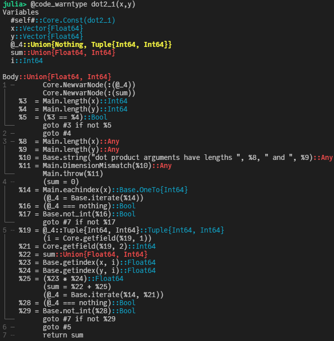

# 如何在Julia中计算点积?

*回字有几种写法?* 🤔

```@blog_meta
last_update="2021-11-16"
create="2021-11-16"
tags=["Julia", "CUDA", "GPU"]
```

两个向量$\vec{a} = [a_1, a_2, ..., a_n]$ 和 $\vec{b} = [b_1, b_2, ..., b_n]$ 之间点积（dot product)的代数定义如下：

```math
\vec{a} \cdot \vec{b} = \sum^n_{i=1} a_i b_i = a_1 b_1 + a_2 b_2 + ... + a_n b_n
```

那么，如何在Julia中快速计算点积呢？

## 版本1： 使用 LinearAlgebra 标准库中的 `dot` 函数

```julia
julia> using LinearAlgebra

julia> N = 1024*1024
1048576

julia> x, y = rand(N), rand(N);

julia> dot(x,y)
262311.47579656926

```

先测试下标准库里 `dot` 的性能：

```julia
julia> using BenchmarkTools

julia> @benchmark dot($(rand(N)), $(rand(N)))
BenchmarkTools.Trial: 10000 samples with 1 evaluation.
 Range (min … max):  244.474 μs …  43.973 ms  ┊ GC (min … max): 0.00% … 0.00%
 Time  (median):     252.275 μs               ┊ GC (median):    0.00%
 Time  (mean ± σ):   314.178 μs ± 884.297 μs  ┊ GC (mean ± σ):  0.00% ± 0.00%

  ▇█▄▃▂▁▁▁▁▁▁▁ ▁▂                                               ▂
  ████████████████▇▇▇▇▇█▇▇▇▇▇▇▇▇▆▆▅▆▇▇▅▃▅▅▄▃▄▄▃▃▄▃▅▇██▆▅▅▃▄▁▃▃▃ █
  244 μs        Histogram: log(frequency) by time        594 μs <

 Memory estimate: 0 bytes, allocs estimate: 0.
```

中间值位于252μs附近。

## 版本2： for循环

当然，即使不使用自带的`dot`函数，我们也可以很方便地用一个 `for` 循环来实现：

```julia
function dot2_1(x, y)
    res = 0
    for i in eachindex(x, y)
        res += x[i] * y[i]
    end
    res
end
```

写法基本和原始的数学表达式一样，那性能如何呢？

```julia
julia> @benchmark dot2_1($(rand(N)), $(rand(N)))
BenchmarkTools.Trial: 2134 samples with 1 evaluation.
 Range (min … max):  2.286 ms …  2.942 ms  ┊ GC (min … max): 0.00% … 0.00%
 Time  (median):     2.302 ms              ┊ GC (median):    0.00%
 Time  (mean ± σ):   2.330 ms ± 56.418 μs  ┊ GC (mean ± σ):  0.00% ± 0.00%

  █ █                                                         
  █▃█▇▃▃▃▃▃▃▃▃▃▃▄▃▃▃▃▃▃▃▃▃▂▂▂▂▂▂▂▂▂▂▂▂▂▁▂▂▂▂▁▁▁▂▂▁▁▁▁▂▂▂▂▂▁▂ ▃
  2.29 ms        Histogram: frequency by time         2.6 ms <

 Memory estimate: 0 bytes, allocs estimate: 0.
```

呃， 耗时差不多是原来的9倍了。有点不可思议，那怎么优化下呢？ 先用 `@code_warntype` 看下：



注意到上面标红色的部分，这是提醒我们上面的实现中出现了类型不稳定的情况。主要原因是`res`在`dot2_1`函数中，初始化成了`Int64`类型的`0`，而我们的输入是两个`Vector{Float64}`类型的向量。了解这一点之后，可以把上面的实现写得更灵活一些：

```julia
function dot2_2(x::AbstractArray{X}, y::AbstractArray{Y}) where {X,Y}
    res = zero(promote_type(X,Y))
    for i in eachindex(x, y)
        res += x[i] * y[i]
    end
    res
end
```

这里， 通过 `promote_type` 获取类型信息。

```julia
julia> @benchmark dot2_2($(rand(N)), $(rand(N)))
BenchmarkTools.Trial: 3384 samples with 1 evaluation.
 Range (min … max):  1.410 ms …  3.580 ms  ┊ GC (min … max): 0.00% … 0.00%
 Time  (median):     1.449 ms              ┊ GC (median):    0.00%
 Time  (mean ± σ):   1.464 ms ± 66.969 μs  ┊ GC (mean ± σ):  0.00% ± 0.00%

         ▆ ▃█ ▄                                               
  ▂▃▃▃▅█▆██████▇▅█▄▄▄▄▄▄▄▃▄▄▄▃▄▄▄▄▄▃▃▄▃▃▃▂▃▃▃▂▂▃▂▂▂▂▂▁▂▂▂▂▂▂ ▃
  1.41 ms        Histogram: frequency by time        1.59 ms <

 Memory estimate: 0 bytes, allocs estimate: 0.
```

可以看到，比之前稍好了一些，大约是之前的5倍左右。 当然，我们还可以顺手做些进一步的优化，加上`@simd`并去掉边界检查：

```julia
function dot2_3(x::AbstractArray{X}, y::AbstractArray{Y}) where {X,Y}
    res = zero(promote_type(X,Y))
    @inbounds @simd for i in eachindex(x, y)
        res += x[i] * y[i]
    end
    res
end
```

```julia
julia> @benchmark dot2_3($(rand(N)), $(rand(N)))
BenchmarkTools.Trial: 5545 samples with 1 evaluation.
 Range (min … max):  848.684 μs …  1.296 ms  ┊ GC (min … max): 0.00% … 0.00%
 Time  (median):     871.641 μs              ┊ GC (median):    0.00%
 Time  (mean ± σ):   888.964 μs ± 50.935 μs  ┊ GC (mean ± σ):  0.00% ± 0.00%

  ▂▇█▇▆▇▆▅▅▅▄▄▃▃▃▂▂▁▂▁▁▁                                       ▂
  ███████████████████████▇▇▇▇▇▆▆▅▅▆▆▇█▇▇████▇█▇▅▇▇▅▅▅▄▄▅▅▅▅▅▄▃ █
  849 μs        Histogram: log(frequency) by time      1.11 ms <

 Memory estimate: 0 bytes, allocs estimate: 0.
```

这样差距进一步缩小了一些。当然，我们还可以进一步利用 [LoopVectorization.jl](https://github.com/JuliaSIMD/LoopVectorization.jl) 这个库来提速：

```julia
using LoopVectorization
function dot2_4(x::AbstractArray{X}, y::AbstractArray{Y}) where {X,Y}
    res = zero(promote_type(X,Y))
    @turbo for i in eachindex(x, y)
        res += x[i] * y[i]
    end
    res
end
```

```julia
julia> @benchmark dot2_4($(rand(N)), $(rand(N)))
BenchmarkTools.Trial: 5905 samples with 1 evaluation.
 Range (min … max):  802.618 μs …  1.211 ms  ┊ GC (min … max): 0.00% … 0.00%
 Time  (median):     820.607 μs              ┊ GC (median):    0.00%
 Time  (mean ± σ):   832.880 μs ± 39.868 μs  ┊ GC (mean ± σ):  0.00% ± 0.00%

   ▂█▄                                                          
  ▂███▆▆▇▅▄▃▃▃▃▃▂▂▂▂▂▁▁▁▁▁▁▁▁▁▁▁▁▁▁▁▁▁▁▁▁▁▁▁▁▁▁▁▁▁▁▁▁▁▁▁▁▁▁▁▁▁ ▂
  803 μs          Histogram: frequency by time         1.02 ms <

 Memory estimate: 0 bytes, allocs estimate: 0.
```

看起来稍微快了一些，不过似乎仍然与`LinearAlgebra`中的性能有3倍多的性能差距？其实不然，`LinearAlgebra`中使用了BLAS，而其默认是有多线程加速的，为了公平比较，可以将其线程数设置为1，然后对比：

```julia
julia> LinearAlgebra.BLAS.set_num_threads(1)

julia> @benchmark dot($(rand(N)), $(rand(N)))
BenchmarkTools.Trial: 5980 samples with 1 evaluation.
 Range (min … max):  795.374 μs …  1.104 ms  ┊ GC (min … max): 0.00% … 0.00%
 Time  (median):     811.659 μs              ┊ GC (median):    0.00%
 Time  (mean ± σ):   823.303 μs ± 37.397 μs  ┊ GC (mean ± σ):  0.00% ± 0.00%

   ▅█                                                           
  ▃███▅▇▇▅▅▄▄▄▄▃▃▃▃▃▂▂▂▂▂▂▂▂▂▂▂▂▂▂▂▂▂▂▁▂▂▂▂▂▂▂▂▂▂▂▂▂▂▂▂▂▂▂▂▂▂▂ ▃
  795 μs          Histogram: frequency by time         1.02 ms <

 Memory estimate: 0 bytes, allocs estimate: 0.
```

可以看到，二者相差无几。

## 版本3： 一行代码

当然，有的时候其实对性能也不是那么关心，反而代码的简洁性更重要，那么也可以简单地用一行代码来搞定：

```julia
julia> @benchmark sum(a*b for (a,b) in zip($(rand(N)),$(rand(N))))
BenchmarkTools.Trial: 3823 samples with 1 evaluation.
 Range (min … max):  1.232 ms …  1.840 ms  ┊ GC (min … max): 0.00% … 0.00%
 Time  (median):     1.281 ms              ┊ GC (median):    0.00%
 Time  (mean ± σ):   1.295 ms ± 54.505 μs  ┊ GC (mean ± σ):  0.00% ± 0.00%

   ▃█▇▄▆▂                                                     
  ▃███████▆▇▄▄▄▅▅▄▅▄▅▆▆▆▅▅▆▇▆▆▆▄▄▃▃▂▂▂▂▂▂▂▂▂▂▂▂▂▂▁▁▁▁▁▁▁▁▁▁▁ ▃
  1.23 ms        Histogram: frequency by time        1.46 ms <

 Memory estimate: 0 bytes, allocs estimate: 0.
```

## 版本4： 多线程

受前面LinearAlgebra中多线程的启发，我们同样也可以用Julia自带的多线程完成点积的计算。不过需要记得在启动Julia的时候，通过 `-t auto` 来指定线程数。

```julia
julia> using Base.Threads

julia> nthreads()
4
```

这里我本机就4个线程。所以

```julia
function dot4_1(x::AbstractArray{X}, y::AbstractArray{Y}) where {X,Y}
    res = zero(promote_type(X,Y))
    @threads for i in eachindex(x, y)
        res += x[i] * y[i]
    end
    res
end
```

```julia
julia> @benchmark dot4_1($(rand(N)), $(rand(N)))
BenchmarkTools.Trial: 109 samples with 1 evaluation.
 Range (min … max):  28.586 ms … 113.851 ms  ┊ GC (min … max):  0.00% … 62.77%
 Time  (median):     39.838 ms               ┊ GC (median):     0.00%
 Time  (mean ± σ):   45.888 ms ±  20.565 ms  ┊ GC (mean ± σ):  14.59% ± 19.04%

   ▁      █▃                                                    
  ▇█▄█▆▁▁▇██▆▇▄▄▄▁▁▁▁▁▆▁▁▁▁▁▁▁▁▁▁▁▁▁▁▁▁▁▁▁▁▁▁▁▁▁▁▁▁▁▁▄▁▁▁▄▁█▇▄ ▄
  28.6 ms       Histogram: log(frequency) by time       108 ms <

 Memory estimate: 32.00 MiB, allocs estimate: 2097174.
```

这个结果就比较有意思了，由于我们的多线程实现存在race condition, 实际上得到的结果并不对，并且速度相当慢。当然，为了保证结果的正确性，可以对`res`加锁，但并不能带来性能上的提升。一个简单的办法是，将数据分片，每个线程做自己单独的计算，最后把多个线程的结果合并：

```julia
function dot4_2(x::AbstractArray{X}, y::AbstractArray{Y}) where {X,Y}
    res = zeros(promote_type(X,Y), nthreads())
    @threads for i in 1:length(x)
        @inbounds res[threadid()] += x[i] * y[i]
    end
    sum(res)
end
```

```julia
julia> @benchmark dot4_2($(rand(N)), $(rand(N)))
BenchmarkTools.Trial: 10000 samples with 1 evaluation.
 Range (min … max):  378.194 μs …  16.460 ms  ┊ GC (min … max): 0.00% … 0.00%
 Time  (median):     397.990 μs               ┊ GC (median):    0.00%
 Time  (mean ± σ):   433.403 μs ± 243.825 μs  ┊ GC (mean ± σ):  0.00% ± 0.00%

  ▅█▆▆▆▄▂▁ ▁▁      ▁▂▂▁ ▂▃▃▂▁                                   ▂
  ██████████████▇▇███████████▇▅▆▅▅▇▅▁▃▁▃▃▁▄▁▃▁▁▅▇▄▅▃▃▄▅▄▁▄▄▆▅▄▅ █
  378 μs        Histogram: log(frequency) by time        878 μs <

 Memory estimate: 1.98 KiB, allocs estimate: 22.
```

这样得到的结果，相比单线程的结果要快了近3.2倍。

Julia标准库里没有提供多线程的求和操作，不过有一些第三方库提供了这类基本操作，比如[`ThreadsX.jl`](https://github.com/tkf/ThreadsX.jl)。

```julia
julia> using ThreadsX

julia> @benchmark ThreadsX.sum(a*b for (a,b) in zip($(rand(N)),$(rand(N))))
BenchmarkTools.Trial: 10000 samples with 1 evaluation.
 Range (min … max):  291.519 μs …  2.023 ms  ┊ GC (min … max): 0.00% … 0.00%
 Time  (median):     326.248 μs              ┊ GC (median):    0.00%
 Time  (mean ± σ):   339.611 μs ± 42.828 μs  ┊ GC (mean ± σ):  0.00% ± 0.00%

        ▃▆█▆▄▂▁                                                 
  ▁▂▃▅▆█████████▆▆▆▆▅▄▄▄▄▃▃▃▂▂▂▂▂▂▂▂▃▃▃▃▃▃▂▂▂▂▁▁▁▁▁▁▁▁▁▁▁▁▁▁▁▁ ▃
  292 μs          Histogram: frequency by time          472 μs <

 Memory estimate: 17.45 KiB, allocs estimate: 249.
```

## 版本5： GPU版

如果你手上正好有块GPU，不妨试试看在GPU上做点积。Julia中的[CUDA.jl](https://github.com/JuliaGPU/CUDA.jl)极大地方便了Julia语言里的GPU编程，针对点积这样的常见操作，其提供了基于cuBLAS的封装，下面来试下：

```julia
julia> using CUDA

julia> @benchmark CUDA.@sync dot($(cu(rand(N))), $(cu(rand(N)))) 
BenchmarkTools.Trial: 10000 samples with 1 evaluation.
 Range (min … max):  26.521 μs … 68.923 μs  ┊ GC (min … max): 0.00% … 0.00%
 Time  (median):     27.798 μs              ┊ GC (median):    0.00%
 Time  (mean ± σ):   28.331 μs ±  1.494 μs  ┊ GC (mean ± σ):  0.00% ± 0.00%

  ▂▁   ▃▇█▅▁ ▃▅▇▅▂   ▂▃                                       ▂
  ███▆▇████████████▇████▆▄▄▅▆▆▅▅▅▅▅▅▅▆▆▆▆▅▆▄▅▆▅▄▅▅▂▅▄▄▅▅▄▄▃▅▄ █
  26.5 μs      Histogram: log(frequency) by time      35.9 μs <

 Memory estimate: 16 bytes, allocs estimate: 1.
```

可以看到，其速度相当快。

不过，由于cuBLAS里的`dot`只针对常见的 `Float32`, `Float64`, `Float16` 以及对应的复数类型的GPU上的向量有实现，当输入的两个向量的元素类型不一致时，目前的CUDA.jl(v3.5.0)会fallback到CPU版本的实现，导致性能极慢：

```julia
julia> z = rand(Bool, N);

julia> cx, cz = cu(x), cu(z);

julia> @time dot(cx, cz)
┌ Warning: Performing scalar indexing on task Task (runnable) @0x00007f63cc0c0010.
│ Invocation of getindex resulted in scalar indexing of a GPU array.
│ This is typically caused by calling an iterating implementation of a method.
│ Such implementations *do not* execute on the GPU, but very slowly on the CPU,
│ and therefore are only permitted from the REPL for prototyping purposes.
│ If you did intend to index this array, annotate the caller with @allowscalar.
└ @ GPUArrays ~/.julia/packages/GPUArrays/3sW6s/src/host/indexing.jl:56
 12.914170 seconds (6.29 M allocations: 1.000 GiB, 0.87% gc time)
```

一个简单的workaround是，先把类型不同的两个向量转换成相同的类型，然后再调用`dot`函数：

```julia
julia> @benchmark CUDA.@sync dot($(cu(rand(N))), convert(CuArray{Float32}, $(cu(rand(Bool, N)))))
BenchmarkTools.Trial: 3968 samples with 1 evaluation.
 Range (min … max):  1.073 ms …   4.408 ms  ┊ GC (min … max): 0.00% … 30.06%
 Time  (median):     1.140 ms               ┊ GC (median):    0.00%
 Time  (mean ± σ):   1.252 ms ± 464.709 μs  ┊ GC (mean ± σ):  3.35% ±  6.05%

  ▂█▃  ▄▁                                     ▁                
  ███▇▆██▆▄▁▁▁▁▁▁▁▁▁▁▁▁▁▁▁▁▁▁▁▁▁▁▁▁▁▁▁▁▁▁▁▁▁▁▄█▅▃▁▃▁▁▁▃▁▃▁▁▁█ █
  1.07 ms      Histogram: log(frequency) by time      3.85 ms <

 Memory estimate: 5.00 MiB, allocs estimate: 12.
```

相比原来的GPU版本，多出来了一次拷贝数据的时间，这显然不是我们想要的。
不过，`CUDA.jl`的强大之处在于，针对这类没有内置的实现，我们可以*很容易地*通过编写自定义的核函数来实现。

```julia
function dot5_1(x::CuArray{T1}, y::CuArray{T2}) where {T1, T2}
    T = promote_type(T1, T2)
    res = CuArray{T}([zero(T)])
    function kernel(x, y, res)
        for i in 1:length(x)
            @inbounds res[] += x[i] * y[i]
        end
    end
    @cuda kernel(x, y, res)
    res[]
end
```

自己手写核函数经常容易出现各种bug，所以首要任务是先确认我们计算的结果是正确的：

```julia
julia> isapprox(dot5_1(cx, cz), dot(cx, convert(CuArray{Float32}, cz)))
true
```

注意这里用的是`isapprox`来做比较。看起来我们得到的结果是正确的，那么其性能如何呢？

```julia
julia> @benchmark CUDA.@sync dot5_1($(cu(rand(N))), $(cu(rand(Bool, N))))
BenchmarkTools.Trial: 103 samples with 1 evaluation.
 Range (min … max):  48.510 ms …  54.895 ms  ┊ GC (min … max): 0.00% … 0.00%
 Time  (median):     48.514 ms               ┊ GC (median):    0.00%
 Time  (mean ± σ):   48.606 ms ± 657.494 μs  ┊ GC (mean ± σ):  0.00% ± 0.00%

  █▁                                                            
  ███▁▁▄▁▁▁▁▁▁▁▁▁▁▁▁▁▁▁▁▁▁▁▁▁▁▁▁▁▁▁▁▁▁▁▁▁▁▁▁▁▁▁▁▁▁▁▁▁▁▁▁▁▁▁▁▁▄ ▄
  48.5 ms       Histogram: log(frequency) by time      50.6 ms <

 Memory estimate: 1.78 KiB, allocs estimate: 29.
```

呃，还不如先`convert`了再调用自带的`dot`函数......
那问题出在哪呢？其实上面的核函数只用了一个线程在计算，但是在GPU上有大量的线程可供计算，于是，可以采用上面的CPU上多线程的方法来计算：

```julia
function dot5_2(x::CuArray{T1}, y::CuArray{T2}) where {T1, T2}
    T = promote_type(T1, T2)
    res = CuArray{T}([zero(T)])
    function kernel(x, y, res)
        index = threadIdx().x
        stride = blockDim().x
        for i in index:stride:length(x)
            @inbounds res[] += x[i] * y[i]
        end
    end
    k = @cuda launch=false kernel(x, y, res)
    config = launch_configuration(k.fun)
    k(x, y, res; threads=min(length(x), config.threads))
    CUDA.@allowscalar res[]
end
```

这里在运行核函数的时候，指定了`threads`的个数，在核函数内部的`for`循环把数据根据`threads`切分成了不同的片段，每个thread负责计算各自的一部分。
先验证下正确性：

```julia
julia> isapprox(dot5_2(cx, cz), dot(cx, convert(CuArray{Float32}, cz)))
false
```

等等，这里似乎犯了和前面多线程计算时候一样的错误，在往`res`里累积求和的时候，会存在静态条件。仔细观察可以发现，我们不用每次都往`res`里写入结果，只需要在每个线程内部先计算完，最后叠加上去即可，同时最后要加锁。

```julia
function dot5_3(x::CuArray{T1}, y::CuArray{T2}) where {T1, T2}
    T = promote_type(T1, T2)
    res = CuArray{T}([zero(T)])
    function kernel(x, y, res, T)
        index = threadIdx().x
        stride = blockDim().x
        s = zero(T)
        for i in index:stride:length(x)
            @inbounds s += x[i] * y[i]
        end
        CUDA.@atomic res[] += s
        return nothing
    end
    k = @cuda launch=false kernel(x, y, res,T)
    config = launch_configuration(k.fun)
    k(x, y, res, T; threads=min(length(x), config.threads))
    CUDA.@allowscalar res[]
end
```

这里用了`CUDA.@atomic`来保证原子操作，同样，先确认计算的正确性：

```julia
julia> isapprox(dot(cx, cz), dot5_3(cx, cz))
true
```

再看下速度如何：

```julia
julia> @benchmark CUDA.@sync dot5_3($(cu(rand(N))), $(cu(rand(Bool, N))))
BenchmarkTools.Trial: 10000 samples with 1 evaluation.
 Range (min … max):  175.298 μs … 448.774 μs  ┊ GC (min … max): 0.00% … 0.00%
 Time  (median):     178.373 μs               ┊ GC (median):    0.00%
 Time  (mean ± σ):   179.218 μs ±   4.301 μs  ┊ GC (mean ± σ):  0.00% ± 0.00%

    ▁▃▅▅▇█████▇▇▇▇▇▆▆▅▅▄▄▃▂▂▁▁▁▁ ▁   ▁▁▁▁▁ ▁▁▁▁▁▁▁              ▃
  ▅▅██████████████████████████████████████████████▇██▇▇▆▇▆▅▅▇▅▆ █
  175 μs        Histogram: log(frequency) by time        191 μs <

 Memory estimate: 2.16 KiB, allocs estimate: 39.
```

还不错，至少比CPU版本快了，但是离CUBLAS版本的性能还有一定差距。

考虑到一块GPU中，还会有多个block，而上面我们才用了其中的一个block，显然还有很大的优化空间！

一个基本思路是，根据输入的数据，分配多个block，在每个block的数据区块中，按thread再切分一次，每个thread计算自己所属的数据的点积之和。

```julia
function dot5_4(x::CuArray{T1}, y::CuArray{T2}) where {T1, T2}
    T = promote_type(T1, T2)
    res = CuArray{T}([zero(T)])
    function kernel(x, y, res, T)
        index = threadIdx().x
        thread_stride = blockDim().x
        block_stride = (length(x)-1) ÷ gridDim().x + 1
        start = (blockIdx().x - 1) * block_stride + 1
        stop = blockIdx().x * block_stride

        s = zero(T)
        for i in start-1+index:thread_stride:stop
            @inbounds s += x[i] * y[i]
        end
        CUDA.@atomic res[] += s
        return nothing
    end
    k = @cuda launch=false kernel(x, y, res,T)
    config = launch_configuration(k.fun)
    k(x, y, res, T; threads=min(length(x), config.threads), blocks=config.blocks)
    CUDA.@allowscalar res[]
end
```

```julia
julia> isapprox(dot(cx, cz), dot5_4(cx, cz))
true

julia> @benchmark CUDA.@sync dot5_4($(cu(rand(N))), $(cu(rand(Bool, N))))
BenchmarkTools.Trial: 10000 samples with 1 evaluation.
 Range (min … max):  134.011 μs … 383.172 μs  ┊ GC (min … max): 0.00% … 0.00%
 Time  (median):     134.933 μs               ┊ GC (median):    0.00%
 Time  (mean ± σ):   135.095 μs ±   2.723 μs  ┊ GC (mean ± σ):  0.00% ± 0.00%

       ▁▃▄▇▇▇▆████▇▆▃▃▁                                          
  ▂▂▃▅▆█████████████████▆▅▅▅▄▃▃▃▃▃▂▂▂▂▂▂▂▂▂▂▂▂▂▂▂▂▂▂▂▂▂▂▂▂▁▂▂▂▂ ▄
  134 μs           Histogram: frequency by time          138 μs <

 Memory estimate: 2.16 KiB, allocs estimate: 39.
```

OK, 看起来稍微快了一些。需要注意的是，前面我们直接将每个thread计算的结果往一个`res`对象中通过加锁叠加上去了，这样导致每个block中每个thread都会卡在原子操作那一步。
一种优化方式是每个block的内部，先把各个thread的计算结果缓存起来，等一个block内所有thread都计算出来了同步一下，然后内部先reduce，最后再通过原子操作同步到最终的结果上。

```julia
function dot5_5(x::CuArray{T1}, y::CuArray{T2}) where {T1, T2}
    T = promote_type(T1, T2)
    res = CuArray{T}([zero(T)])
    function kernel(x, y, res, T)
        index = threadIdx().x
        thread_stride = blockDim().x
        block_stride = (length(x)-1) ÷ gridDim().x + 1
        start = (blockIdx().x - 1) * block_stride + 1
        stop = blockIdx().x * block_stride

        cache = CuDynamicSharedArray(T, (thread_stride,))

        for i in start-1+index:thread_stride:stop
            @inbounds cache[index] += x[i] * y[i]
        end

        sync_threads()

        if index == 1
            s = zero(T)
            for i in 1:thread_stride
                s += cache[i]
            end
            CUDA.@atomic res[] += s
        end
        return nothing
    end
    k = @cuda launch=false kernel(x, y, res,T)
    config = launch_configuration(k.fun; shmem=(threads) -> threads*sizeof(T))
    threads = min(length(x), config.threads)
    blocks = config.blocks
    k(x, y, res, T; threads=threads, blocks=config.blocks, shmem=threads*sizeof(T))
    CUDA.@allowscalar res[]
end
```

```julia
julia> isapprox(dot(cx, cz), dot5_5(cx, cz))
true

julia> @benchmark CUDA.@sync dot5_5($(cu(rand(N))), $(cu(rand(Bool, N))))
BenchmarkTools.Trial: 10000 samples with 1 evaluation.
 Range (min … max):  54.364 μs … 358.597 μs  ┊ GC (min … max): 0.00% … 0.00%
 Time  (median):     55.217 μs               ┊ GC (median):    0.00%
 Time  (mean ± σ):   55.559 μs ±   4.023 μs  ┊ GC (mean ± σ):  0.00% ± 0.00%

     ▄▇█▇▅▃▂                                                    
  ▂▄█████████▇▇▆▅▄▄▃▃▃▃▃▃▂▂▂▂▂▂▂▂▂▂▂▂▂▂▂▂▂▂▂▂▂▂▂▂▂▂▂▂▂▂▂▂▂▁▂▁▂ ▃
  54.4 μs         Histogram: frequency by time         61.3 μs <

 Memory estimate: 2.33 KiB, allocs estimate: 43.
```

可以看到,其性能跟CUBLAS比较接近了。当然，上面的代码还可以进一步优化，上面最后reduce的时候，只有index为1的线程在运行，其实可以多个线程一起工作：

```julia
using CUDA:i32

function dot5_6(x::CuArray{T1}, y::CuArray{T2}) where {T1, T2}
    T = promote_type(T1, T2)
    res = CuArray{T}([zero(T)])
    function kernel(x, y, res, T)
        index = threadIdx().x
        thread_stride = blockDim().x
        block_stride = (length(x)-1i32) ÷ gridDim().x + 1i32
        start = (blockIdx().x - 1i32) * block_stride + 1i32
        stop = blockIdx().x * block_stride

        cache = CuDynamicSharedArray(T, (thread_stride,))

        for i in start-1i32+index:thread_stride:stop
            @inbounds cache[index] += x[i] * y[i]
        end
        sync_threads()

        mid = thread_stride
        while true
            mid = (mid - 1i32) ÷ 2i32 + 1i32
            if index <= mid
                @inbounds cache[index] += cache[index+mid]
            end
            sync_threads()
            mid == 1i32 && break
        end

        if index == 1i32
            CUDA.@atomic res[] += cache[1]
        end
        return nothing
    end
    k = @cuda launch=false kernel(x, y, res,T)
    config = launch_configuration(k.fun; shmem=(threads) -> threads*sizeof(T))
    threads = min(length(x), config.threads)
    blocks = config.blocks
    k(x, y, res, T; threads=threads, blocks=config.blocks, shmem=threads*sizeof(T))
    CUDA.@allowscalar res[]
end
```

```julia
julia> isapprox(dot(cx, cz), dot5_6(cx, cz))
true

julia> @benchmark CUDA.@sync dot5_6($(cu(rand(N))), $(cu(rand(Bool, N))))
BenchmarkTools.Trial: 10000 samples with 1 evaluation.
 Range (min … max):  22.520 μs … 375.954 μs  ┊ GC (min … max): 0.00% … 0.00%
 Time  (median):     23.475 μs               ┊ GC (median):    0.00%
 Time  (mean ± σ):   23.762 μs ±   3.748 μs  ┊ GC (mean ± σ):  0.00% ± 0.00%

        ▁▅██▆▃▁                                                 
  ▂▂▃▃▄▆███████▇▅▄▅▅▅▆▅▄▄▃▃▃▂▂▂▂▂▂▂▂▂▁▂▂▁▂▂▂▂▂▂▂▂▁▂▂▂▂▂▂▂▂▁▂▂▂ ▃
  22.5 μs         Histogram: frequency by time           28 μs <

 Memory estimate: 2.16 KiB, allocs estimate: 39.
```

这样，最终的结果跟CUBLAS的性能基本一致了。

从代码层面上讲，上面的代码还可以进一步简化下，上面的while循环其实是一个经典的reduce操作，而`CUDA.jl`中内置了一个函数`reduce_block`来简化该操作:

```julia
function dot5_7(x::CuArray{T1}, y::CuArray{T2}) where {T1, T2}
    T = promote_type(T1, T2)
    res = CuArray{T}([zero(T)])
    function kernel(x, y, res, T)
        index = threadIdx().x
        thread_stride = blockDim().x
        block_stride = (length(x)-1i32) ÷ gridDim().x + 1i32
        start = (blockIdx().x - 1i32) * block_stride + 1i32
        stop = blockIdx().x * block_stride

        local_val = zero(T)

        for i in start-1i32+index:thread_stride:stop
            @inbounds local_val += x[i] * y[i]
        end

        val = CUDA.reduce_block(+, local_val, zero(T), #=shuffle=# Val(true))
        if threadIdx().x == 1i32
            @inbounds CUDA.@atomic res[] += val
        end
        return
    end
    k = @cuda launch=false kernel(x, y, res,T)
    config = launch_configuration(k.fun; shmem=(threads) -> threads*sizeof(T))
    threads = min(length(x), config.threads)
    blocks = config.blocks
    k(x, y, res, T; threads=threads, blocks=config.blocks, shmem=threads*sizeof(T))
    CUDA.@allowscalar res[]
end
```

```julia
julia> @benchmark CUDA.@sync dot5_7($(cu(rand(N))), $(cu(rand(Bool, N))))
BenchmarkTools.Trial: 10000 samples with 1 evaluation.
 Range (min … max):  23.674 μs … 252.995 μs  ┊ GC (min … max): 0.00% … 0.00%
 Time  (median):     25.095 μs               ┊ GC (median):    0.00%
 Time  (mean ± σ):   25.911 μs ±   3.444 μs  ┊ GC (mean ± σ):  0.00% ± 0.00%

      ▁▇█▄▁  ▁                                                  
  ▁▃▄▅█████▆▇██▇▅▄▃▂▂▂▂▂▁▂▁▁▁▁▁▁▁▁▁▁▁▂▂▂▂▃▃▃▂▂▂▁▁▁▁▁▁▁▁▁▁▁▁▁▁▁ ▂
  23.7 μs         Histogram: frequency by time         33.2 μs <

 Memory estimate: 2.33 KiB, allocs estimate: 43.
```

## 参考

- [Introduction to CUDA.jl](https://cuda.juliagpu.org/stable/tutorials/introduction/)
- [GTC-2010](https://www.nvidia.com/content/GTC-2010/pdfs/2131_GTC2010.pdf)
- [CUDA.jl#1240](https://github.com/JuliaGPU/CUDA.jl/pull/1240)

```@comment
```