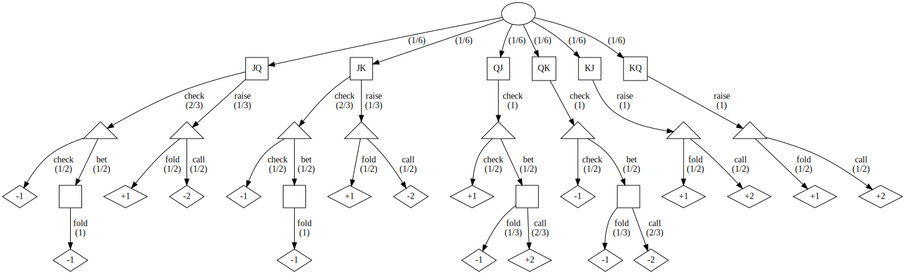

# Notes on Distributional Reinforcement Learning

```@blog_meta
last_update="2021-12-29"
create="2021-12-29"
tags=["Reinforcement Learning"]
```

Here are some personal notes while reading the book: [*Distributional Reinforcement Learning*](https://www.distributional-rl.org/).

## Chapter 1

In Chapter 1, the [Kuhn Poker](https://en.wikipedia.org/wiki/Kuhn_poker) is introduced to explain the distribution of rewards after playing ``T`` rounds. We can calculate the probability when ``T = 1`` based on the given policy.

| First player holding a ... | Jack | Queen | King|
|:--------------------------:|:----:|:-----:|:----|
|Probability of raising      | 1/3  | 0     | 1   |
|Probability of calling      | 0    | 2/3   | 1   |



```math
\begin{alignedat}{4}

& p(r=-2) && = && \left( \frac{1}{6} * \frac{1}{3} * \frac{1}{2} \right) && + \\
& &&        && \left( \frac{1}{6} * \frac{1}{3} * \frac{1}{2} \right) && +  \\
& &&        && \left( \frac{1}{6} * 1 * \frac{1}{2} * \frac{2}{3} \right) \\
& && = && \frac{4}{36} \\

& p(r=-1) && = && \left( \frac{1}{6} * \frac{2}{3} * \frac{1}{2} \right) && + \\
& &&        && \left( \frac{1}{6} * \frac{2}{3} * \frac{1}{2} \right) &&  +  \\
& &&        && \left( \frac{1}{6} * \frac{2}{3} * \frac{1}{2} \right) &&  + \\ 
& &&        && \left( \frac{1}{6} * \frac{2}{3} * \frac{1}{2} \right) && + \\
& &&        && \left( \frac{1}{6} * 1 * \frac{1}{2} * \frac{1}{3} \right)&&  + \\
& &&        && \left( \frac{1}{6} * 1 * \frac{1}{2} \right) && + \\
& &&        && \left( \frac{1}{6} * 1 * \frac{1}{2} * \frac{1}{3} \right) \\
& && = && \frac{13}{36} \\

& p(r=+1) && = && \left( \frac{1}{6} * \frac{1}{3} * \frac{1}{2} \right) && + \\
& &&        &&  \left( \frac{1}{6} * \frac{1}{3} * \frac{1}{2} \right) && + \\
& &&        &&  \left( \frac{1}{6} * 1 * \frac{1}{2} \right) && + \\
& &&        &&  \left( \frac{1}{6} * 1 * \frac{1}{2} \right) && + \\
& &&        &&  \left( \frac{1}{6} * 1 * \frac{1}{2} \right)  \\
& && = && \frac{11}{36} \\


& p(r=+2) && = && \left( \frac{1}{6} * 1 * \frac{1}{2} * \frac{2}{3} \right)  && +\\
& &&        &&  \left( \frac{1}{6} * 1 * \frac{1}{2} \right) && + \\
& &&        &&  \left( \frac{1}{6} * 1 * \frac{1}{2} \right) \\
& && = && \frac{8}{36} \\

\end{alignedat}
```
